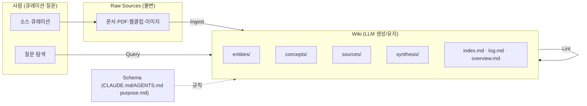

# LLM Wiki 분석

이 디렉토리는 **LLM Wiki**(Karpathy 패턴 + nashsu 구현)의 개념과 아키텍처를 강의용으로 정리합니다.

> 소스: Andrej Karpathy의 패턴 문서 `llm-wiki.md`([gist](https://gist.github.com/karpathy/442a6bf555914893e9891c11519de94f)) + 오픈소스 구현 [github.com/nashsu/llm_wiki](https://github.com/nashsu/llm_wiki) (GPL-3.0). 참고: [PyTorch Korea 소개글](https://discuss.pytorch.kr/t/llm-wiki-feat-karpathy-llm-wiki/10139)

## 한 줄 요약

전통적 RAG가 매 질문마다 원문에서 지식을 "다시 발견"한다면, LLM Wiki는 LLM이 **지속적으로 갱신되는 상호 연결 위키**를 증분 구축·유지한다 — 지식을 한 번 컴파일하고 계속 최신으로 둔다.

## 문서 목록

| 파일 | 내용 |
|------|------|
| [01-핵심아이디어.md](./01-핵심아이디어.md) | RAG의 한계, compounding artifact, 역할 분담(사람 vs LLM) |
| [02-아키텍처와오퍼레이션.md](./02-아키텍처와오퍼레이션.md) | 3계층(Raw/Wiki/Schema), 3대 작업(Ingest·Query·Lint), index.md·log.md |
| [03-앱구현-nashsu.md](./03-앱구현-nashsu.md) | 2단계 CoT 인제스트, 지식 그래프, 검색 파이프라인, Deep Research, 생태계, 기술 스택 |
| [04-도입가이드.md](./04-도입가이드.md) | 시작하기, 프로젝트 구조, 라이선스 |

## 아키텍처 개요

