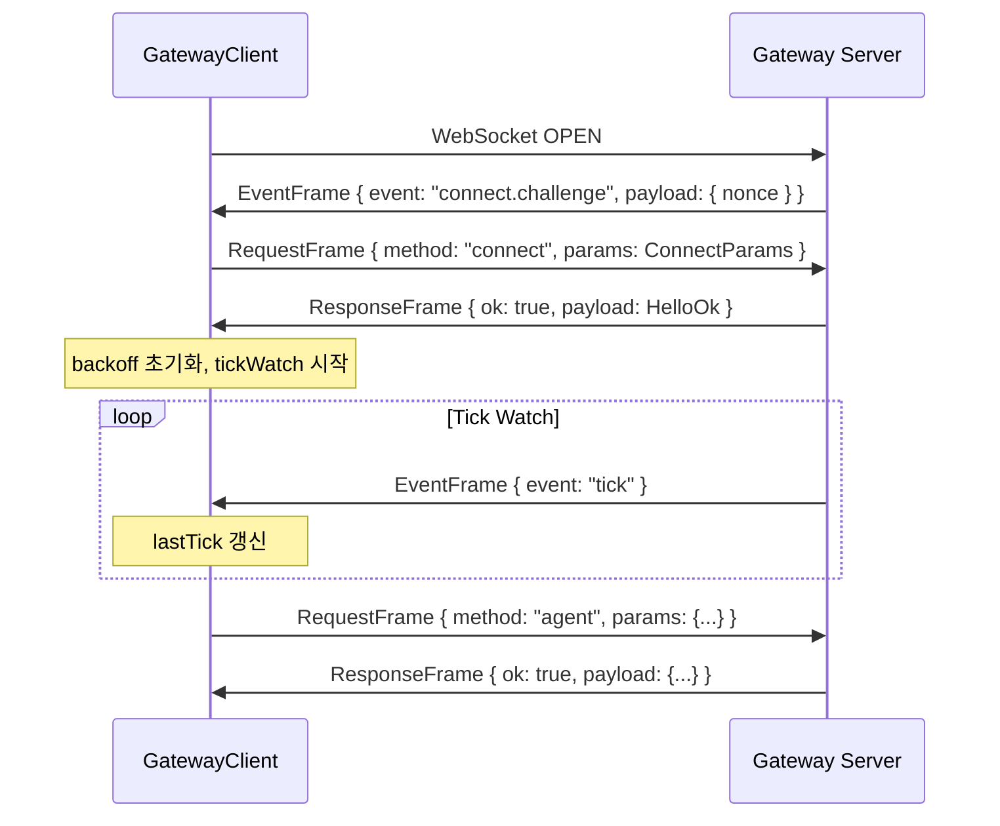

# 01. 게이트웨이 아키텍처 (Gateway Architecture)

## 개요

Gateway는 OpenClaw의 중앙 **WebSocket 컨트롤 플레인**으로, 모든 런타임 상태를 관리하는 핵심 서버 프로세스이다.
클라이언트 연결, 채널 관리, 크론 서비스, 세션 영속화, 설정 핫리로드, 플러그인 로딩, Canvas 호스트, 모델 카탈로그, 노드 레지스트리 등
시스템의 모든 서브시스템을 하나의 프로세스에서 오케스트레이션한다.

- **기본 포트**: `18789` (환경변수 `OPENCLAW_GATEWAY_PORT`로 오버라이드 가능)
- **프로토콜**: WebSocket JSON-RPC (PROTOCOL_VERSION = 3)
- **HTTP 프레임워크**: Express 기반 HTTP 서버 + `ws` 기반 WebSocket (WS + HTTP 멀티플렉스)
- **버전**: `2026.4.16` (`engines.node >= 22.14.0`; 공식 문서 권장 Node 24 또는 Node 22 LTS 22.14+)
- **HTTP API 표면**: WebSocket RPC 외에 OpenAI 호환 `/v1/*`, OpenResponses `/v1/responses`, `POST /tools/invoke` 를 동일 포트에서 제공

---

## 아키텍처 다이어그램

```mermaid
flowchart TB
    subgraph GatewayServer["Gateway Server (server.impl.ts)"]
        direction TB
        CORE["Core Orchestrator"]
    end

    CM["Client Manager<br/>(ws connections)"]
    CHM["Channel Manager<br/>(server-channels.ts)"]
    CRON["Cron Service<br/>(server-cron.ts)"]
    SM["Session Manager<br/>(session-utils.fs.ts)"]
    CR["Config Reloader<br/>(config-reload.ts)"]
    PM["Plugin Manager<br/>(server-plugins.ts)"]
    CH["Canvas Host<br/>(canvas-host/)"]
    MC["Model Catalog<br/>(server-model-catalog.ts)"]
    NR["Node Registry<br/>(node-registry.ts)"]
    WS["WebSocket Runtime<br/>(server-ws-runtime.ts)"]
    HTTP["HTTP Routes<br/>(server-http.ts)"]
    TS["Tailscale<br/>(server-tailscale.ts)"]
    DISC["Discovery<br/>(server-discovery.ts)"]

    CORE --> CM
    CORE --> CHM
    CORE --> CRON
    CORE --> SM
    CORE --> CR
    CORE --> PM
    CORE --> CH
    CORE --> MC
    CORE --> NR
    CORE --> WS
    CORE --> HTTP
    CORE --> TS
    CORE --> DISC

    CLIENT1["CLI Client"] -->|WebSocket| WS
    CLIENT2["Mobile Node"] -->|WebSocket| WS
    CLIENT3["Control UI"] -->|HTTP + WS| HTTP
    CLIENT4["External Hook"] -->|HTTP POST| HTTP
```



---

## 서버 구현 (server.impl.ts)

`src/gateway/server.impl.ts`는 게이트웨이의 진입점이며, 모든 서브시스템을 임포트하고 조립하는 오케스트레이터이다.

### 주요 팩토리 함수

```typescript
// src/gateway/server.impl.ts
export type GatewayServer = {
  close: (opts?: { reason?: string; restartExpectedMs?: number | null }) => Promise<void>;
};

export type GatewayServerOptions = {
  bind?: "loopback" | "lan" | "tailnet" | "auto";
  host?: string;
  controlUiEnabled?: boolean;
  openAiChatCompletionsEnabled?: boolean;
  openResponsesEnabled?: boolean;
  auth?: GatewayAuthConfig;
  tailscale?: GatewayTailscaleConfig;
  allowCanvasHostInTests?: boolean;
  wizardRunner?: (...) => Promise<void>;
};

export async function startGatewayServer(
  port = 18789,
  opts: GatewayServerOptions = {},
): Promise<GatewayServer> { ... }
```

### 시작 시퀀스 (Startup Sequence)

`startGatewayServer()`가 호출되면 다음 순서로 초기화가 진행된다:

| 단계 | 작업 | 소스 파일 |
|------|------|-----------|
| 1 | 설정 파일 로드 및 레거시 마이그레이션 | `config/config.ts` |
| 2 | 플러그인 자동 활성화 | `config/plugin-auto-enable.ts` |
| 3 | 진단 하트비트 시작 | `logging/diagnostic.ts` |
| 4 | 서브에이전트 레지스트리 초기화 | `agents/subagent-registry.ts` |
| 5 | 게이트웨이 플러그인 로딩 | `server-plugins.ts` |
| 6 | 채널 플러그인 나열 및 로거 생성 | `channels/plugins/index.ts` |
| 7 | 런타임 설정 해석 (바인드, TLS, Auth) | `server-runtime-config.ts` |
| 8 | 런타임 상태 생성 (HTTP/WS 서버) | `server-runtime-state.ts` |
| 9 | 노드 레지스트리, 구독 매니저 생성 | `node-registry.ts`, `server-node-subscriptions.ts` |
| 10 | 크론 서비스 빌드 | `server-cron.ts` |
| 11 | 채널 매니저 생성 | `server-channels.ts` |
| 12 | 게이트웨이 디스커버리 (mDNS/Bonjour) | `server-discovery-runtime.ts` |
| 13 | 유지보수 타이머 시작 | `server-maintenance.ts` |
| 14 | 에이전트 이벤트 핸들러 등록 | `server-chat.ts` |
| 15 | WebSocket 핸들러 부착 | `server-ws-runtime.ts` |
| 16 | Tailscale 노출 시작 | `server-tailscale.ts` |
| 17 | 사이드카 프로세스 시작 (브라우저 등) | `server-startup.ts` |
| 18 | 핫 리로드 핸들러 등록 | `server-reload-handlers.ts` |
| 19 | Config 파일 감시자(chokidar) 시작 | `config-reload.ts` |
| 20 | 종료 핸들러 등록 | `server-close.ts` |

---

## 게이트웨이 클라이언트 (client.ts)

`src/gateway/client.ts`는 게이트웨이에 접속하는 WebSocket 클라이언트 구현체이다.

### GatewayClientOptions

```typescript
// src/gateway/client.ts
export type GatewayClientOptions = {
  url?: string;                    // ws://127.0.0.1:18789
  token?: string;                  // 인증 토큰
  password?: string;               // 비밀번호 인증
  instanceId?: string;             // 클라이언트 인스턴스 ID
  clientName?: GatewayClientName;  // 클라이언트 식별 이름
  clientDisplayName?: string;      // UI 표시 이름
  clientVersion?: string;          // 클라이언트 버전
  platform?: string;               // 플랫폼 (darwin, linux 등)
  mode?: GatewayClientMode;        // backend, probe 등
  role?: string;                   // operator 등
  scopes?: string[];               // ["operator.admin"]
  caps?: string[];                 // 클라이언트 기능 목록
  commands?: string[];             // 지원 명령어 목록
  permissions?: Record<string, boolean>;
  pathEnv?: string;                // PATH 환경변수 전달
  deviceIdentity?: DeviceIdentity; // 디바이스 인증 정보
  minProtocol?: number;            // 최소 프로토콜 버전
  maxProtocol?: number;            // 최대 프로토콜 버전
  tlsFingerprint?: string;         // TLS 인증서 핑거프린트
  onEvent?: (evt: EventFrame) => void;
  onHelloOk?: (hello: HelloOk) => void;
  onConnectError?: (err: Error) => void;
  onClose?: (code: number, reason: string) => void;
  onGap?: (info: { expected: number; received: number }) => void;
};
```

### 연결 흐름



### 자동 재연결

클라이언트는 지수 백오프(1초 ~ 30초)를 사용한 자동 재연결을 구현하며,
틱 타임아웃(서버 tick 간격 x 2) 발생 시 코드 `4000`으로 연결을 종료하고 재접속을 시도한다.

---

## 프로토콜 (Protocol)

`src/gateway/protocol/` 디렉토리에서 정의되며, JSON 기반 WebSocket RPC 프레임을 사용한다.

### 프레임 타입

| 프레임 | 방향 | 구조 |
|--------|------|------|
| `RequestFrame` | Client -> Server | `{ type: "req", id: UUID, method: string, params?: unknown }` |
| `ResponseFrame` | Server -> Client | `{ type: "res", id: UUID, ok: boolean, payload?: unknown, error?: ErrorShape }` |
| `EventFrame` | Server -> Client | `{ event: string, payload?: unknown, seq?: number }` |

### PROTOCOL_VERSION

```typescript
// src/gateway/protocol/schema/protocol-schemas.ts
export const PROTOCOL_VERSION = 3 as const;
```

프로토콜 버전 협상은 `connect` 핸드셰이크 시 `minProtocol`/`maxProtocol` 범위로 수행된다.

---

## RPC 메서드 목록

`src/gateway/server-methods-list.ts`에서 등록되는 전체 메서드 목록이다.

### 핵심 메서드

| 카테고리 | 메서드 | 설명 |
|----------|--------|------|
| **Agent** | `agent` | 에이전트 실행 요청 |
| | `agent.identity.get` | 에이전트 아이덴티티 조회 |
| | `agent.wait` | 에이전트 실행 완료 대기 |
| **Send** | `send` | 메시지 전송 |
| **Channels** | `channels.status` | 채널 상태 조회 |
| | `channels.logout` | 채널 로그아웃 |
| **Config** | `config.get` | 설정값 조회 |
| | `config.set` | 설정값 변경 |
| | `config.apply` | 설정 블록 적용 |
| | `config.patch` | 설정 패치 적용 |
| | `config.schema` | 설정 스키마 조회 |
| **Sessions** | `sessions.list` / `sessions.preview` | 세션 목록/미리보기 |
| | `sessions.subscribe` / `sessions.unsubscribe` | 세션 변경 스트림 구독 |
| | `sessions.messages.subscribe` / `sessions.messages.unsubscribe` | 메시지/툴 스트림 구독 |
| | `sessions.create` / `sessions.send` / `sessions.abort` | 세션 생성·메시지 전송·중단 |
| | `sessions.compaction.list` / `sessions.compaction.get` / `sessions.compaction.branch` / `sessions.compaction.restore` | 컴팩션 체크포인트 조회/분기/복원 |
| | `sessions.patch` / `sessions.reset` / `sessions.delete` / `sessions.compact` | 세션 메타 수정·초기화·삭제·압축 |
| **Skills** | `skills.status` | 스킬 상태 조회 |
| | `skills.bins` | 바이너리 스킬 목록 |
| | `skills.install` | 스킬 설치 |
| | `skills.update` | 스킬 업데이트 |
| **Wizard** | `wizard.start` | 온보딩 위저드 시작 |
| | `wizard.next` | 위저드 다음 단계 |
| | `wizard.cancel` | 위저드 취소 |
| | `wizard.status` | 위저드 상태 조회 |
| **Cron** | `cron.list` / `cron.add` / `cron.update` / `cron.remove` / `cron.run` / `cron.runs` | 크론 작업 관리 |
| **Nodes** | `node.list` / `node.describe` / `node.invoke` / `node.event` | 원격 노드 관리 |
| **Chat** | `chat.history` / `chat.send` / `chat.abort` | WebChat 전용 메서드 |
| **Models** | `models.list` | 모델 카탈로그 조회 |
| **Talk** | `talk.mode` | 음성 대화 모드 전환 |
| **Exec** | `exec.approvals.get/set` / `exec.approval.request/resolve` | 실행 승인 관리 |

---

## HTTP 엔드포인트

`src/gateway/server-http.ts`에서 HTTP 라우트를 구성한다.

| 메서드 | 경로 | 설명 |
|--------|------|------|
| `GET` | `/health` | 헬스 체크 (JSON 상태 반환, `live` alias 포함) |
| `GET` | `/presence` | 연결 클라이언트 현황 |
| `POST` | `/call` | HTTP RPC 호출 (hooks 경유) |
| `GET` | `/v1/models`, `/v1/models/:id` | OpenAI 호환 모델 카탈로그 조회 |
| `POST` | `/v1/embeddings` | OpenAI 호환 임베딩 API |
| `POST` | `/v1/chat/completions` | OpenAI 호환 Chat Completions API (`openai-http.ts`) |
| `POST` | `/v1/responses` | OpenResponses API (`openresponses-http.ts`) |
| `POST` | `/tools/invoke` | 단일 도구 직접 실행 (Gateway auth + tool policy 적용, `tools-invoke-http.ts`) |
| `WS` | `/` | WebSocket 메인 엔드포인트 |
| `*` | `/a2ui/*` | Canvas Host A2UI 정적 자산 |
| `*` | `/control/*` | Control UI SPA |

OpenAI 호환 HTTP API, OpenResponses API, Tools Invoke API는 모두 게이트웨이와 같은 포트에서 멀티플렉스되며, 각각 다음 공식 문서에 상세가 정리되어 있다:

- `gateway/openai-http-api.md` — `/v1/chat/completions`, `/v1/models`, `/v1/embeddings`
- `gateway/openresponses-http-api.md` — `/v1/responses`
- `gateway/tools-invoke-http-api.md` — `/tools/invoke` (기본 페이로드 상한 2MB, shared-secret bearer 인증은 operator 권한으로 취급)

---

## 서버 서브시스템 파일 참조

| 파일 | 역할 |
|------|------|
| `server-channels.ts` | 채널 매니저 생성 (시작/중지/로그아웃) |
| `server-chat.ts` | 에이전트 이벤트 핸들러, 채팅 실행 상태 관리 |
| `server-close.ts` | 정상 종료(graceful shutdown) 핸들러 |
| `server-cron.ts` | 크론 서비스 빌드 및 관리 |
| `server-http.ts` | HTTP 라우팅, hooks 핸들러, Canvas/Control UI 서빙 |
| `server-methods.ts` | 코어 게이트웨이 RPC 핸들러 레지스트리 |
| `server-methods-list.ts` | RPC 메서드 및 이벤트 목록 정의 |
| `server-node-events.ts` | 모바일 노드 이벤트 디스패치 |
| `server-node-subscriptions.ts` | 노드 세션 Pub/Sub 구독 관리 |
| `server-plugins.ts` | 플러그인 로딩 및 레지스트리 초기화 |
| `server-runtime-state.ts` | 런타임 상태 생성 (HTTP/WS 서버 인스턴스, 브로드캐스트 등) |
| `server-startup.ts` | 사이드카 프로세스 시작 (브라우저 컨트롤 등) |
| `server-tailscale.ts` | Tailscale 네트워크 노출 관리 |
| `server-broadcast.ts` | 이벤트 브로드캐스트 시스템 |
| `server-maintenance.ts` | 유지보수 타이머 (tick, health, dedupe 정리) |
| `server-discovery.ts` | mDNS/Bonjour 서비스 디스커버리 |
| `server-reload-handlers.ts` | 핫 리로드 핸들러 (채널/크론/하트비트/hooks) |
| `server-lanes.ts` | 동시성 레인 제어 |
| `server-wizard-sessions.ts` | 온보딩 위저드 세션 추적 |
| `server-ws-runtime.ts` | WebSocket 핸들러 부착 및 메시지 라우팅 |

---

## 세션 관리 (Session Management)

세션 트랜스크립트는 JSONL 파일로 저장된다.

### 저장 경로

```
~/.openclaw/agents/<agentId>/sessions/<sessionId>.jsonl
```

각 라인은 하나의 JSON 객체로, `{ message: { role, content, ... } }` 형태이다.

### 파일 기반 잠금 및 복구

`src/gateway/session-utils.fs.ts`에서 세션 파일 I/O를 담당한다:

- **읽기**: `readSessionMessages()` - JSONL 라인을 파싱하여 메시지 배열 반환
- **후보 경로 탐색**: `resolveSessionTranscriptCandidates()` - 여러 후보 경로 중 존재하는 파일 사용
- **손상 복구**: `archiveFileOnDisk()` - 손상된 파일을 타임스탬프 접미사로 아카이브 후 새로 시작
- **미리보기**: `readSessionPreviewItemsFromTranscript()` - 점진적 읽기 크기(64KB -> 256KB -> 1MB)로 최근 메시지 미리보기 추출
- **바이트 제한**: `capArrayByJsonBytes()` - JSON 직렬화 바이트 크기 기준으로 배열 자르기

```typescript
// src/gateway/session-utils.fs.ts - 후보 경로 해석
export function resolveSessionTranscriptCandidates(
  sessionId: string,
  storePath: string | undefined,
  sessionFile?: string,
  agentId?: string,
): string[] {
  const candidates: string[] = [];
  if (sessionFile) candidates.push(sessionFile);
  if (storePath) {
    const dir = path.dirname(storePath);
    candidates.push(path.join(dir, `${sessionId}.jsonl`));
  }
  if (agentId) candidates.push(resolveSessionTranscriptPath(sessionId, agentId));
  candidates.push(path.join(os.homedir(), ".openclaw", "sessions", `${sessionId}.jsonl`));
  return candidates;
}
```

---

## 설정 핫리로드 (Config Hot-Reload)

`src/gateway/config-reload.ts`에서 설정 파일 변경을 감시하고, 게이트웨이 재시작 없이 적용 가능한 변경을 즉시 반영한다.

### 리로드 모드

| 모드 | 동작 |
|------|------|
| `off` | 변경 감지만 하고 아무것도 하지 않음 |
| `restart` | 모든 변경에 대해 게이트웨이 재시작 |
| `hot` | 핫 리로드 가능한 변경만 적용, 재시작 필요 시 무시 |
| `hybrid` (기본값) | 핫 리로드 가능하면 즉시 적용, 불가능하면 재시작 |

### 리로드 플랜 빌드

```typescript
// src/gateway/config-reload.ts
export type GatewayReloadPlan = {
  changedPaths: string[];
  restartGateway: boolean;         // 전체 재시작 필요 여부
  restartReasons: string[];        // 재시작 원인 경로
  hotReasons: string[];            // 핫 리로드 원인 경로
  reloadHooks: boolean;            // hooks 재로드
  restartGmailWatcher: boolean;    // Gmail 워처 재시작
  restartBrowserControl: boolean;  // 브라우저 컨트롤 재시작
  restartCron: boolean;            // 크론 서비스 재시작
  restartHeartbeat: boolean;       // 하트비트 러너 재시작
  restartChannels: Set<ChannelId>; // 재시작할 채널 목록
  noopPaths: string[];             // 무시 가능한 변경 경로
};
```

### 핫 리로드 규칙 매핑

| 설정 경로 프리픽스 | 동작 | 액션 |
|--------------------|------|------|
| `hooks.gmail` | hot | restart-gmail-watcher |
| `hooks` | hot | reload-hooks |
| `agents.defaults.heartbeat` | hot | restart-heartbeat |
| `cron` | hot | restart-cron |
| `browser` | hot | restart-browser-control |
| `<channel>.config.*` | hot | restart-channel:<id> |
| `plugins` | restart | (전체 재시작) |
| `gateway` | restart | (전체 재시작) |
| `discovery` | restart | (전체 재시작) |
| `identity`, `wizard`, `models`, `tools` 등 | none | (무시) |

Config 파일 감시에는 **chokidar**를 사용하며, 300ms 디바운스 후 변경 경로를 diff하여 리로드 플랜을 생성한다.

---

## 파일 구조

```
src/gateway/
├── protocol/
│   ├── index.ts                          # AJV 검증기 + 타입 re-export
│   ├── schema.ts                         # 전체 프로토콜 스키마 re-export
│   ├── schema/                           # 개별 스키마 정의
│   │   └── protocol-schemas.ts           # PROTOCOL_VERSION, 프레임 스키마
│   ├── client-info.ts                    # 클라이언트 정보 유틸
│   └── index.test.ts
├── server/
│   ├── ws-types.ts                       # WebSocket 클라이언트 타입
│   ├── ws-connection.ts                  # WS 연결 핸들링
│   ├── ws-connection/                    # WS 연결 서브모듈
│   ├── health-state.ts                   # 헬스 스냅샷 캐시
│   ├── hooks.ts                          # Hook HTTP 핸들러
│   ├── http-listen.ts                    # HTTP 서버 리스닝
│   ├── plugins-http.ts                   # 플러그인 HTTP 라우트
│   ├── close-reason.ts                   # 종료 사유 직렬화
│   └── tls.ts                            # TLS 런타임
├── server-methods/
│   ├── agent.ts                          # agent 핸들러
│   ├── channels.ts                       # channels.* 핸들러
│   ├── chat.ts                           # chat.* 핸들러
│   ├── config.ts                         # config.* 핸들러
│   ├── connect.ts                        # connect 핸드셰이크
│   ├── cron.ts                           # cron.* 핸들러
│   ├── devices.ts                        # device.* 핸들러
│   ├── exec-approval.ts                  # exec.approval.* 핸들러
│   ├── health.ts                         # health 핸들러
│   ├── models.ts                         # models.* 핸들러
│   ├── nodes.ts                          # node.* 핸들러
│   ├── sessions.ts                       # sessions.* 핸들러
│   ├── skills.ts                         # skills.* 핸들러
│   ├── send.ts                           # send 핸들러
│   ├── system.ts                         # system-* 핸들러
│   ├── talk.ts                           # talk.* 핸들러
│   ├── tts.ts                            # tts.* 핸들러
│   ├── update.ts                         # update.* 핸들러
│   ├── usage.ts                          # usage.* 핸들러
│   ├── voicewake.ts                      # voicewake.* 핸들러
│   ├── web.ts                            # web.* 핸들러
│   ├── wizard.ts                         # wizard.* 핸들러
│   └── types.ts                          # 공유 타입
├── client.ts                             # WebSocket 게이트웨이 클라이언트
├── server.impl.ts                        # 서버 메인 구현 (오케스트레이터)
├── server.ts                             # 퍼블릭 re-export
├── config-reload.ts                      # 설정 핫리로드 (chokidar)
├── server-broadcast.ts                   # 이벤트 브로드캐스트
├── server-channels.ts                    # 채널 매니저
├── server-chat.ts                        # 에이전트 이벤트 핸들러
├── server-close.ts                       # 정상 종료 핸들러
├── server-cron.ts                        # 크론 서비스
├── server-http.ts                        # HTTP 라우트
├── server-methods.ts                     # 코어 RPC 핸들러
├── server-methods-list.ts                # 메서드/이벤트 목록
├── server-node-events.ts                 # 노드 이벤트 디스패치
├── server-node-subscriptions.ts          # 노드 Pub/Sub
├── server-plugins.ts                     # 플러그인 로딩
├── server-runtime-config.ts              # 런타임 설정 해석
├── server-runtime-state.ts               # 런타임 상태 생성
├── server-startup.ts                     # 사이드카 시작
├── server-tailscale.ts                   # Tailscale 통합
├── server-maintenance.ts                 # 유지보수 타이머
├── server-discovery.ts                   # 서비스 디스커버리
├── server-discovery-runtime.ts           # 디스커버리 런타임
├── server-reload-handlers.ts             # 리로드 핸들러
├── server-lanes.ts                       # 동시성 레인
├── server-wizard-sessions.ts             # 위저드 세션
├── server-ws-runtime.ts                  # WS 런타임 핸들러
├── server-mobile-nodes.ts                # 모바일 노드 헬퍼
├── server-model-catalog.ts               # 모델 카탈로그 로딩
├── server-startup-log.ts                 # 시작 로그 출력
├── server-constants.ts                   # 상수 (MAX_PAYLOAD_BYTES 등)
├── server-shared.ts                      # 공유 타입 (DedupeEntry 등)
├── server-session-key.ts                 # 세션 키 해석
├── node-registry.ts                      # 노드 레지스트리
├── exec-approval-manager.ts              # 실행 승인 매니저
├── auth.ts                               # 인증 로직
├── device-auth.ts                        # 디바이스 인증
├── hooks.ts                              # HTTP Hook 처리
├── hooks-mapping.ts                      # Hook 매핑 로직
├── net.ts                                # 네트워크 유틸 (IP 해석)
├── origin-check.ts                       # Origin 검사
├── boot.ts                               # 부트스트랩
├── call.ts                               # HTTP 호출 핸들러
├── chat-abort.ts                         # 채팅 중단 관리
├── chat-attachments.ts                   # 첨부파일 처리
├── chat-sanitize.ts                      # 채팅 메시지 정리
├── control-ui.ts                         # Control UI 서빙
├── probe.ts                              # 게이트웨이 프로브
├── session-utils.ts                      # 세션 유틸리티
├── session-utils.fs.ts                   # 세션 파일 I/O
├── session-utils.types.ts                # 세션 타입 정의
├── sessions-patch.ts                     # 세션 패치 로직
├── sessions-resolve.ts                   # 세션 해석 로직
├── ws-log.ts                             # WS 로그
├── ws-logging.ts                         # WS 로깅 유틸
├── assistant-identity.ts                 # 어시스턴트 아이덴티티
├── http-common.ts                        # HTTP 공통 유틸
├── http-utils.ts                         # HTTP 유틸
├── live-image-probe.ts                   # 이미지 프로브
├── open-responses.schema.ts              # OpenResponses 스키마
├── openai-http.ts                        # OpenAI 호환 Chat Completions/모델/임베딩 HTTP
├── openresponses-http.ts                 # OpenResponses HTTP (/v1/responses)
├── tools-invoke-http.ts                  # 도구 호출 HTTP (/tools/invoke)
├── mcp-http.ts                           # MCP HTTP 트랜스포트
├── models-http.ts                        # /v1/models 핸들러
├── embeddings-http.ts                    # /v1/embeddings 핸들러
├── node-command-policy.ts                # 노드 명령 정책
└── *.test.ts / *.e2e.test.ts             # 테스트 파일들
```

---

## 이벤트 목록 (GATEWAY_EVENTS)

서버에서 클라이언트로 브로드캐스트되는 이벤트 목록:

```typescript
// src/gateway/server-methods-list.ts
export const GATEWAY_EVENTS = [
  "connect.challenge",
  "agent",
  "chat",
  "session.message",
  "session.tool",
  "sessions.changed",
  "presence",
  "tick",
  "talk.mode",
  "shutdown",
  "health",
  "heartbeat",
  "cron",
  "node.pair.requested",
  "node.pair.resolved",
  "node.invoke.request",
  "device.pair.requested",
  "device.pair.resolved",
  "voicewake.changed",
  "exec.approval.requested",
  "exec.approval.resolved",
  "plugin.approval.requested",
  "plugin.approval.resolved",
  GATEWAY_EVENT_UPDATE_AVAILABLE,
];
```
