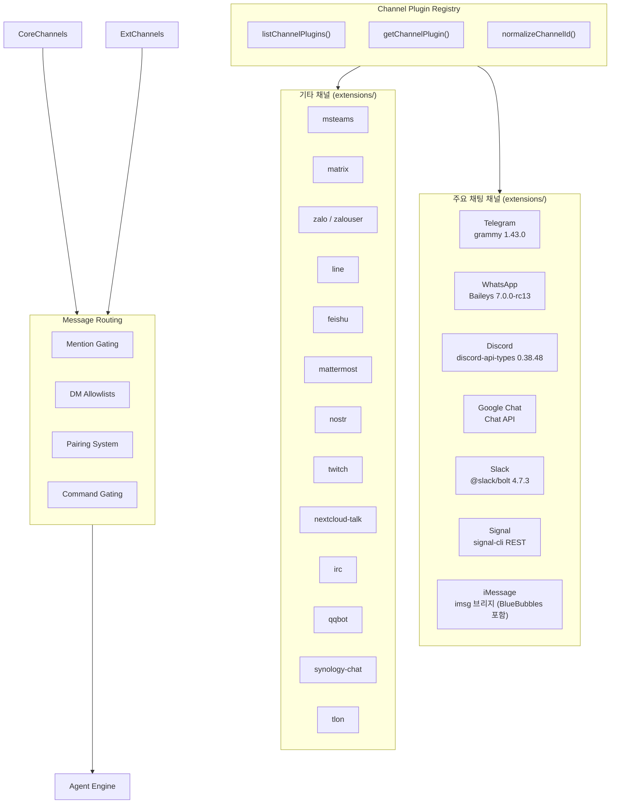
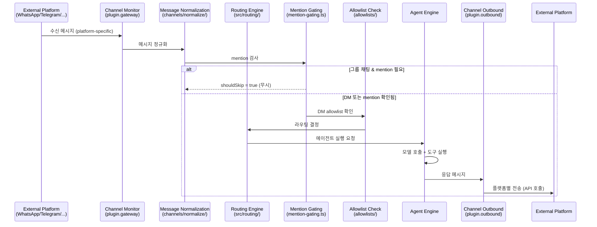

# 02. 채널/메시징 시스템 (Channel & Messaging System)

> 본 문서는 OpenClaw 2026.6.11 기준으로 갱신되었습니다.

## 개요

OpenClaw의 채널 시스템은 **플러그인 기반 추상화 계층**으로, 다양한 메시징 플랫폼을 통합된 인터페이스로 관리한다.
모든 채팅 채널은 `extensions/` 아래의 번들 채널 확장 패키지로 구현되며(매니페스트 기준 약 25개, 이 중 사용자용 메시징 채널 약 22개), 각 채널은 수신, 메시지 정규화, 라우팅, 응답 전송의 일관된 파이프라인을 따른다.

- **번들 채널 확장 (사용자용 메시징 채널 22개)**: `discord`, `feishu`, `googlechat`, `imessage`, `irc`, `line`, `matrix`, `mattermost`, `msteams`, `nextcloud-talk`, `nostr`, `qqbot`, `signal`, `slack`, `sms`, `synology-chat`, `telegram`, `tlon`, `twitch`, `whatsapp`, `zalo`, `zalouser` (이 외에 내부/테스트용 채널 확장 `clickclack`, `qa-channel`, `raft` 가 매니페스트에 포함되어 총 약 25개). 과거 별도 확장이던 `bluebubbles` 는 제거되고 iMessage 확장이 BlueBubbles 서버 경유 동작을 흡수했다.
- **채널 카탈로그**: 각 확장의 `package.json > openclaw.channel` 메타데이터(id, aliases, order)를 런타임에 읽어 `CHAT_CHANNEL_ORDER` / `CHAT_CHANNEL_ALIASES` 를 구성(`src/channels/bundled-channel-catalog-read.ts`)
- **플러그인 레지스트리**: 중복 제거 및 정렬된 채널 목록 제공
- **채널 라우팅**: mention-gating, DM allowlist, 페어링 시스템, 채널별 개별 설정

---

## 아키텍처 다이어그램



---

## Channel Plugin 인터페이스

`src/channels/plugins/types.plugin.ts`에서 정의된 `ChannelPlugin`은 각 채널이 구현해야 하는 계약(contract)이다.

### ChannelPlugin 타입

```typescript
// src/channels/plugins/types.plugin.ts
export type ChannelPlugin<ResolvedAccount = any, Probe = unknown, Audit = unknown> = {
  id: ChannelId;                           // 채널 고유 식별자 (예: "telegram")
  meta: ChannelMeta;                       // 메타데이터 (레이블, 문서 경로, 정렬 등)
  capabilities: ChannelCapabilities;       // 지원 기능 플래그

  defaults?: {
    queue?: { debounceMs?: number };       // 메시지 큐 디바운스 기본값
  };
  reload?: {                               // 핫 리로드 설정
    configPrefixes: string[];              // 이 접두사 변경 시 채널 재시작
    noopPrefixes?: string[];               // 이 접두사 변경은 무시
  };
  setupWizard?: ChannelSetupWizard | ChannelSetupWizardAdapter; // 온보딩 위저드

  // 어댑터 인터페이스들
  config: ChannelConfigAdapter<ResolvedAccount>;    // 설정 해석
  configSchema?: ChannelConfigSchema;               // 설정 JSON 스키마 + UI 힌트
  setup?: ChannelSetupAdapter;                      // 초기 설정 (토큰, QR 등)
  pairing?: ChannelPairingAdapter;                  // 디바이스 페어링
  security?: ChannelSecurityAdapter<ResolvedAccount>; // DM 정책, 허용목록
  groups?: ChannelGroupAdapter;                     // 그룹 채팅 관리
  mentions?: ChannelMentionAdapter;                 // 멘션 감지
  outbound?: ChannelOutboundAdapter;                // 발신 메시지 전송
  status?: ChannelStatusAdapter<ResolvedAccount, Probe, Audit>; // 상태 점검
  gateway?: ChannelGatewayAdapter<ResolvedAccount>; // 게이트웨이 통합
  gatewayMethods?: string[];                        // 채널 전용 RPC 메서드
  auth?: ChannelAuthAdapter;                        // 인증 (QR 로그인 등)
  approvalCapability?: ChannelApprovalCapability;   // 승인 인증 능력
  elevated?: ChannelElevatedAdapter;                // 권한 상승 작업
  commands?: ChannelCommandAdapter;                 // 텍스트 명령어 처리
  lifecycle?: ChannelLifecycleAdapter;              // 채널 라이프사이클 훅
  secrets?: ChannelSecretsAdapter;                  // 시크릿 입력 스키마
  allowlist?: ChannelAllowlistAdapter;              // 허용목록 어댑터
  doctor?: ChannelDoctorAdapter;                    // 진단 / 자가 점검
  bindings?: ChannelConfiguredBindingProvider;      // 설정 기반 바인딩 빌더
  conversationBindings?: ChannelConversationBindingSupport; // 대화 바인딩 지원
  streaming?: ChannelStreamingAdapter;              // 스트리밍 응답
  threading?: ChannelThreadingAdapter;              // 스레드/답장 관리
  messaging?: ChannelMessagingAdapter;              // 메시지 포맷팅
  agentPrompt?: ChannelAgentPromptAdapter;          // 에이전트 프롬프트 커스텀
  directory?: ChannelDirectoryAdapter;              // 연락처/그룹 디렉토리
  resolver?: ChannelResolverAdapter;                // 채널/사용자 해석
  actions?: ChannelMessageActionAdapter;            // 메시지 액션 (반응 등)
  heartbeat?: ChannelHeartbeatAdapter;              // 하트비트 통합
  agentTools?: ChannelAgentToolFactory | ChannelAgentTool[]; // 채널 전용 도구
};
```

`ChannelPlugin` 계약은 `packages/plugin-sdk` 의 플러그인 엔트리 규약과 맞물리며, 각 확장 패키지는 `packages/plugin-sdk/src/plugin-entry.ts` 에서 제공하는 러너에 의해 런타임에 로드된다.

### ChannelMeta 구조

```typescript
// src/channels/plugins/types.core.ts
export type ChannelMeta = {
  id: ChannelId;
  label: string;                   // "Telegram"
  selectionLabel: string;          // "Telegram (Bot API)"
  docsPath: string;                // "/channels/telegram"
  docsLabel?: string;
  blurb: string;                   // 간단한 설명 문자열
  order?: number;                  // 정렬 순서 (없으면 CHAT_CHANNEL_ORDER 기준)
  aliases?: string[];              // 대체 이름 (예: "imsg" -> "imessage")
  detailLabel?: string;            // "Telegram Bot"
  systemImage?: string;            // SF Symbols 아이콘 이름
  showConfigured?: boolean;
  quickstartAllowFrom?: boolean;
  forceAccountBinding?: boolean;
  preferSessionLookupForAnnounceTarget?: boolean;
  preferOver?: string[];
};
```

---

## 플러그인 레지스트리 (Plugin Registry)

`src/channels/plugins/index.ts`에서 채널 플러그인의 조회, 정렬, 정규화를 담당한다.

### 핵심 함수

`src/channels/plugins/index.ts` 는 레지스트리 API를 `./registry.js` 에서 re-export하며, 정렬/중복 제거는 `registry-loaded.ts` 에서 수행한다.

```typescript
// src/channels/plugins/registry-loaded.ts (요약)
combined.toSorted((a, b) => {
  const indexA = CHAT_CHANNEL_ORDER.indexOf(a.id);
  const indexB = CHAT_CHANNEL_ORDER.indexOf(b.id);
  const orderA = a.meta.order ?? (indexA === -1 ? 999 : indexA);
  const orderB = b.meta.order ?? (indexB === -1 ? 999 : indexB);
  if (orderA !== orderB) return orderA - orderB;
  return a.id.localeCompare(b.id);
});
```

### 정렬 우선순위 (CHAT_CHANNEL_ORDER)

`CHAT_CHANNEL_ORDER` 는 더 이상 코드 내 고정 배열이 아니다. 런타임에 번들된 각 채널 확장의 `package.json > openclaw.channel.{id, aliases, order}` 를 읽어 `order` 오름차순, 동일 order인 경우 `id.localeCompare()` 로 정렬한 배열을 만든다(`src/channels/ids.ts`).

```typescript
// src/channels/ids.ts (요약)
export const CHAT_CHANNEL_ORDER = Object.freeze(
  BUNDLED_CHAT_CHANNEL_ENTRIES.map((entry) => entry.id),
);
export const CHAT_CHANNEL_ALIASES: Record<string, ChatChannelId> = Object.freeze(
  Object.fromEntries(
    BUNDLED_CHAT_CHANNEL_ENTRIES.flatMap((entry) =>
      entry.aliases.map((alias) => [alias, entry.id] as const),
    ),
  ),
);
```

`CHANNEL_IDS` 는 `CHAT_CHANNEL_ORDER` 와 동일하며, 구성에 없거나 정규화되지 않은 id는 `normalizeChatChannelId()` 에서 `null` 을 반환한다.

### 레지스트리 API

| 함수 | 설명 |
|------|------|
| `listChannelPlugins()` | 중복 제거 후 정렬된 전체 채널 플러그인 목록 반환 |
| `getChannelPlugin(id)` | 특정 ID의 채널 플러그인 조회 |
| `normalizeChannelId(raw)` | 입력 문자열을 정규화된 ChannelId로 변환 (alias 해석 포함) |

### 채널 ID 별칭 (Aliases)

별칭도 각 확장 패키지의 `openclaw.channel.aliases` 배열에서 수집된다. 대표 예시:

- `imsg`, `messages` -> `imessage`
- `google-chat`, `gchat` -> `googlechat`
- `ms-teams`, `teams` -> `msteams`
- `zalo-user` -> `zalouser`

`normalizeChatChannelId(raw)` 는 소문자로 정규화한 뒤 alias 매핑을 적용하고, 결과가 번들된 채널 id 집합에 없으면 `null` 을 반환한다.

---

## 메시지 플로우 시퀀스 다이어그램



---

## 채널 라우팅

### Mention Gating

`src/channels/mention-gating.ts`에서 그룹 채팅의 멘션 게이팅 로직을 처리한다.

```typescript
// src/channels/mention-gating.ts
export function resolveMentionGating(params: MentionGateParams): MentionGateResult {
  const implicit = params.implicitMention === true;
  const bypass = params.shouldBypassMention === true;
  const effectiveWasMentioned = params.wasMentioned || implicit || bypass;
  const shouldSkip = params.requireMention && params.canDetectMention && !effectiveWasMentioned;
  return { effectiveWasMentioned, shouldSkip };
}
```

그룹 채팅에서 봇이 명시적으로 멘션되지 않은 메시지는 `shouldSkip = true`로 무시된다.
단, 텍스트 명령어가 감지되고 명령어 권한이 있는 경우 `shouldBypassMention`으로 우회할 수 있다.

### DM Allowlist

채널별 DM 허용 목록은 설정 파일에서 관리되며, `src/channels/allowlists/` 디렉토리에서 처리한다.

### 페어링 시스템

`src/pairing/` 디렉토리에서 디바이스 페어링을 관리한다:

| 파일 | 역할 |
|------|------|
| `pairing-store.ts` | 페어링 상태 영속화 |
| `pairing-messages.ts` | 페어링 메시지 생성 |
| `pairing-labels.ts` | 페어링 레이블 포맷팅 |

### 명령어 게이팅

`src/channels/command-gating.ts`에서 텍스트 명령어의 권한 검사를 수행한다.

---

## 주요 채널 구현

모든 채널은 `extensions/<channel>/` 확장 패키지로 구현된다. 상위 번들 기준 주요 구현 라이브러리:

| 채널 | 라이브러리 | 소스 위치 | 프로토콜 |
|------|-----------|-----------|----------|
| **WhatsApp** | `baileys` 7.0.0-rc13 | `extensions/whatsapp/` | WhatsApp Web (QR 링크) |
| **Telegram** | `grammy` 1.43.0 | `extensions/telegram/` | Telegram Bot API |
| **Discord** | `discord-api-types` 0.38.48 | `extensions/discord/` | Discord Bot API |
| **Google Chat** | Chat API (HTTP webhook) | `extensions/googlechat/` | Google Workspace Chat |
| **Slack** | `@slack/bolt` 4.7.3 | `extensions/slack/` | Slack Socket Mode |
| **Signal** | signal-cli REST (내부 `ws` 클라이언트) | `extensions/signal/` | signal-cli REST API |
| **iMessage** | imsg 브리지 (macOS 네이티브, BlueBubbles 포함) | `extensions/imessage/` | macOS Messages / BlueBubbles 서버 |

---

## 확장 채널 (Extension Channels)

확장 채널은 `extensions/` 디렉토리의 독립된 워크스페이스 패키지로 구현된다.
각 확장은 자체 `package.json`을 가지며, 런타임 의존성은 `dependencies`에 선언한다.

### 번들된 채팅 채널 확장 (사용자용 22개)

| 확장 | 디렉토리 | 설명 |
|------|----------|------|
| **Telegram** | `extensions/telegram/` | Telegram Bot API |
| **WhatsApp** | `extensions/whatsapp/` | WhatsApp Web (Baileys) |
| **Discord** | `extensions/discord/` | Discord Bot |
| **Slack** | `extensions/slack/` | Slack (Bolt Socket Mode) |
| **Signal** | `extensions/signal/` | Signal (signal-cli REST) |
| **iMessage** | `extensions/imessage/` | macOS 네이티브 iMessage (BlueBubbles 서버 경유 포함) |
| **SMS** | `extensions/sms/` | Twilio SMS |
| **Google Chat** | `extensions/googlechat/` | Google Workspace Chat |
| **Microsoft Teams** | `extensions/msteams/` | Microsoft Teams |
| **Matrix** | `extensions/matrix/` | Matrix 프로토콜 |
| **Feishu** | `extensions/feishu/` | 페이슈 / Lark |
| **LINE** | `extensions/line/` | LINE Messaging API |
| **Mattermost** | `extensions/mattermost/` | Mattermost 봇 |
| **Nextcloud Talk** | `extensions/nextcloud-talk/` | Nextcloud Talk |
| **Nostr** | `extensions/nostr/` | Nostr 프로토콜 |
| **Twitch** | `extensions/twitch/` | Twitch 채팅 |
| **IRC** | `extensions/irc/` | IRC 클라이언트 |
| **QQ Bot** | `extensions/qqbot/` | QQ 봇 |
| **Synology Chat** | `extensions/synology-chat/` | Synology Chat |
| **Tlon** | `extensions/tlon/` | Tlon (Urbit) |
| **Zalo** | `extensions/zalo/` | Zalo OA (공식 계정) |
| **Zalo Personal** | `extensions/zalouser/` | Zalo 개인 계정 |

이 외에 매니페스트(`package.json > openclaw.channel`)에는 내부/테스트용 채널 확장 `clickclack`, `qa-channel`, `raft` 가 함께 등록되어 채널 확장 총합은 약 25개다. 그리고 `extensions/` 디렉토리 전체에는 채널이 아닌 모델 프로바이더·음성/영상·메모리 등 다양한 플러그인이 함께 번들되어(예: `voice-call`, `copilot-proxy`, `memory-lancedb`, `diagnostics-otel` 등) 총 140여 개의 확장 패키지 디렉토리가 존재한다.

---

## 디렉토리 설정 (Directory Config)

채널별 연락처/그룹 디렉토리는 각 채널 플러그인의 `directory` 어댑터(`ChannelDirectoryAdapter`)가 제공하며, 공용 해석 로직은 다음 파일에 있다:

- `src/channels/plugins/directory-adapters.ts` — 어댑터 진입점
- `src/channels/plugins/directory-config-helpers.ts` — 설정 파싱/정규화 헬퍼
- `src/channels/plugins/directory-types.ts` — 디렉토리 타입

각 채널 확장은 이 어댑터를 구현해 설정 파일에서 peer/group 항목을 정규화된 배열로 반환한다.

---

## 채널 설정 매칭

`src/channels/plugins/channel-config.ts`에서 채널 설정의 매칭 및 해석을 담당한다.

### 설정 관련 Export

```typescript
// src/channels/plugins/index.ts (re-exports)
export {
  applyChannelMatchMeta,
  buildChannelKeyCandidates,
  normalizeChannelSlug,
  resolveChannelEntryMatch,
  resolveChannelEntryMatchWithFallback,
  resolveChannelMatchConfig,
  resolveNestedAllowlistDecision,
  type ChannelEntryMatch,
  type ChannelMatchSource,
} from "./channel-config.js";
```

---

## 메시지 액션

`src/channels/plugins/actions/` 디렉토리에서 플랫폼별 메시지 액션(리액션, 답장 등)을 정의한다.

| 액션 | 설명 |
|------|------|
| ACK 리액션 | 메시지 수신 확인 이모지 반응 (`src/channels/ack-reactions.ts`) |
| 타이핑 표시 | 입력 중 상태 전송 (`src/channels/typing.ts`) |
| 답장 프리픽스 | 발신자 라벨 접두사 (`src/channels/reply-prefix.ts`) |

---

## 채널 상태 관리

`src/channels/plugins/status.ts`에서 각 채널의 상태를 집계하며, 다음 상태를 추적한다:

```typescript
// src/channels/plugins/types.core.ts
export type ChannelAccountState =
  | "linked"          // 계정 연결됨
  | "not linked"      // 계정 미연결
  | "configured"      // 설정 완료
  | "not configured"  // 설정 미완료
  | "enabled"         // 활성화됨
  | "disabled";       // 비활성화됨
```

---

## 파일 구조

### src/channels/

```
src/channels/
├── plugins/
│   ├── index.ts                    # 플러그인 레지스트리 re-export 허브
│   ├── registry.ts                 # 런타임 레지스트리 (list/get/normalize)
│   ├── registry-loader.ts          # 번들 확장 로드/정렬
│   ├── registry-loaded.ts          # 로드된 플러그인 상태 관리
│   ├── module-loader.ts            # 채널 모듈 동적 import
│   ├── types.ts                    # 타입 re-export 허브
│   ├── types.plugin.ts             # ChannelPlugin 메인 타입
│   ├── types.core.ts               # 코어 타입 (ChannelMeta, ChannelId 등)
│   ├── types.adapters.ts           # 어댑터 인터페이스 타입
│   ├── types.config.ts             # 설정 타입
│   ├── types.public.ts             # 외부 공개 타입
│   ├── channel-config.ts           # 채널 설정 매칭 로직
│   ├── directory-adapters.ts       # 디렉토리 어댑터 진입점
│   ├── directory-config-helpers.ts # 디렉토리 설정 파싱
│   ├── directory-types.ts          # 디렉토리 타입
│   ├── config-helpers.ts           # 설정 헬퍼 유틸
│   ├── config-schema.ts            # 설정 JSON 스키마
│   ├── config-writes.ts            # 설정 쓰기
│   ├── catalog.ts                  # 채널 카탈로그
│   ├── helpers.ts                  # 공용 헬퍼
│   ├── setup-helpers.ts            # 설정 도우미
│   ├── setup-wizard.ts             # 통합 setup 위저드
│   ├── setup-registry.ts           # setup 전용 채널 레지스트리
│   ├── status.ts                   # 채널 상태 조회
│   ├── status-issues/              # 채널별 상태 이슈 정의
│   ├── pairing.ts                  # 채널 페어링
│   ├── pairing-adapters.ts         # 페어링 어댑터
│   ├── pairing-message.ts          # 페어링 메시지
│   ├── media-limits.ts             # 미디어 크기 제한
│   ├── media-payload.ts            # 미디어 페이로드 유틸
│   ├── message-action-names.ts     # 액션 이름 상수
│   ├── message-action-discovery.ts # 액션 발견
│   ├── message-action-dispatch.ts  # 액션 디스패치
│   ├── allowlist-match.ts          # 허용목록 매칭
│   ├── approvals.ts                # 승인 어댑터 해석
│   ├── outbound/                   # 발신 처리 서브모듈
│   ├── actions/                    # 플랫폼별 액션 처리
│   ├── stateful-target-*.ts        # 상태 기반 타깃 드라이버
│   └── bluebubbles-actions.ts      # BlueBubbles 액션
├── registry.ts                     # 코어 채널 레지스트리 (CHAT_CHANNEL_ORDER, 메타데이터)
├── allowlists/                     # DM 허용목록 관리
├── web/                            # WhatsApp Web 관련
├── mention-gating.ts               # 멘션 게이팅 로직
├── command-gating.ts               # 명령어 게이팅
├── chat-type.ts                    # 채팅 유형 판별 (DM/group)
├── channel-config.ts               # 채널 설정 해석
├── conversation-label.ts           # 대화 레이블 생성
├── ack-reactions.ts                # 수신 확인 리액션
├── typing.ts                       # 타이핑 표시
├── reply-prefix.ts                 # 답장 접두사
├── sender-identity.ts              # 발신자 식별
├── sender-label.ts                 # 발신자 레이블
├── session.ts                      # 채널 세션
├── targets.ts                      # 대상 해석
├── location.ts                     # 위치 메시지 처리
├── logging.ts                      # 채널 로깅
├── bundled-channel-catalog-read.ts # 번들 확장 package.json 에서 채널 카탈로그 로드
├── transport/                      # 수신/발신 공용 트랜스포트 유틸
└── *.test.ts                       # 테스트 파일
```

### src/routing/

```
src/routing/
├── resolve-route.ts                # 라우팅 해석 (채널 -> 에이전트)
├── bindings.ts                     # 채널-에이전트 바인딩
├── session-key.ts                  # 세션 키 생성
├── account-id.ts                   # 채널 계정 ID 정규화
├── account-lookup.ts               # 계정 조회/매칭
├── bound-account-read.ts           # 바인딩된 계정 읽기
├── default-account-warnings.ts     # 기본 계정 경고
└── *.test.ts                       # 테스트
```

### src/pairing/

```
src/pairing/
├── pairing-store.ts                # 페어링 상태 영속화
├── pairing-store.types.ts          # 페어링 스토어 타입
├── pairing-messages.ts             # 페어링 메시지 생성
├── pairing-labels.ts               # 페어링 레이블 포맷팅
├── pairing-challenge.ts            # 페어링 챌린지 생성/검증
├── setup-code.ts                   # 페어링 setup 코드
├── allow-from-store-read.ts        # allow-from 스토어 조회
└── *.test.ts                       # 테스트
```

### 주요 확장 디렉토리

```
extensions/
# 사용자용 채팅 채널 확장 (22개)
├── telegram/                       # Telegram
├── whatsapp/                       # WhatsApp (Baileys)
├── discord/                        # Discord
├── slack/                          # Slack
├── signal/                         # Signal (signal-cli REST)
├── imessage/                       # iMessage (macOS 네이티브, BlueBubbles 포함)
├── sms/                            # SMS (Twilio)
├── googlechat/                     # Google Chat
├── msteams/                        # Microsoft Teams
├── matrix/                         # Matrix
├── feishu/                         # 페이슈 / Lark
├── line/                           # LINE
├── mattermost/                     # Mattermost
├── nextcloud-talk/                 # Nextcloud Talk
├── nostr/                          # Nostr
├── twitch/                         # Twitch
├── irc/                            # IRC
├── qqbot/                          # QQ Bot
├── synology-chat/                  # Synology Chat
├── tlon/                           # Tlon (Urbit)
├── zalo/                           # Zalo OA
├── zalouser/                       # Zalo Personal
# 내부/테스트용 채널 확장
├── clickclack/                     # ClickClack (내부)
├── qa-channel/                     # QA 합성 채널
├── raft/                           # Raft CLI 브리지
# 채널이 아닌 기능 확장 (예시)
├── voice-call/                     # Voice Call
├── copilot-proxy/                  # Copilot 프록시
├── memory-core/                    # 메모리 코어
├── memory-lancedb/                 # LanceDB 메모리
├── llm-task/                       # LLM 태스크
├── diagnostics-otel/               # OpenTelemetry 진단
└── <45+ 모델 프로바이더>/          # anthropic, openai, google, xai, ... 등
```

---

## 채널 추가 시 체크리스트

채널 플러그인을 새로 추가할 때 반영해야 하는 항목 (CLAUDE.md 기준):

1. `ChannelPlugin` 인터페이스 구현 (최소: `id`, `meta`, `capabilities`, `config`)
2. 확장 패키지의 `package.json`에 런타임 의존성 선언
3. 플러그인 레지스트리에 등록 (extension entrypoint)
4. `.github/labeler.yml` 라벨 커버리지 업데이트
5. UI 표면 업데이트 (macOS app, Web UI, Mobile)
6. 문서 업데이트 (`docs/channels/`)
7. 온보딩/설정 폼 추가
8. 라우팅, allowlist, 페어링, 명령어 게이팅 공유 로직 확인
