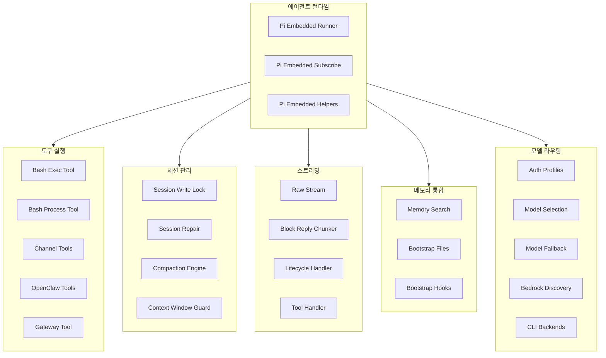
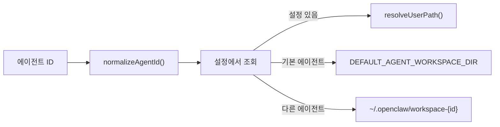
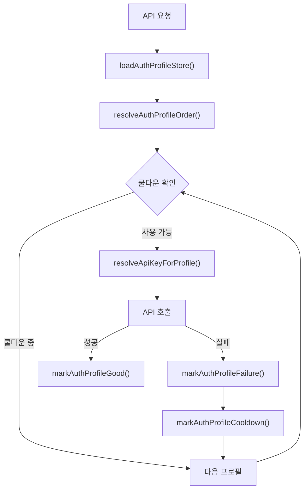
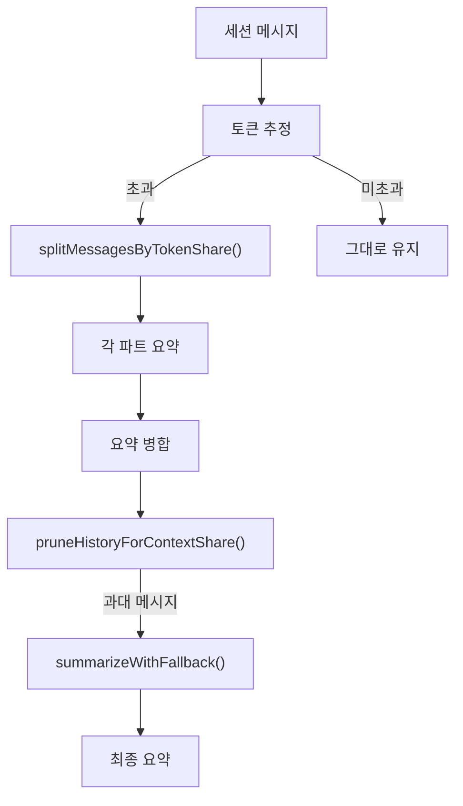
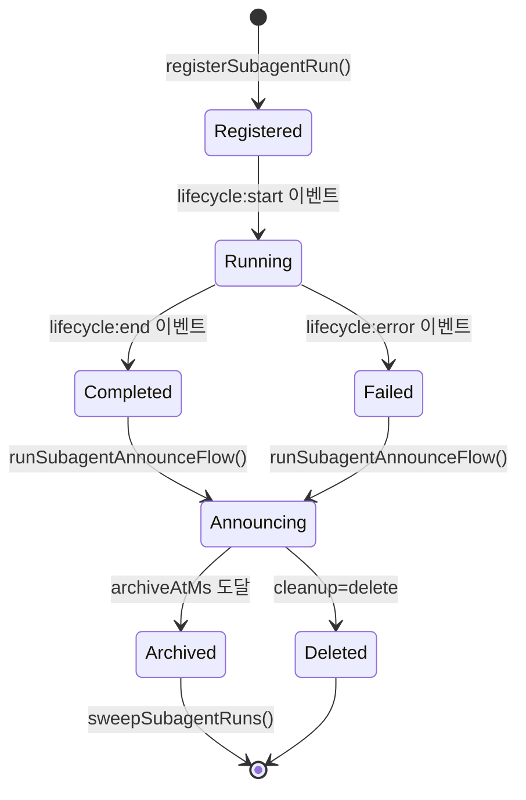
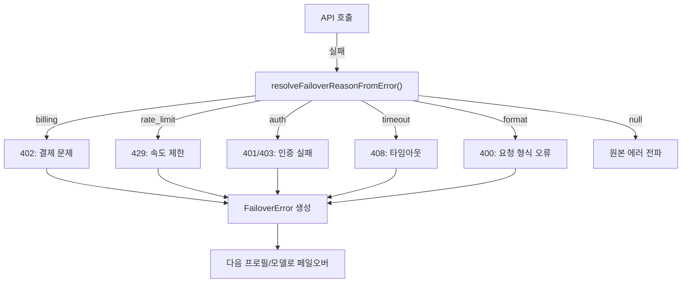
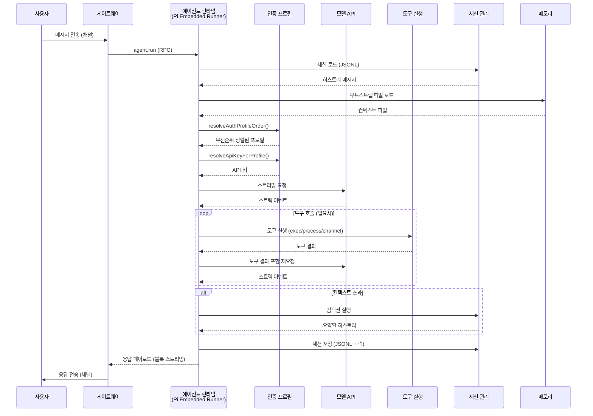

# 03. 에이전트 AI 시스템

## 1. 개요

OpenClaw의 에이전트 시스템은 **Pi 에이전트 코어(pi-agent-core)** 기반의 임베디드 AI 실행 엔진입니다. 공식 문서 용어로 에이전트는 "Pi" 로 지칭되며, 퍼스낼리티 계층은 `SOUL.md` 로 표현되는 "soul" 개념입니다. RPC 기반 명령 실행, 도구 스트리밍, 멀티 프로바이더 모델 라우팅을 통해 다양한 채널에서 수신된 사용자 메시지를 처리하고 AI 응답을 생성합니다.

### 핵심 특성

| 특성 | 설명 |
|------|------|
| 런타임 엔진 | Pi 임베디드 러너(`runEmbeddedPiAgent`) + 이벤트 구독(`subscribeEmbeddedPiSession`) |
| 에이전트 루프 | `agent` / `agent.wait` RPC, 세션 당 직렬화된 실행 레인(`lanes.ts`) |
| 도구 실행 | Bash exec/process, 채널 도구, OpenClaw 도구, MCP(`mcp-http`, `mcp-stdio`), 플러그인 도구 |
| 통신 프로토콜 | ACP (Agent Client Protocol, `src/acp/`), MCP (Model Context Protocol, `src/mcp/`, `src/agents/mcp-*`) |
| 멀티 에이전트 | 다중 에이전트 바인딩(`src/routing/`), 채널 계정 · 에이전트 매핑, 서브에이전트 위임 |
| 세션 관리 | JSONL 파일 기반, 파일 락, 컴팩션 체크포인트, 트랜스크립트 복구 |
| 스트리밍 | 블록 단위 청킹(`blockStreamingChunk` 800–1200자), 텍스트/메시지 경계 분할, 실시간 전송 |
| 모델 라우팅 | 45+ 모델 프로바이더(공식 문서 기준, `extensions/` 프로바이더 플러그인으로 동적 등록), 페일오버, 프로필 로테이션 |
| 메모리 통합 | 벡터 DB 검색, 세션 히스토리 요약, `sessions_history` 안전 회상 |
| 스킬 시스템 | 번들 스킬 + 워크스페이스/프로젝트/개인 스킬 계층, 온디맨드 등록 |

---

## 2. 아키텍처 다이어그램



---

## 3. 핵심 의존성

| 패키지 | 버전 | 역할 |
|--------|------|------|
| `@mariozechner/pi-agent-core` | 0.66.1 | 에이전트 코어 (메시지 타입, 스트림, 도구 인터페이스) |
| `@mariozechner/pi-ai` | 0.66.1 | AI 모델 추상화 (프로바이더, 스트리밍, 컨텍스트) |
| `@mariozechner/pi-coding-agent` | 0.66.1 | 코딩 에이전트 확장 (토큰 추정, 요약 생성) |
| `@agentclientprotocol/sdk` | - | ACP (Agent Client Protocol) SDK — `src/acp/` 에서 Gateway 세션과 브리지 |
| `@sinclair/typebox` | - | JSON Schema 기반 도구 파라미터 정의 |

> OpenClaw 2026.4.16 기준. `engines.node >= 22.14.0`.

```typescript
// 핵심 임포트 패턴
import type { AgentMessage, StreamFn, AgentTool, AgentToolResult } from "@mariozechner/pi-agent-core";
import type { ExtensionContext } from "@mariozechner/pi-coding-agent";
import { estimateTokens, generateSummary } from "@mariozechner/pi-coding-agent";
import { Type } from "@sinclair/typebox";
```

---

## 4. 에이전트 스코프 시스템

**파일:** `src/agents/agent-scope.ts`

에이전트 스코프 시스템은 멀티 에이전트 환경에서 각 에이전트의 워크스페이스, 디렉토리, 세션을 격리합니다.

### 핵심 함수

```typescript
// 에이전트 워크스페이스 디렉토리 해석
export function resolveAgentWorkspaceDir(cfg: OpenClawConfig, agentId: string) {
  const id = normalizeAgentId(agentId);
  const configured = resolveAgentConfig(cfg, id)?.workspace?.trim();
  if (configured) {
    return resolveUserPath(configured);
  }
  const defaultAgentId = resolveDefaultAgentId(cfg);
  if (id === defaultAgentId) {
    const fallback = cfg.agents?.defaults?.workspace?.trim();
    if (fallback) {
      return resolveUserPath(fallback);
    }
    return DEFAULT_AGENT_WORKSPACE_DIR;
  }
  return path.join(os.homedir(), ".openclaw", `workspace-${id}`);
}

// 기본 에이전트 ID 결정
export function resolveDefaultAgentId(cfg: OpenClawConfig): string {
  const agents = listAgents(cfg);
  if (agents.length === 0) {
    return DEFAULT_AGENT_ID;
  }
  const defaults = agents.filter((agent) => agent?.default);
  const chosen = (defaults[0] ?? agents[0])?.id?.trim();
  return normalizeAgentId(chosen || DEFAULT_AGENT_ID);
}
```

### 에이전트 설정 구조

```typescript
type ResolvedAgentConfig = {
  name?: string;           // 에이전트 표시 이름
  workspace?: string;      // 워크스페이스 경로
  agentDir?: string;       // 에이전트 상태 디렉토리
  model?: AgentEntry["model"];       // 모델 설정 (primary + fallbacks)
  skills?: AgentEntry["skills"];     // 허용 스킬 필터
  memorySearch?: AgentEntry["memorySearch"];  // 메모리 검색 설정
  humanDelay?: AgentEntry["humanDelay"];      // 응답 지연 시뮬레이션
  heartbeat?: AgentEntry["heartbeat"];        // 하트비트 설정
  identity?: AgentEntry["identity"];          // 아이덴티티 설정
  groupChat?: AgentEntry["groupChat"];        // 그룹 채팅 설정
  subagents?: AgentEntry["subagents"];        // 서브에이전트 설정
  sandbox?: AgentEntry["sandbox"];            // 샌드박스 설정
  tools?: AgentEntry["tools"];                // 도구 설정
};
```

### 경로 해석 흐름



---

## 5. 인증 프로필 시스템

**파일:** `src/agents/auth-profiles.ts`, `src/agents/auth-profiles/`

멀티 프로바이더 AI 모델 접근을 위한 인증 관리 시스템입니다. OAuth, API 키, 토큰 교환을 지원하며, 장애 시 자동 페일오버와 쿨다운을 제공합니다.

### 모듈 구조

| 파일 | 역할 |
|------|------|
| `auth-profiles/types.ts` | 타입 정의 (OAuthCredential, ApiKeyCredential, TokenCredential) |
| `auth-profiles/store.ts` | 프로필 저장소 (CRUD, 영속화) |
| `auth-profiles/profiles.ts` | 프로필 관리 (목록, 업서트, 마킹) |
| `auth-profiles/oauth.ts` | OAuth 토큰 교환, API 키 해석 |
| `auth-profiles/order.ts` | 프로필 우선순위 결정 (라운드 로빈) |
| `auth-profiles/usage.ts` | 사용 통계, 쿨다운, 장애 마킹 |
| `auth-profiles/display.ts` | 표시 라벨 생성 |
| `auth-profiles/doctor.ts` | 진단 힌트 포맷팅 |
| `auth-profiles/repair.ts` | OAuth 프로필 ID 불일치 복구 |
| `auth-profiles/paths.ts` | 저장소 경로 해석 |
| `auth-profiles/constants.ts` | Claude CLI, Codex CLI 프로필 ID 상수 |
| `auth-profiles/session-override.ts` | 세션별 프로필 오버라이드 |
| `auth-profiles/external-cli-sync.ts` | 외부 CLI 프로필 동기화 |

### 핵심 내보내기

```typescript
// 주요 기능 내보내기 (auth-profiles.ts)
export { resolveApiKeyForProfile } from "./auth-profiles/oauth.js";
export { resolveAuthProfileOrder } from "./auth-profiles/order.js";
export {
  listProfilesForProvider,
  markAuthProfileGood,
  setAuthProfileOrder,
  upsertAuthProfile,
} from "./auth-profiles/profiles.js";
export {
  ensureAuthProfileStore,
  loadAuthProfileStore,
  saveAuthProfileStore,
} from "./auth-profiles/store.js";
export {
  calculateAuthProfileCooldownMs,
  clearAuthProfileCooldown,
  isProfileInCooldown,
  markAuthProfileCooldown,
  markAuthProfileFailure,
  markAuthProfileUsed,
} from "./auth-profiles/usage.js";
```

### 인증 프로필 타입

```typescript
// 지원되는 자격 증명 유형
type OAuthCredential = { type: "oauth"; /* ... */ };
type ApiKeyCredential = { type: "api-key"; /* ... */ };
type TokenCredential = { type: "token"; /* ... */ };
type AuthProfileCredential = OAuthCredential | ApiKeyCredential | TokenCredential;
```

### 프로필 선택 흐름



---

## 6. CLI 백엔드 시스템

**파일:** `src/agents/cli-backends.ts`, `src/agents/claude-cli-runner.ts`, `src/agents/cli-runner.ts`, `src/agents/cli-runner/`

외부 CLI 도구(Claude CLI, Codex CLI, Opencode, Kimi Coding 등)를 에이전트 백엔드로 활용하는 시스템입니다. 각 백엔드의 기본 인자·세션 정책·모델 별칭은 더 이상 `cli-backends.ts` 내부 상수가 아니라 각 확장 플러그인(`extensions/codex/`, `extensions/opencode/`, `extensions/kimi-coding/` 등)과 setup 레지스트리(`src/plugins/setup-registry.ts`)에 분산 선언되며, `resolveRuntimeCliBackends()` / `resolvePluginSetupCliBackend()` 가 이를 수집하여 `ResolvedCliBackend` 로 합성합니다.

### ResolvedCliBackend 요약

```typescript
// src/agents/cli-backends.ts
export type ResolvedCliBackend = {
  id: string;
  config: CliBackendConfig;                // command/args/output/modelArg/sessionMode 등
  bundleMcp: boolean;
  bundleMcpMode?: CliBundleMcpMode;        // 예: "claude-config-file"
  pluginId?: string;
  transformSystemPrompt?: CliBackendPlugin["transformSystemPrompt"];
  textTransforms?: PluginTextTransforms;
};
```

모델 별칭은 각 백엔드의 `config.modelAliases` 에 정의되며 Claude 최신 모델(`claude-opus-4-6`, `claude-sonnet-4-6`, `claude-haiku-3-5` 등) 및 단축 별칭(`opus`, `sonnet`, `haiku`) 을 정규화합니다.

---

## 7. 세션 관리 시스템

### 7.1 세션 파일 락

**파일:** `src/agents/session-write-lock.ts`

파일 기반 배타적 잠금 메커니즘으로, 동시 세션 쓰기를 방지합니다.

```typescript
export async function acquireSessionWriteLock(params: {
  sessionFile: string;
  timeoutMs?: number;    // 기본값: 10,000ms
  staleMs?: number;      // 기본값: 30분
}): Promise<{ release: () => Promise<void> }> {
  // 1. 락 파일 생성 시도 (fs.open "wx" 플래그)
  // 2. 이미 존재하면: 소유자 PID 확인, 스테일 체크
  // 3. 재귀적 카운팅으로 동일 프로세스 재진입 허용
  // 4. 프로세스 종료 시 자동 정리 (SIGINT, SIGTERM, SIGQUIT, SIGABRT)
}
```

**락 파일 포맷:**

```json
{
  "pid": 12345,
  "createdAt": "2026-02-06T10:30:00.000Z"
}
```

### 7.2 컴팩션 (Compaction)

**파일:** `src/agents/compaction.ts`

세션 히스토리가 컨텍스트 윈도우를 초과할 때 오래된 메시지를 요약하여 압축합니다.

```typescript
// 핵심 상수
export const BASE_CHUNK_RATIO = 0.4;    // 기본 청크 비율
export const MIN_CHUNK_RATIO = 0.15;    // 최소 청크 비율
export const SAFETY_MARGIN = 1.2;       // 토큰 추정 오차 20% 버퍼

// 적응형 청크 비율 계산
export function computeAdaptiveChunkRatio(
  messages: AgentMessage[],
  contextWindow: number
): number {
  // 메시지 크기에 따라 청크 비율을 동적 조정
  // 큰 메시지 -> 작은 청크 -> 모델 한계 초과 방지
}

// 단계적 요약 (progressive summarization)
export async function summarizeInStages(params: {
  messages: AgentMessage[];
  model: NonNullable<ExtensionContext["model"]>;
  apiKey: string;
  signal: AbortSignal;
  reserveTokens: number;
  maxChunkTokens: number;
  contextWindow: number;
  customInstructions?: string;
  previousSummary?: string;
  parts?: number;                // 기본값: 2
}): Promise<string> {
  // 1. 메시지를 토큰 기준으로 N개 파트로 분할
  // 2. 각 파트별 요약 생성
  // 3. 부분 요약을 하나로 병합
}
```

### 컴팩션 흐름



### 7.3 컨텍스트 윈도우 가드

**파일:** `src/agents/context-window-guard.ts`

모델별 컨텍스트 윈도우 크기를 확인하고 안전 임계값을 적용합니다.

```typescript
export const CONTEXT_WINDOW_HARD_MIN_TOKENS = 16_000;    // 절대 최소
export const CONTEXT_WINDOW_WARN_BELOW_TOKENS = 32_000;  // 경고 임계값

export type ContextWindowSource = "model" | "modelsConfig" | "agentContextTokens" | "default";

// 컨텍스트 윈도우 해석 우선순위:
// 1. modelsConfig (사용자 설정의 모델별 contextWindow)
// 2. model (모델 메타데이터의 contextWindow)
// 3. default (기본값)
// + agentContextTokens 상한 적용
```

---

## 8. 도구 시스템

### 8.1 Bash 도구

**파일:** `src/agents/bash-tools.ts`, `src/agents/bash-tools.exec.ts`, `src/agents/bash-tools.process.ts`

#### Exec 도구

명령어를 실행하는 핵심 도구로, PTY 지원, 승인 흐름, 샌드박스 격리를 제공합니다.

```typescript
// bash-tools.ts - 진입점
export { createExecTool, execTool } from "./bash-tools.exec.js";
export { createProcessTool, processTool } from "./bash-tools.process.js";

// bash-tools.exec.ts - 실행 도구 임포트 (주요)
import type { AgentTool, AgentToolResult } from "@mariozechner/pi-agent-core";
import { Type } from "@sinclair/typebox";
// 보안: 승인 시스템, 허용 목록, 안전 바이너리
import {
  evaluateShellAllowlist,
  requiresExecApproval,
  resolveSafeBins,
  resolveExecApprovals,
} from "../infra/exec-approvals.js";
```

#### Process 도구

실행 중인 세션을 관리하는 도구입니다.

```typescript
const processSchema = Type.Object({
  action: Type.String({ description: "Process action" }),
  sessionId: Type.Optional(Type.String()),
  data: Type.Optional(Type.String()),          // write 데이터
  keys: Type.Optional(Type.Array(Type.String())),  // send-keys 토큰
  hex: Type.Optional(Type.Array(Type.String())),   // hex 바이트
  literal: Type.Optional(Type.String()),       // 리터럴 문자열
  text: Type.Optional(Type.String()),          // paste 텍스트
  bracketed: Type.Optional(Type.Boolean()),    // bracketed paste 모드
  eof: Type.Optional(Type.Boolean()),          // stdin 종료
  offset: Type.Optional(Type.Number()),        // 로그 오프셋
  limit: Type.Optional(Type.Number()),         // 로그 길이
});
// 지원 액션: list, poll, log, write, send-keys, submit, paste, kill
```

### 8.2 채널 도구

**파일:** `src/agents/channel-tools.ts`

채널 플러그인이 제공하는 에이전트 도구를 집계합니다.

```typescript
// 채널별 지원 액션 조회
export function listChannelSupportedActions(params: {
  cfg?: OpenClawConfig;
  channel?: string;
}): ChannelMessageActionName[] { /* ... */ }

// 모든 채널의 에이전트 도구 집계
export function listChannelAgentTools(params: {
  cfg?: OpenClawConfig;
}): ChannelAgentTool[] { /* ... */ }

// 채널별 메시지 도구 힌트 해석
export function resolveChannelMessageToolHints(params: {
  cfg?: OpenClawConfig;
  channel?: string | null;
  accountId?: string | null;
}): string[] { /* ... */ }
```

### 8.3 도구 스키마 가드레일

OpenClaw는 다양한 모델 프로바이더 호환성을 위해 도구 스키마에 엄격한 제약을 적용합니다.

| 규칙 | 설명 |
|------|------|
| `anyOf` 금지 | JSON Schema에서 `anyOf` 사용 금지 |
| `oneOf` 금지 | JSON Schema에서 `oneOf` 사용 금지 |
| `allOf` 금지 | JSON Schema에서 `allOf` 사용 금지 |
| `Type.Union` 최소화 | Typebox `Type.Union` 사용 자제 |
| `stringEnum` 사용 | 문자열 열거형은 `Type.Unsafe` 기반 enum 사용 |
| `Type.Optional` 사용 | nullable 대신 `Type.Optional(...)` 사용 |
| 최상위 `type: "object"` | 도구 스키마 최상위는 반드시 object |
| `format` 속성 금지 | 일부 검증기가 예약어로 처리하여 거부 |

---

## 9. 아이덴티티 시스템

### 9.1 에이전트 아이덴티티

**파일:** `src/agents/identity.ts`

에이전트의 표시 이름, 이모지, 메시지 접두사를 관리합니다.

```typescript
// 채널별 응답 접두사 해석 (4단계 우선순위)
export function resolveResponsePrefix(
  cfg: OpenClawConfig,
  agentId: string,
  opts?: { channel?: string; accountId?: string },
): string | undefined {
  // L1: 채널 계정 레벨 (channels.{channel}.accounts.{accountId}.responsePrefix)
  // L2: 채널 레벨 (channels.{channel}.responsePrefix)
  // L4: 글로벌 레벨 (messages.responsePrefix)
  // "auto" -> resolveIdentityNamePrefix() -> "[에이전트이름]"
}
```

### 9.2 아이덴티티 파일

**파일:** `src/agents/identity-file.ts`

워크스페이스의 마크다운 아이덴티티 파일을 파싱합니다.

```typescript
export type AgentIdentityFile = {
  name?: string;      // 에이전트 이름
  emoji?: string;     // 시그니처 이모지
  theme?: string;     // 테마
  creature?: string;  // 캐릭터 유형
  vibe?: string;      // 분위기/성격
  avatar?: string;    // 아바타 경로/URL
};

// 마크다운 파싱: "- name: MyAgent" 형식
export function parseIdentityMarkdown(content: string): AgentIdentityFile { /* ... */ }
```

### 9.3 아바타 해석

**파일:** `src/agents/identity-avatar.ts`

```typescript
export type AgentAvatarResolution =
  | { kind: "none"; reason: string }      // 아바타 없음
  | { kind: "local"; filePath: string }   // 로컬 파일
  | { kind: "remote"; url: string }       // HTTP(S) URL
  | { kind: "data"; url: string };        // data: URI

// 허용 확장자: .png, .jpg, .jpeg, .gif, .webp, .svg
// 보안: 워크스페이스 외부 경로 차단 (isPathWithin 검증)
```

---

## 10. 부트스트랩 시스템

### 10.1 부트스트랩 훅

**파일:** `src/agents/bootstrap-hooks.ts`

에이전트 시작 시 부트스트랩 파일을 내부 훅으로 오버라이드할 수 있게 합니다.

```typescript
export async function applyBootstrapHookOverrides(params: {
  files: WorkspaceBootstrapFile[];
  workspaceDir: string;
  config?: OpenClawConfig;
  sessionKey?: string;
  sessionId?: string;
  agentId?: string;
}): Promise<WorkspaceBootstrapFile[]> {
  // createInternalHookEvent("agent", "bootstrap", ...) 이벤트 발행
  // 플러그인/확장이 부트스트랩 파일을 수정할 수 있음
}
```

### 10.2 부트스트랩 파일

**파일:** `src/agents/bootstrap-files.ts`

세션 실행 시 워크스페이스 부트스트랩 파일을 로드하고 컨텍스트로 변환합니다.

```typescript
export async function resolveBootstrapContextForRun(params: {
  workspaceDir: string;
  config?: OpenClawConfig;
  sessionKey?: string;
  sessionId?: string;
  agentId?: string;
  warn?: (message: string) => void;
}): Promise<{
  bootstrapFiles: WorkspaceBootstrapFile[];
  contextFiles: EmbeddedContextFile[];
}> {
  // 1. loadWorkspaceBootstrapFiles() - 워크스페이스 파일 로드
  // 2. filterBootstrapFilesForSession() - 세션별 필터링
  // 3. applyBootstrapHookOverrides() - 훅 오버라이드 적용
  // 4. buildBootstrapContextFiles() - 컨텍스트 파일 변환
}
```

---

## 11. 스킬 시스템

**파일:** `src/agents/skills.ts`, `src/agents/skills/`

53개의 번들 스킬을 관리하며, 에이전트별로 허용 스킬을 필터링하고 온디맨드로 등록합니다.

### 번들 스킬 (53개, `skills/` 디렉토리)

```
1password, apple-notes, apple-reminders, bear-notes, blogwatcher, blucli,
bluebubbles, camsnap, canvas, clawhub, coding-agent, discord, eightctl,
gemini, gh-issues, gifgrep, github, gog, goplaces, healthcheck, himalaya,
imsg, mcporter, model-usage, nano-pdf, node-connect, notion, obsidian,
openai-whisper, openai-whisper-api, openhue, oracle, ordercli, peekaboo,
sag, session-logs, sherpa-onnx-tts, skill-creator, slack, songsee,
sonoscli, spotify-player, summarize, taskflow, taskflow-inbox-triage,
things-mac, tmux, trello, video-frames, voice-call, wacli, weather, xurl
```

스킬 로드 우선순위(공식 문서 `concepts/agent.md` 기준):

1. 워크스페이스: `<workspace>/skills`
2. 프로젝트 에이전트 스킬: `<workspace>/.agents/skills`
3. 개인 에이전트 스킬: `~/.agents/skills`
4. Managed/local: `~/.openclaw/skills`
5. 번들: `skills/` (설치본과 함께 배포)
6. 추가 경로: `skills.load.extraDirs`

### 스킬 관리 함수

```typescript
// 스킬 내보내기 (skills.ts)
export {
  buildWorkspaceSkillSnapshot,      // 워크스페이스 스킬 스냅샷 생성
  buildWorkspaceSkillsPrompt,       // 에이전트 프롬프트에 스킬 설명 포함
  buildWorkspaceSkillCommandSpecs,  // 커맨드 스펙 빌드
  filterWorkspaceSkillEntries,      // 에이전트별 스킬 필터링
  loadWorkspaceSkillEntries,        // 워크스페이스에서 스킬 로드
  resolveSkillsPromptForRun,        // 런타임 스킬 프롬프트 해석
  syncSkillsToWorkspace,            // 스킬을 워크스페이스에 동기화
} from "./skills/workspace.js";

// 설치 환경 설정
export function resolveSkillsInstallPreferences(config?: OpenClawConfig): SkillsInstallPreferences {
  // preferBrew: 기본 true (macOS Homebrew 우선)
  // nodeManager: npm | pnpm | yarn | bun (기본: npm)
}
```

---

## 12. 서브에이전트 레지스트리

**파일:** `src/agents/subagent-registry.ts`

서브에이전트 실행을 등록, 추적, 정리하는 레지스트리입니다.

```typescript
export type SubagentRunRecord = {
  runId: string;                    // 실행 고유 ID
  childSessionKey: string;          // 자식 세션 키
  requesterSessionKey: string;      // 요청자 세션 키
  requesterOrigin?: DeliveryContext; // 요청 출처
  requesterDisplayKey: string;      // 표시용 키
  task: string;                     // 작업 설명
  cleanup: "delete" | "keep";       // 완료 후 정리 정책
  label?: string;                   // 라벨
  createdAt: number;                // 생성 시각
  startedAt?: number;               // 시작 시각
  endedAt?: number;                 // 종료 시각
  outcome?: SubagentRunOutcome;     // 결과 (ok | error)
  archiveAtMs?: number;             // 아카이브 예정 시각
  cleanupCompletedAt?: number;      // 정리 완료 시각
};

// 주요 함수
export function registerSubagentRun(params: { /* ... */ }): void;
export function releaseSubagentRun(runId: string): void;
export function listSubagentRunsForRequester(requesterSessionKey: string): SubagentRunRecord[];
export function initSubagentRegistry(): void;
```

### 서브에이전트 생명주기



---

## 13. Bedrock 디스커버리

**파일:** `extensions/amazon-bedrock/discovery.ts` (과거 `src/agents/bedrock-discovery.ts` 에서 플러그인으로 이관)

AWS Bedrock 모델 디스커버리는 `extensions/amazon-bedrock/` 확장 플러그인이 담당하며, 다른 모델 프로바이더와 동일하게 `registerProvider({ catalog })` 경유로 모델 카탈로그를 주입합니다. 기본 필터링 기준(상태 `ACTIVE`, 텍스트 출력, 스트리밍 지원, 프로바이더 필터)과 캐시/갱신 주기는 플러그인 내부에서 유지됩니다. `mantle` 변형은 `extensions/amazon-bedrock-mantle/` 에 별도 존재합니다.

이와 동일한 방식으로 45개 이상의 모델 프로바이더(anthropic, openai, google, xai, openrouter, groq, mistral, perplexity, deepseek, moonshot, qwen, zai, ollama, lmstudio, vllm, fireworks, together, venice, minimax, nvidia, vercel-ai-gateway 등 다수)가 `extensions/` 에 플러그인으로 제공됩니다.

---

## 14. 캐시 트레이스

**파일:** `src/agents/cache-trace.ts`

디버깅용 세션 캐시 동작 추적 시스템입니다.

```typescript
export type CacheTraceStage =
  | "session:loaded"      // 세션 로드됨
  | "session:sanitized"   // 세션 정제됨
  | "session:limited"     // 세션 제한됨
  | "prompt:before"       // 프롬프트 전
  | "prompt:images"       // 이미지 처리
  | "stream:context"      // 스트림 컨텍스트
  | "session:after";      // 세션 후

// JSONL 형식으로 기록, SHA-256 기반 메시지 핑거프린트
// 활성화: OPENCLAW_CACHE_TRACE=1 환경 변수 또는 diagnostics.cacheTrace.enabled 설정
```

---

## 15. 페일오버 에러 처리

**파일:** `src/agents/failover-error.ts`

모델 API 호출 실패 시 구조화된 에러 분류와 자동 페일오버를 지원합니다.

```typescript
export class FailoverError extends Error {
  readonly reason: FailoverReason;   // billing | rate_limit | auth | timeout | format
  readonly provider?: string;
  readonly model?: string;
  readonly profileId?: string;
  readonly status?: number;          // HTTP 상태 코드
  readonly code?: string;            // 에러 코드
}

// 에러 분류 매핑
// 402 -> billing, 429 -> rate_limit, 401/403 -> auth, 408 -> timeout
// ETIMEDOUT, ECONNRESET -> timeout
// TimeoutError, AbortError -> timeout
```

### 페일오버 흐름



---

## 16. 에이전트 메시지 처리 시퀀스



---

## 16.1 ACP · MCP · 멀티 에이전트 라우팅

### ACP (Agent Client Protocol)

**파일:** `src/acp/`

`openclaw acp` 명령은 stdio 기반 ACP 에이전트를 노출하고, 프롬프트를 실행 중인 OpenClaw Gateway 로 WebSocket 을 통해 전달합니다. ACP 세션 id 와 Gateway 세션 키를 매핑해 IDE 가 동일한 에이전트 트랜스크립트에 재접속하거나 리셋할 수 있게 합니다.

- `client.ts` — Gateway WebSocket 클라이언트 브리지
- `server.ts`, `session.ts` — ACP 세션/서버 구현
- `translator.ts` — ACP <-> Gateway 이벤트/오류 매퍼
- `persistent-bindings.*` — ACP 세션과 Gateway 세션 키의 안정적 매핑
- `approval-classifier.ts`, `policy.ts` — 승인·정책 처리
- SDK: `@agentclientprotocol/sdk`
- 상세: 리포지토리 최상위 `docs.acp.md`

### MCP (Model Context Protocol)

**파일:** `src/mcp/`, `src/agents/mcp-*.ts`, `src/agents/pi-bundle-mcp-*.ts`

MCP 서버를 채널 도구로 브리지하고, 번들된 MCP 툴을 에이전트 세션에 주입합니다.

- `src/mcp/channel-bridge.ts`, `channel-server.ts` — 채널 도구 <-> MCP 서버 브리지
- `src/mcp/plugin-tools-serve.ts` — 플러그인 도구를 MCP 로 노출
- `src/agents/mcp-http.ts`, `mcp-stdio.ts`, `mcp-transport.ts` — MCP 트랜스포트
- `src/agents/pi-bundle-mcp-runtime.ts`, `pi-bundle-mcp-tools.ts` — CLI 백엔드에 MCP 툴 번들 주입
- 게이트웨이 HTTP: `src/gateway/mcp-http.ts`

### 멀티 에이전트 라우팅

**공식 문서:** `concepts/multi-agent.md`

하나의 Gateway 프로세스 안에서 여러 개의 **격리된 에이전트**(워크스페이스 + `agentDir` + 세션 분리)와 여러 채널 계정(예: WhatsApp 2개)을 동시에 운용할 수 있습니다. 인바운드는 바인딩을 통해 에이전트로 라우팅됩니다.

- 에이전트 스코프: 각 에이전트는 `~/.openclaw/agents/<agentId>/` 아래 `agent/auth-profiles.json`, `sessions/` 을 별도 보유
- 라우팅 코드: `src/routing/` (resolve-route, bindings, account-lookup, session-key 등)
- 바인딩 레지스트리: `src/channels/plugins/configured-binding-*.ts`, `bindings.ts`
- 서브에이전트: `src/agents/subagent-*.ts` — 부모 세션에서 자식 세션을 생성·추적·알림

---

## 17. 파일 구조

```
src/agents/
├── agent-scope.ts                    # 에이전트 스코프 (워크스페이스, ID 해석)
├── agent-paths.ts                    # 에이전트 경로 유틸리티
│
├── auth-profiles.ts                  # 인증 프로필 진입점
├── auth-profiles/                    # 인증 프로필 서브모듈
│   ├── constants.ts                  #   상수 (CLAUDE_CLI, CODEX_CLI 프로필 ID)
│   ├── display.ts                    #   표시 라벨
│   ├── doctor.ts                     #   진단 힌트
│   ├── external-cli-sync.ts          #   외부 CLI 동기화
│   ├── oauth.ts                      #   OAuth 토큰 교환
│   ├── order.ts                      #   프로필 우선순위
│   ├── paths.ts                      #   저장소 경로
│   ├── profiles.ts                   #   프로필 CRUD
│   ├── repair.ts                     #   프로필 복구
│   ├── session-override.ts           #   세션별 오버라이드
│   ├── store.ts                      #   프로필 저장소
│   ├── types.ts                      #   타입 정의
│   └── usage.ts                      #   사용 통계, 쿨다운
│
├── bash-tools.ts                     # Bash 도구 진입점
├── bash-tools.exec.ts                # Exec 도구 (명령 실행)
├── bash-tools.process.ts             # Process 도구 (세션 관리)
├── bash-tools.shared.ts              # 공유 유틸리티
├── bash-process-registry.ts          # 프로세스 세션 레지스트리
│
├── bootstrap-files.ts                # 부트스트랩 파일 로딩
├── bootstrap-hooks.ts                # 부트스트랩 훅 오버라이드
│
├── cache-trace.ts                    # 캐시 트레이스 (디버깅)
├── channel-tools.ts                  # 채널 도구 집계
├── cli-backends.ts                   # CLI 백엔드 (Claude, Codex)
├── cli-runner.ts                     # CLI 러너
├── claude-cli-runner.ts              # Claude CLI 러너
│
├── compaction.ts                     # 세션 컴팩션 (요약)
├── context-window-guard.ts           # 컨텍스트 윈도우 가드
├── context.ts                        # 컨텍스트 유틸리티
│
├── failover-error.ts                 # 페일오버 에러
├── failover-policy.ts                # 페일오버 정책 (Bedrock 디스커버리는 extensions/amazon-bedrock/ 로 이관)
│
├── identity.ts                       # 에이전트 아이덴티티
├── identity-file.ts                  # 아이덴티티 파일 파싱
├── identity-avatar.ts                # 아바타 해석
│
├── model-auth.ts                     # 모델 인증
├── model-catalog.ts                  # 모델 카탈로그
├── model-fallback.ts                 # 모델 페일오버
├── model-scan.ts                     # 모델 스캔
├── model-selection.ts                # 모델 선택
├── models-config.ts                  # 모델 설정
├── models-config.providers.ts        # 프로바이더별 모델 설정
│
├── memory-search.ts                  # 메모리 검색 통합
│
├── pi-embedded.ts                    # Pi 임베디드 모드 진입점
├── pi-embedded-runner.ts             # Pi 임베디드 러너
├── pi-embedded-subscribe.ts          # Pi 임베디드 구독
├── pi-embedded-helpers.ts            # Pi 임베디드 헬퍼
├── pi-embedded-messaging.ts          # Pi 임베디드 메시징
├── pi-embedded-utils.ts              # Pi 임베디드 유틸리티
├── pi-embedded-block-chunker.ts      # 블록 청킹
│
├── pi-tools.ts                       # Pi 도구 정의
├── pi-tools.schema.ts                # 도구 스키마
├── pi-tools.types.ts                 # 도구 타입
├── pi-tools.policy.ts                # 도구 정책
├── pi-tools.abort.ts                 # 도구 중단
├── pi-tools.before-tool-call.ts      # 도구 호출 전 훅
├── pi-tools.read.ts                  # 읽기 도구
├── pi-tool-definition-adapter.ts     # 도구 정의 어댑터
│
├── session-write-lock.ts             # 세션 쓰기 락
├── session-file-repair.ts            # 세션 파일 복구
├── session-transcript-repair.ts      # 트랜스크립트 복구
├── session-slug.ts                   # 세션 슬러그
├── session-tool-result-guard.ts      # 도구 결과 가드
│
├── skills.ts                         # 스킬 시스템 진입점
├── skills/                           # 스킬 서브모듈
├── skills-install.ts                 # 스킬 설치
├── skills-status.ts                  # 스킬 상태
│
├── subagent-registry.ts              # 서브에이전트 레지스트리
├── subagent-registry.store.ts        # 서브에이전트 영속화
├── subagent-announce.ts              # 서브에이전트 알림
├── subagent-announce-queue.ts        # 알림 큐
│
├── sandbox.ts                        # 샌드박스 관리
├── sandbox/                          # 샌드박스 서브모듈
│
├── system-prompt.ts                  # 시스템 프롬프트
├── system-prompt-params.ts           # 시스템 프롬프트 파라미터
│
├── tool-policy.ts                    # 도구 정책
├── tool-display.ts                   # 도구 표시
├── tool-call-id.ts                   # 도구 호출 ID
├── tool-images.ts                    # 도구 이미지
├── tool-description-summary.ts       # 도구 설명 요약
├── tool-error-summary.ts             # 도구 오류 요약
│
├── mcp-http.ts                       # MCP HTTP 트랜스포트
├── mcp-stdio.ts                      # MCP stdio 트랜스포트
├── mcp-transport.ts                  # MCP 공통 트랜스포트
├── pi-bundle-mcp-runtime.ts          # CLI 백엔드용 MCP 번들 런타임
├── pi-bundle-mcp-tools.ts            # 번들된 MCP 도구 주입
│
├── usage.ts                          # 사용량 추적
├── workspace.ts                      # 워크스페이스 관리
├── workspace-templates.ts            # 워크스페이스 템플릿
├── defaults.ts                       # 기본값
├── lanes.ts                          # 레인 관리
├── timeout.ts                        # 타임아웃 설정
└── date-time.ts                      # 날짜/시간 유틸리티
```

---

## 18. 요약

OpenClaw 에이전트 시스템(공식 용어: "Pi") 은 다음과 같은 계층으로 구성됩니다:

1. **Pi 임베디드 러너** - 핵심 에이전트 런타임으로, 모델 API 호출과 도구 실행 루프를 관리 (`runEmbeddedPiAgent` + `subscribeEmbeddedPiSession`)
2. **에이전트 루프 · 큐 · 스트리밍** - `agent` / `agent.wait` RPC, 세션 당 직렬 실행 레인, 블록 단위 청킹
3. **인증 프로필** - 멀티 프로바이더 인증, 자동 로테이션, 쿨다운 기반 페일오버
4. **세션 관리** - JSONL 영속화, 파일 락, 컨텍스트 오버플로우 시 자동 컴팩션
5. **도구 시스템** - Bash exec/process, 채널 도구, OpenClaw 도구, MCP, Typebox 스키마 기반 파라미터 검증
6. **소울(SOUL.md) · 아이덴티티** - 에이전트 이름/이모지/아바타 + 성격/톤 계층의 다단계 해석
7. **멀티 에이전트 라우팅 · 서브에이전트** - `src/routing/` 의 바인딩, 서브에이전트 자식 세션 생성·추적·알림
8. **프로토콜 통합** - ACP(`src/acp/`) 로 IDE 연동, MCP(`src/mcp/`, `src/agents/mcp-*`) 로 외부 도구 연결
9. **스킬 시스템** - 번들/워크스페이스/프로젝트/개인 스킬 계층의 온디맨드 등록과 에이전트별 필터링
10. **모델 프로바이더** - 45+ 프로바이더(`extensions/`) 플러그인으로 동적 등록 및 카탈로그 주입
