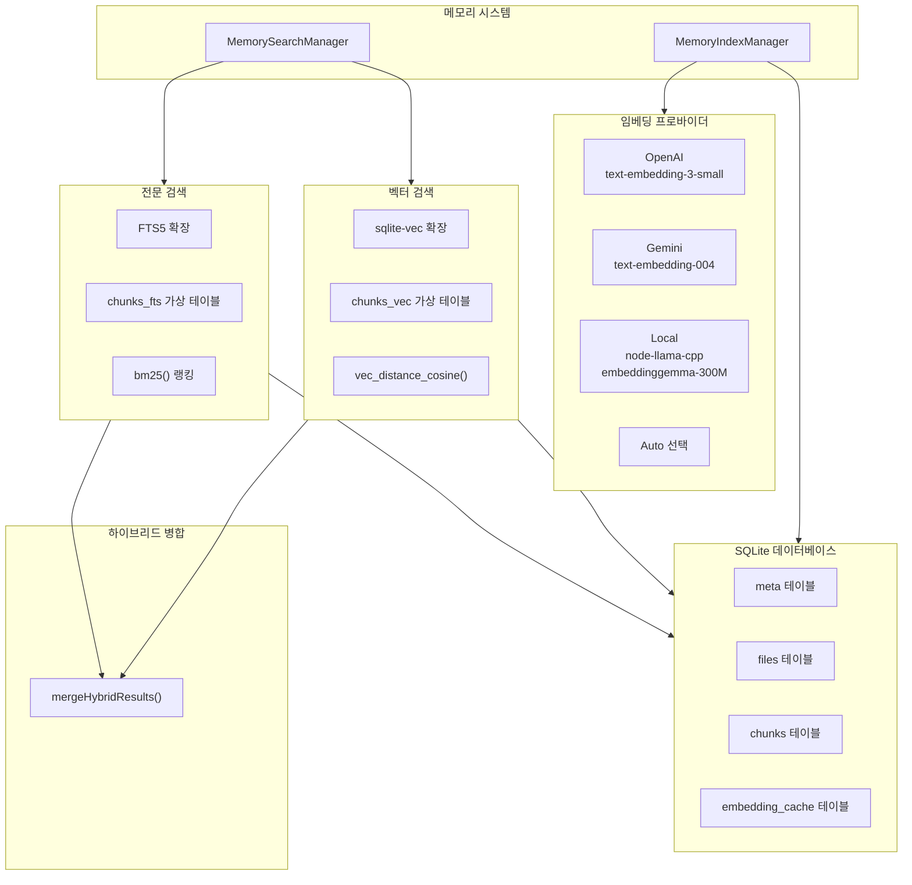
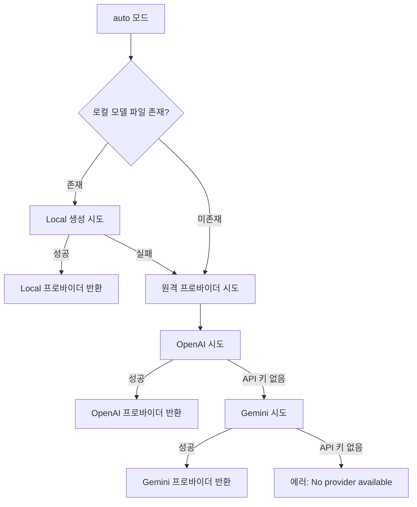
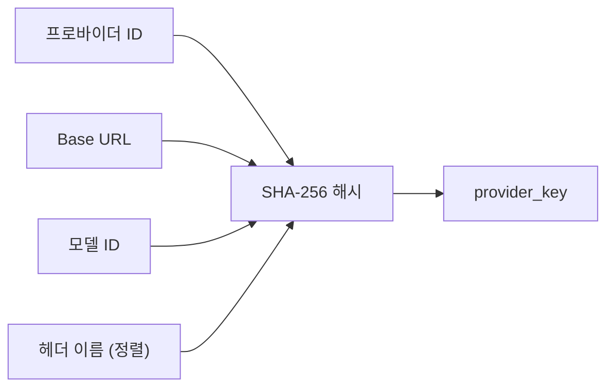
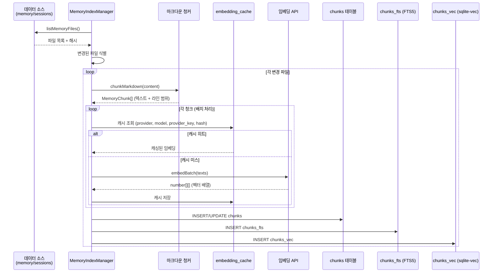
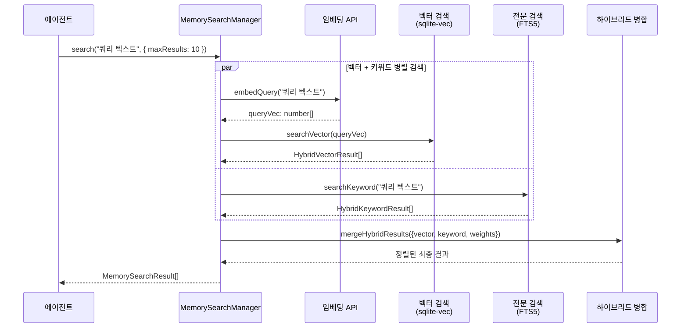

# 04. 메모리 / 벡터 DB 시스템

## 1. 개요

OpenClaw의 메모리 시스템은 **하이브리드 벡터 + 전문 검색** 엔진입니다. 기본 내장(builtin) 백엔드는 SQLite를 저장소로 사용하며, `sqlite-vec` 확장으로 벡터 유사도 검색을, `FTS5` 가상 테이블로 전문 검색을 제공합니다. 멀티 프로바이더 임베딩(OpenAI, Gemini, Local/node-llama-cpp)을 지원하고, `provider_key` 기반 중복 제거와 임베딩 캐시를 통해 효율적인 인덱싱을 수행합니다. 내장 백엔드 외에도 QMD 사이드카, Honcho(플러그인), LanceDB 확장을 교체 가능한 메모리 엔진으로 제공합니다.

### 핵심 특성

| 특성 | 설명 |
|------|------|
| 저장 백엔드 | Node.js `DatabaseSync` API (동기 SQLite) |
| 벡터 검색 | `sqlite-vec` 0.1.9 (코사인 유사도) |
| 전문 검색 | SQLite FTS5 (BM25 랭킹, `unicode61` 또는 `trigram` 토크나이저) |
| 하이브리드 검색 | 벡터 + 키워드 결과를 가중 합산으로 병합 |
| 임베딩 프로바이더 | OpenAI, Gemini, Local (node-llama-cpp), Auto |
| 임베딩 캐시 | `embedding_cache` 테이블, provider_key 기반 중복 제거 |
| 데이터 소스 | `memory` (워크스페이스 파일), `sessions` (세션 트랜스크립트) |
| 청킹 | 마크다운 기반 청크 분할 |
| 지원 메모리 엔진 | builtin(기본), QMD, Honcho(플러그인), LanceDB(확장) |

---

## 2. 아키텍처 다이어그램



---

## 3. 데이터베이스 스키마

**파일:** `src/memory-host-sdk/host/memory-schema.ts`

### 스키마 생성 함수

```typescript
export function ensureMemoryIndexSchema(params: {
  db: DatabaseSync;
  embeddingCacheTable: string;
  cacheEnabled: boolean;
  ftsTable: string;
  ftsEnabled: boolean;
  ftsTokenizer?: "unicode61" | "trigram";
}): { ftsAvailable: boolean; ftsError?: string } {
  // meta/files/chunks 테이블 + (옵션) embedding_cache + FTS5 가상 테이블
  // 인덱스 3종: idx_chunks_path, idx_chunks_source, idx_embedding_cache_updated_at
  // 스키마 마이그레이션: ensureColumn()으로 안전한 컬럼 추가
}
```

### 3.1 meta 테이블

메모리 인덱스의 메타데이터를 저장하는 키-값 테이블입니다.

```sql
CREATE TABLE IF NOT EXISTS meta (
  key TEXT PRIMARY KEY,
  value TEXT NOT NULL
);
```

| 키 | 값 예시 | 설명 |
|----|---------|------|
| `memory_index_meta_v1` | JSON 문자열 | 모델, 프로바이더, 청크 설정 |

```typescript
// 메타데이터 구조
type MemoryIndexMeta = {
  model: string;            // 임베딩 모델 ID
  provider: string;         // 프로바이더 ID (openai, local, gemini)
  providerKey?: string;     // 프로바이더 고유 키 (해시)
  chunkTokens: number;      // 청크 최대 토큰 수
  chunkOverlap: number;     // 청크 오버랩 토큰 수
  vectorDims?: number;      // 벡터 차원 수
};
```

### 3.2 files 테이블

인덱싱된 파일의 메타데이터를 추적합니다.

```sql
CREATE TABLE IF NOT EXISTS files (
  path TEXT PRIMARY KEY,
  source TEXT NOT NULL DEFAULT 'memory',
  hash TEXT NOT NULL,
  mtime INTEGER NOT NULL,
  size INTEGER NOT NULL
);
```

| 컬럼 | 타입 | 설명 |
|------|------|------|
| `path` | TEXT (PK) | 파일 상대 경로 |
| `source` | TEXT | 데이터 소스 (`memory` 또는 `sessions`) |
| `hash` | TEXT | 파일 내용 해시 |
| `mtime` | INTEGER | 수정 시각 (밀리초) |
| `size` | INTEGER | 파일 크기 (바이트) |

### 3.3 chunks 테이블

파일에서 추출된 텍스트 청크와 임베딩 벡터를 저장합니다.

```sql
CREATE TABLE IF NOT EXISTS chunks (
  id TEXT PRIMARY KEY,
  path TEXT NOT NULL,
  source TEXT NOT NULL DEFAULT 'memory',
  start_line INTEGER NOT NULL,
  end_line INTEGER NOT NULL,
  hash TEXT NOT NULL,
  model TEXT NOT NULL,
  text TEXT NOT NULL,
  embedding TEXT NOT NULL,
  updated_at INTEGER NOT NULL
);

-- 인덱스
CREATE INDEX IF NOT EXISTS idx_chunks_path ON chunks(path);
CREATE INDEX IF NOT EXISTS idx_chunks_source ON chunks(source);
```

| 컬럼 | 타입 | 설명 |
|------|------|------|
| `id` | TEXT (PK) | 청크 고유 ID |
| `path` | TEXT | 소스 파일 경로 |
| `source` | TEXT | 데이터 소스 (`memory` / `sessions`) |
| `start_line` | INTEGER | 시작 라인 번호 |
| `end_line` | INTEGER | 종료 라인 번호 |
| `hash` | TEXT | 텍스트 내용 해시 |
| `model` | TEXT | 임베딩 모델 ID |
| `text` | TEXT | 청크 텍스트 원문 |
| `embedding` | TEXT | 임베딩 벡터 (JSON 직렬화) |
| `updated_at` | INTEGER | 마지막 갱신 시각 |

### 3.4 embedding_cache 테이블

임베딩 API 호출 결과를 캐싱하여 중복 요청을 방지합니다.

```sql
CREATE TABLE IF NOT EXISTS embedding_cache (
  provider TEXT NOT NULL,
  model TEXT NOT NULL,
  provider_key TEXT NOT NULL,
  hash TEXT NOT NULL,
  embedding TEXT NOT NULL,
  dims INTEGER,
  updated_at INTEGER NOT NULL,
  PRIMARY KEY (provider, model, provider_key, hash)
);

-- 인덱스
CREATE INDEX IF NOT EXISTS idx_embedding_cache_updated_at
  ON embedding_cache(updated_at);
```

| 컬럼 | 타입 | 설명 |
|------|------|------|
| `provider` | TEXT (PK) | 임베딩 프로바이더 (`openai`, `local`, `gemini`) |
| `model` | TEXT (PK) | 임베딩 모델 ID |
| `provider_key` | TEXT (PK) | 프로바이더 고유 키 (baseUrl + 헤더 해시) |
| `hash` | TEXT (PK) | 입력 텍스트 해시 |
| `embedding` | TEXT | 임베딩 벡터 (JSON 직렬화) |
| `dims` | INTEGER | 벡터 차원 수 |
| `updated_at` | INTEGER | 캐시 갱신 시각 |

### 3.5 FTS5 가상 테이블

SQLite FTS5 확장을 사용한 전문 검색 인덱스입니다.

```sql
CREATE VIRTUAL TABLE IF NOT EXISTS chunks_fts USING fts5(
  text,                   -- 검색 대상 텍스트 (인덱싱됨)
  id UNINDEXED,           -- 청크 ID (검색 미사용)
  path UNINDEXED,         -- 파일 경로 (검색 미사용)
  source UNINDEXED,       -- 데이터 소스 (검색 미사용)
  model UNINDEXED,        -- 모델 ID (검색 미사용)
  start_line UNINDEXED,   -- 시작 라인 (검색 미사용)
  end_line UNINDEXED      -- 종료 라인 (검색 미사용)
);
```

> **참고:** FTS5 생성 실패 시(확장 미지원 환경) `ftsAvailable: false`를 반환하고, 벡터 검색만으로 동작합니다.

### 3.6 인덱스 요약

| 인덱스 | 대상 테이블 | 컬럼 | 용도 |
|--------|------------|------|------|
| `idx_chunks_path` | `chunks` | `path` | 파일별 청크 조회 |
| `idx_chunks_source` | `chunks` | `source` | 소스별 청크 필터링 |
| `idx_embedding_cache_updated_at` | `embedding_cache` | `updated_at` | 캐시 정리/만료 |

---

## 4. 스키마 마이그레이션

**파일:** `src/memory-host-sdk/host/memory-schema.ts`

기존 데이터베이스에 새 컬럼을 안전하게 추가하는 마이그레이션 함수입니다.

```typescript
function ensureColumn(
  db: DatabaseSync,
  table: "files" | "chunks",
  column: string,
  definition: string,
): void {
  // 1. PRAGMA table_info()로 기존 컬럼 목록 조회
  const rows = db.prepare(`PRAGMA table_info(${table})`).all() as Array<{ name: string }>;
  // 2. 컬럼이 이미 존재하면 스킵
  if (rows.some((row) => row.name === column)) {
    return;
  }
  // 3. ALTER TABLE ADD COLUMN 실행
  db.exec(`ALTER TABLE ${table} ADD COLUMN ${column} ${definition}`);
}

// 적용 예: source 컬럼 추가 (기존 DB 호환)
ensureColumn(params.db, "files", "source", "TEXT NOT NULL DEFAULT 'memory'");
ensureColumn(params.db, "chunks", "source", "TEXT NOT NULL DEFAULT 'memory'");
```

---

## 5. 임베딩 프로바이더

**파일:** `src/memory-host-sdk/host/embeddings.ts` (로컬), `embeddings-remote-provider.ts` (원격)

### 프로바이더 인터페이스

```typescript
export type EmbeddingProvider = {
  id: string;                                    // 프로바이더 ID
  model: string;                                 // 모델 이름
  embedQuery: (text: string) => Promise<number[]>;       // 단일 임베딩
  embedBatch: (texts: string[]) => Promise<number[][]>;  // 배치 임베딩
};

export type EmbeddingProviderResult = {
  provider: EmbeddingProvider;
  requestedProvider: "openai" | "local" | "gemini" | "auto";
  fallbackFrom?: "openai" | "local" | "gemini";     // 폴백 출처
  fallbackReason?: string;                           // 폴백 사유
  openAi?: OpenAiEmbeddingClient;                    // OpenAI 클라이언트
  gemini?: GeminiEmbeddingClient;                    // Gemini 클라이언트
};
```

### 프로바이더 비교

| 프로바이더 | 모델 | 특징 | 요구사항 |
|------------|------|------|----------|
| **OpenAI** | `text-embedding-3-small` | 고품질, 빠름 | API 키 |
| **Gemini** | `text-embedding-004` | Google AI 통합 | API 키 |
| **Local** | `embeddinggemma-300m-qat-Q8_0` | 오프라인, 무료 | `node-llama-cpp` |
| **Auto** | 자동 선택 | 순서: Local(파일존재) -> OpenAI -> Gemini | 상황 의존 |

### Auto 선택 흐름



### 로컬 임베딩 프로바이더

```typescript
async function createLocalEmbeddingProvider(
  options: EmbeddingProviderOptions,
): Promise<EmbeddingProvider> {
  const modelPath = normalizeOptionalString(options.local?.modelPath)
    || "hf:ggml-org/embeddinggemma-300m-qat-q8_0-GGUF/embeddinggemma-300m-qat-Q8_0.gguf";

  // node-llama-cpp 지연 로딩 (로컬 비활성화 시 부팅 부담 제거)
  const { getLlama, resolveModelFile, LlamaLogLevel } = await importNodeLlamaCpp();

  return {
    id: "local",
    model: modelPath,
    embedQuery: async (text) => {
      const ctx = await ensureContext();
      const embedding = await ctx.getEmbeddingFor(text);
      return sanitizeAndNormalizeEmbedding(Array.from(embedding.vector));
    },
    embedBatch: async (texts) => {
      // 각 텍스트를 순차적으로 임베딩
      return Promise.all(texts.map(async (text) => {
        const embedding = await ctx.getEmbeddingFor(text);
        return sanitizeAndNormalizeEmbedding(Array.from(embedding.vector));
      }));
    },
  };
}
```

### 임베딩 정규화

```typescript
// 벡터 정규화: L2 norm으로 단위 벡터 변환
function sanitizeAndNormalizeEmbedding(vec: number[]): number[] {
  const sanitized = vec.map((value) => (Number.isFinite(value) ? value : 0));
  const magnitude = Math.sqrt(sanitized.reduce((sum, value) => sum + value * value, 0));
  if (magnitude < 1e-10) {
    return sanitized;
  }
  return sanitized.map((value) => value / magnitude);
}
```

---

## 6. Provider Key 기반 중복 제거

**파일:** `src/memory-host-sdk/host/embedding-provider-adapter-utils.ts` (키 계산), `headers-fingerprint`는 원격 클라이언트 모듈에 내장

같은 프로바이더라도 baseUrl, 헤더가 다르면 별도 캐시 엔트리로 관리합니다.

```typescript
export function computeEmbeddingProviderKey(params: {
  providerId: string;
  providerModel: string;
  openAi?: { baseUrl: string; model: string; headers: Record<string, string> };
  gemini?: { baseUrl: string; model: string; headers: Record<string, string> };
}): string {
  // OpenAI: hash({ provider: "openai", baseUrl, model, headerNames })
  // Gemini: hash({ provider: "gemini", baseUrl, model, headerNames })
  // 기타:   hash({ provider, model })
}
```

### 캐시 키 구조



**embedding_cache PK:** `(provider, model, provider_key, hash)`

같은 텍스트(`hash`)라도 다른 API 엔드포인트(`provider_key`)에서 생성된 임베딩은 별도로 캐싱됩니다.

---

## 7. 저장 백엔드

### SQLite (Node.js DatabaseSync)

**파일:** `src/memory-host-sdk/host/sqlite.ts`

```typescript
import type { DatabaseSync } from "node:sqlite";
// Node.js 22+ 내장 동기 SQLite API 사용
// 별도 네이티브 바인딩 불필요
```

### sqlite-vec 확장

**파일:** `src/memory-host-sdk/host/sqlite-vec.ts`

```typescript
export async function loadSqliteVecExtension(params: {
  db: DatabaseSync;
  extensionPath?: string;
}): Promise<{ ok: boolean; extensionPath?: string; error?: string }> {
  const sqliteVec = await import("sqlite-vec");
  // 1. enableLoadExtension(true)
  // 2. 사용자 지정 경로 또는 getLoadablePath()에서 확장 로드
  // 3. 실패 시 { ok: false, error } 반환 (폴백: 순수 JS 코사인 유사도)
}
```

**sqlite-vec 버전:** `0.1.9` (`package.json` 의존성 기준)

---

## 8. 검색 모드

### 8.1 벡터 유사도 검색

**파일:** `extensions/memory-core/src` 내부 `manager-search` (builtin 백엔드 구현)

```typescript
export async function searchVector(params: {
  db: DatabaseSync;
  vectorTable: string;        // "chunks_vec"
  providerModel: string;
  queryVec: number[];
  limit: number;
  snippetMaxChars: number;
  ensureVectorReady: (dimensions: number) => Promise<boolean>;
  sourceFilterVec: { sql: string; params: SearchSource[] };
  sourceFilterChunks: { sql: string; params: SearchSource[] };
}): Promise<SearchRowResult[]> {
  // sqlite-vec 사용 가능 시: vec_distance_cosine() SQL 함수
  // 불가 시: 순수 JS cosineSimilarity() 폴백
}
```

**sqlite-vec 쿼리:**

```sql
SELECT c.id, c.path, c.start_line, c.end_line, c.text,
       c.source,
       vec_distance_cosine(v.embedding, ?) AS dist
  FROM chunks_vec v
  JOIN chunks c ON c.id = v.id
 WHERE c.model = ?
 ORDER BY dist ASC
 LIMIT ?
```

**점수 변환:** `score = 1 - dist` (거리 -> 유사도)

**폴백 (순수 JS):**

```typescript
// sqlite-vec 로드 실패 시
const candidates = listChunks({ db, providerModel, sourceFilter });
const scored = candidates.map((chunk) => ({
  chunk,
  score: cosineSimilarity(queryVec, chunk.embedding),
}));
return scored.toSorted((a, b) => b.score - a.score).slice(0, limit);
```

### 8.2 FTS5 전문 검색

```typescript
export async function searchKeyword(params: {
  db: DatabaseSync;
  ftsTable: string;           // "chunks_fts"
  providerModel: string;
  query: string;
  limit: number;
  snippetMaxChars: number;
  sourceFilter: { sql: string; params: SearchSource[] };
  buildFtsQuery: (raw: string) => string | null;
  bm25RankToScore: (rank: number) => number;
}): Promise<Array<SearchRowResult & { textScore: number }>> { /* ... */ }
```

**FTS5 쿼리:**

```sql
SELECT id, path, source, start_line, end_line, text,
       bm25(chunks_fts) AS rank
  FROM chunks_fts
 WHERE chunks_fts MATCH ? AND model = ?
 ORDER BY rank ASC
 LIMIT ?
```

**FTS 쿼리 빌드:**

```typescript
// "hello world" -> '"hello" AND "world"'
export function buildFtsQuery(raw: string): string | null {
  const tokens = raw.match(/[A-Za-z0-9_]+/g)
    ?.map((t) => t.trim()).filter(Boolean) ?? [];
  if (tokens.length === 0) return null;
  const quoted = tokens.map((t) => `"${t.replaceAll('"', "")}"`);
  return quoted.join(" AND ");
}

// BM25 랭크 -> 점수 변환 (0~1 범위)
export function bm25RankToScore(rank: number): number {
  const normalized = Number.isFinite(rank) ? Math.max(0, rank) : 999;
  return 1 / (1 + normalized);
}
```

### 8.3 하이브리드 검색 병합

**파일:** `extensions/memory-core/src` 내부 하이브리드 병합 모듈

```typescript
export function mergeHybridResults(params: {
  vector: HybridVectorResult[];     // 벡터 검색 결과
  keyword: HybridKeywordResult[];   // 키워드 검색 결과
  vectorWeight: number;             // 벡터 가중치
  textWeight: number;               // 텍스트 가중치
}): Array<{
  path: string;
  startLine: number;
  endLine: number;
  score: number;                    // 최종 점수
  snippet: string;
  source: HybridSource;
}> {
  // 1. ID 기반 결과 매핑 (Map<id, {vectorScore, textScore}>)
  // 2. 최종 점수 = vectorWeight * vectorScore + textWeight * textScore
  // 3. 점수 기준 내림차순 정렬
}
```

### 하이브리드 결과 병합 예시

| 청크 ID | 벡터 점수 | 텍스트 점수 | 가중치 (0.7/0.3) | 최종 점수 |
|---------|----------|------------|------------------|----------|
| chunk_1 | 0.85 | 0.60 | 0.7 * 0.85 + 0.3 * 0.60 | **0.775** |
| chunk_2 | 0.70 | 0.90 | 0.7 * 0.70 + 0.3 * 0.90 | **0.760** |
| chunk_3 | 0.92 | 0.00 | 0.7 * 0.92 + 0.3 * 0.00 | **0.644** |
| chunk_4 | 0.00 | 0.95 | 0.7 * 0.00 + 0.3 * 0.95 | **0.285** |

---

## 9. MemorySearchManager 인터페이스

**파일:** `src/memory-host-sdk/host/types.ts`

```typescript
export type MemorySource = "memory" | "sessions";

export type MemorySearchResult = {
  path: string;         // 파일 경로
  startLine: number;    // 시작 라인
  endLine: number;      // 종료 라인
  score: number;        // 검색 점수 (0~1)
  snippet: string;      // 텍스트 스니펫
  source: MemorySource; // 데이터 소스
  citation?: string;    // 인용 정보
};

export interface MemorySearchManager {
  search(
    query: string,
    opts?: { maxResults?: number; minScore?: number; sessionKey?: string },
  ): Promise<MemorySearchResult[]>;

  readFile(params: {
    relPath: string;
    from?: number;
    lines?: number;
  }): Promise<{ text: string; path: string }>;

  status(): MemoryProviderStatus;

  sync?(params?: {
    reason?: string;
    force?: boolean;
    progress?: (update: MemorySyncProgressUpdate) => void;
  }): Promise<void>;

  probeEmbeddingAvailability(): Promise<MemoryEmbeddingProbeResult>;
  probeVectorAvailability(): Promise<boolean>;
  close?(): Promise<void>;
}
```

### MemoryProviderStatus 구조

```typescript
export type MemoryProviderStatus = {
  backend: "builtin" | "qmd";       // 백엔드 종류
  provider: string;                  // 임베딩 프로바이더
  model?: string;                    // 임베딩 모델
  files?: number;                    // 인덱싱된 파일 수
  chunks?: number;                   // 총 청크 수
  dirty?: boolean;                   // 재인덱싱 필요 여부
  workspaceDir?: string;             // 워크스페이스 경로
  dbPath?: string;                   // DB 파일 경로
  sources?: MemorySource[];          // 활성 소스
  fts?: {
    enabled: boolean;                // FTS 활성화 여부
    available: boolean;              // FTS 사용 가능 여부
    error?: string;                  // FTS 오류
  };
  vector?: {
    enabled: boolean;                // 벡터 검색 활성화
    available?: boolean;             // sqlite-vec 사용 가능 여부
    extensionPath?: string;          // 확장 경로
    loadError?: string;              // 확장 로드 오류
    dims?: number;                   // 벡터 차원
  };
  cache?: {
    enabled: boolean;                // 캐시 활성화
    entries?: number;                // 캐시 엔트리 수
    maxEntries?: number;             // 최대 엔트리
  };
  batch?: {                          // 배치 임베딩 설정
    enabled: boolean;
    failures: number;
    limit: number;
    wait: boolean;
    concurrency: number;
    pollIntervalMs: number;
    timeoutMs: number;
  };
};
```

---

## 10. MemoryIndexManager 핵심 상수

**파일:** `extensions/memory-core/manager-runtime.ts` 및 `extensions/memory-core/src` (builtin 메모리 매니저)

```typescript
const META_KEY = "memory_index_meta_v1";
const SNIPPET_MAX_CHARS = 700;                    // 스니펫 최대 문자
const VECTOR_TABLE = "chunks_vec";                // 벡터 테이블 이름
const FTS_TABLE = "chunks_fts";                   // FTS 테이블 이름
const EMBEDDING_CACHE_TABLE = "embedding_cache";  // 캐시 테이블 이름
const SESSION_DIRTY_DEBOUNCE_MS = 5000;           // 세션 변경 디바운스
const EMBEDDING_BATCH_MAX_TOKENS = 8000;          // 배치 최대 토큰
const EMBEDDING_INDEX_CONCURRENCY = 4;            // 인덱싱 동시성
const EMBEDDING_RETRY_MAX_ATTEMPTS = 3;           // 재시도 최대 횟수
const EMBEDDING_RETRY_BASE_DELAY_MS = 500;        // 재시도 기본 지연
const EMBEDDING_RETRY_MAX_DELAY_MS = 8000;        // 재시도 최대 지연
const BATCH_FAILURE_LIMIT = 2;                    // 배치 실패 한계
const VECTOR_LOAD_TIMEOUT_MS = 30_000;            // 벡터 로드 타임아웃
const EMBEDDING_QUERY_TIMEOUT_REMOTE_MS = 60_000; // 원격 쿼리 타임아웃
const EMBEDDING_QUERY_TIMEOUT_LOCAL_MS = 5 * 60_000;  // 로컬 쿼리 타임아웃
const EMBEDDING_BATCH_TIMEOUT_REMOTE_MS = 2 * 60_000; // 원격 배치 타임아웃
const EMBEDDING_BATCH_TIMEOUT_LOCAL_MS = 10 * 60_000;  // 로컬 배치 타임아웃
```

---

## 11. 데이터 플로우 시퀀스 다이어그램

### 11.1 인덱싱 플로우



### 11.2 검색 플로우



---

## 12. 파일 구조

메모리 시스템은 재사용 가능한 Host SDK와 엔진/플러그인 확장으로 분리되어 있습니다. 기본 `memory` 디렉토리는 없으며, 코어 SDK는 `src/memory-host-sdk/`(워크스페이스 패키지로도 `packages/memory-host-sdk/`에 노출), 엔진/플러그인은 `extensions/memory-*`에 위치합니다.

```
src/memory-host-sdk/
├── engine.ts                   # 엔진 진입 집합 (foundation/storage/embeddings/qmd 재수출)
├── engine-foundation.ts        # 설정/경로/로깅 등 기반 재수출
├── engine-storage.ts           # 저장 경로/파일 시스템 유틸
├── engine-embeddings.ts        # 임베딩 공개 API
├── engine-qmd.ts               # QMD 바인딩
├── runtime.ts / runtime-core.ts / runtime-cli.ts / runtime-files.ts
├── query.ts                    # 검색 엔트리
├── multimodal.ts               # 멀티모달 첨부 유틸
├── events.ts                   # 메모리 이벤트 타입
├── status.ts                   # 상태 리포트
├── secret.ts                   # 시크릿 입력 유틸
└── host/
    ├── types.ts                # MemorySearchManager, MemorySearchResult
    ├── memory-schema.ts        # DB 스키마 (테이블, 인덱스, FTS5)
    ├── sqlite.ts               # Node.js DatabaseSync 래퍼
    ├── sqlite-vec.ts           # sqlite-vec 확장 로딩
    ├── embeddings.ts           # 로컬(node-llama-cpp) 임베딩
    ├── embeddings-remote-client.ts
    ├── embeddings-remote-fetch.ts
    ├── embeddings-remote-provider.ts
    ├── embedding-provider-adapter-utils.ts   # provider_key 계산
    ├── node-llama.ts           # node-llama-cpp 지연 로딩
    ├── batch-*.ts              # OpenAI/Gemini 배치 임베딩
    ├── qmd-process.ts / qmd-query-parser.ts / qmd-scope.ts
    ├── query-expansion.ts      # 쿼리 확장
    ├── backend-config.ts       # 백엔드 설정 해석
    ├── status-format.ts        # 상태 포맷팅
    ├── session-files.ts        # 세션 파일 관리
    └── *.test.ts               # 테스트

extensions/
├── memory-core/                # 기본(builtin) 메모리 엔진 + 드리밍
│   ├── index.ts
│   ├── api.ts / runtime-api.ts
│   ├── manager-runtime.ts
│   ├── cli-metadata.ts
│   ├── openclaw.plugin.json
│   └── src/                    # 내부 매니저/검색/하이브리드 구현
│
├── memory-lancedb/             # LanceDB 벡터 백엔드 확장
│   ├── index.ts / api.ts
│   ├── lancedb-runtime.ts
│   ├── config.ts
│   └── openclaw.plugin.json    # kind: "memory"
│
├── memory-wiki/                # 지식 위키/볼트 컴파일러 플러그인
│   ├── index.ts / api.ts / setup-api.ts / contract-api.ts
│   ├── cli-metadata.ts
│   ├── skills/
│   └── openclaw.plugin.json    # commandAliases: ["wiki"]
│
└── active-memory/              # 블로킹 메모리 서브에이전트
    ├── index.ts
    └── openclaw.plugin.json
```

> Honcho 백엔드는 별도 플러그인(예: `openclaw-plugin-honcho`)으로 배포되며, 본 리포지토리에 번들되지 않습니다. 문서: `docs/concepts/memory-honcho.md`.

---

## 13. 메모리 엔진 (백엔드) 비교

공식 문서(`docs/concepts/memory.md`) 기준, OpenClaw는 세 가지 메모리 엔진을 교체 가능하게 제공합니다. 타입 정의(`src/config/types.memory.ts`)에서 `MemoryBackend = "builtin" | "qmd"`가 핵심 분기이며, Honcho와 LanceDB는 플러그인 슬롯으로 연결됩니다.

| 엔진 | 구현 위치 | 벡터 | 전문 검색 | 특징 |
|------|-----------|------|-----------|------|
| **builtin (기본)** | `extensions/memory-core` + `src/memory-host-sdk/host` | `sqlite-vec` | FTS5 | SQLite 기반. 추가 의존성 없이 벡터/키워드/하이브리드 검색 제공 |
| **QMD** | `src/memory-host-sdk/host/qmd-process.ts` 외 | QMD 사이드카 | QMD 검색 | 로컬 퍼스트 외부 인덱서. 쿼리 확장, 리랭킹, 워크스페이스 외부 경로 인덱싱 지원. `mcporter` 연동 가능 |
| **Honcho** | 별도 플러그인 패키지 | 원격 | 원격 | AI 네이티브 크로스 세션 메모리. 사용자 모델링, 시맨틱 검색, 멀티 에이전트 인지. 플러그인 설치 필요 |
| **LanceDB** | `extensions/memory-lancedb` | LanceDB | 내장 필터 | OpenAI 호환 임베딩과 LanceDB 벡터 스토어. `dbPath` 기본값 `~/.openclaw/memory/lancedb` |

설정 예:

```json
{
  "memory": {
    "backend": "builtin",
    "citations": "auto",
    "qmd": { "searchMode": "vsearch", "mcporter": { "enabled": true } }
  }
}
```

## 14. Active Memory (블로킹 메모리 서브 에이전트)

**파일:** `extensions/active-memory/index.ts`, `extensions/active-memory/openclaw.plugin.json`

Active Memory는 적격한 대화형 응답 이전에 **경계가 있는(blocking) 메모리 서브 에이전트**를 실행하여, 프롬프트 컨텍스트에 관련 메모리를 주입하는 플러그인입니다.

주요 설정 필드:

| 필드 | 설명 |
|------|------|
| `enabled` | 전역 활성/일시 중지 |
| `agents` | 활성 대상 에이전트 ID 배열 |
| `model` / `modelFallback` | 서브 에이전트 모델과 폴백 |
| `allowedChatTypes` | `direct` / `group` / `channel` 중 허용 범위 |
| `queryMode` | `message` / `recent` / `full` - 서브 에이전트가 보는 컨텍스트 범위 |
| `promptStyle` | `balanced` / `strict` / `contextual` / `recall-heavy` / `precision-heavy` / `preference-only` |
| `thinking` | `off` / `minimal` / `low` / `medium` / `high` / `xhigh` / `adaptive` |
| `timeoutMs` | 서브 에이전트 실행 타임아웃 |
| `maxSummaryChars` | 주입 요약 최대 길이 |
| `recentUserTurns` / `recentAssistantTurns` | 최근 턴 포함 개수 |
| `persistTranscripts` / `transcriptDir` | 별도 디렉토리에 트랜스크립트 보관 |
| `qmd.searchMode` | QMD 백엔드 사용 시 검색 모드 재정의 |

기본적으로 다이렉트 메시지 스타일 세션에서만 동작하며, `cacheTtlMs`로 짧은 캐시를 적용합니다.

## 15. Memory Wiki (지식 볼트 컴파일러)

**파일:** `extensions/memory-wiki/index.ts`, `extensions/memory-wiki/openclaw.plugin.json`

`memory-wiki`는 장기 메모리를 **출처 정보가 있는 위키 볼트(vault)**로 컴파일하는 번들 플러그인입니다. 액티브 메모리 플러그인을 대체하지 않고, 그 옆에서 지식 레이어를 제공합니다.

| 설정 | 설명 |
|------|------|
| `vaultMode` | `isolated` / `bridge` / `unsafe-local` |
| `vault.path` | 위키 볼트 루트 경로 |
| `vault.renderMode` | `native` (OpenClaw 포맷) 또는 `obsidian` (Obsidian 친화) |
| `obsidian.useOfficialCli` | 공식 Obsidian CLI 탐지/사용 |
| `bridge.enabled` / `bridge.readMemoryArtifacts` | 활성 메모리 플러그인의 공개 아티팩트 브리지 읽기 |
| `ingest.autoCompile` / `ingest.maxConcurrentJobs` / `ingest.allowUrlIngest` | 인제스트 옵션 |
| `search.backend` (`shared`/`local`) / `search.corpus` (`wiki`/`memory`/`all`) | 검색 범위 설정 |
| `render.preserveHumanBlocks` / `createBacklinks` / `createDashboards` | 렌더 옵션 |
| `context.includeCompiledDigestPrompt` | 컴파일된 다이제스트를 프롬프트에 주입 |

제공 기능: 결정론적 페이지 구조, 구조화된 클레임/근거, 모순·신선도 추적, 대시보드 생성, 위키 네이티브 도구(`wiki_search`, `wiki_get`, `wiki_apply`, `wiki_lint`). 커맨드 별칭으로 `openclaw wiki`를 노출합니다.

## 16. 요약

OpenClaw 메모리 시스템의 핵심 설계 원칙:

1. **하이브리드 검색** - 벡터 유사도(의미적 매칭)와 FTS5(키워드 매칭)를 가중 합산하여 정확도와 재현율을 동시에 확보
2. **멀티 프로바이더 임베딩** - OpenAI, Gemini, 로컬(node-llama-cpp) 임베딩을 교체 가능하며, Auto 모드로 최적 프로바이더를 자동 선택
3. **멀티 백엔드** - 내장 SQLite(builtin), QMD 사이드카, Honcho 플러그인, LanceDB 확장을 동일한 인터페이스로 교체
4. **임베딩 캐시** - `(provider, model, provider_key, hash)` 복합 키로 중복 API 호출을 제거하고, 프로바이더 엔드포인트 변경 시 자동 구분
5. **단계적 폴백** - sqlite-vec 로드 실패 시 순수 JS 코사인 유사도로, FTS5 미지원 시 벡터 전용으로 자동 전환
6. **스키마 마이그레이션** - `ensureColumn()`으로 기존 DB에 안전하게 컬럼을 추가, 하위 호환성 유지
7. **동기 SQLite** - Node.js 22+ 내장 `DatabaseSync` API로 별도 네이티브 바인딩 없이 동작
8. **지식 레이어 분리** - Active Memory(블로킹 리콜)와 Memory Wiki(컴파일된 지식 볼트)를 플러그인으로 명확히 분리
