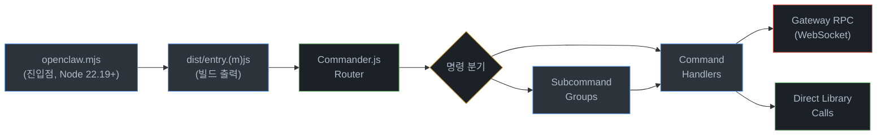
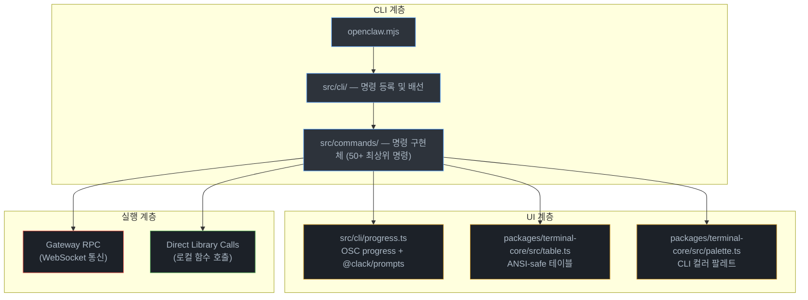
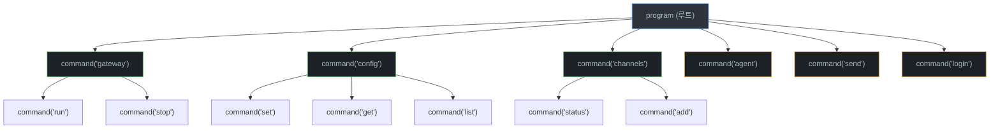
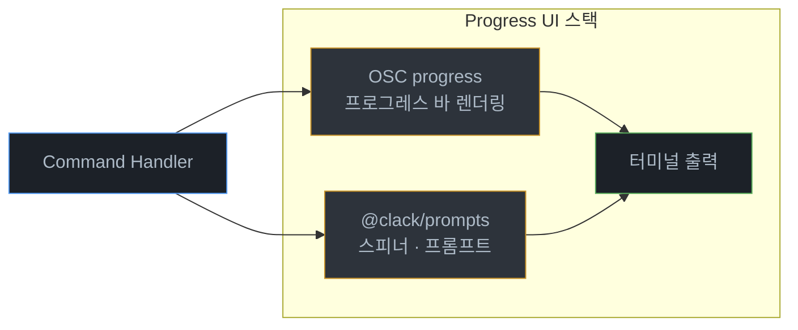
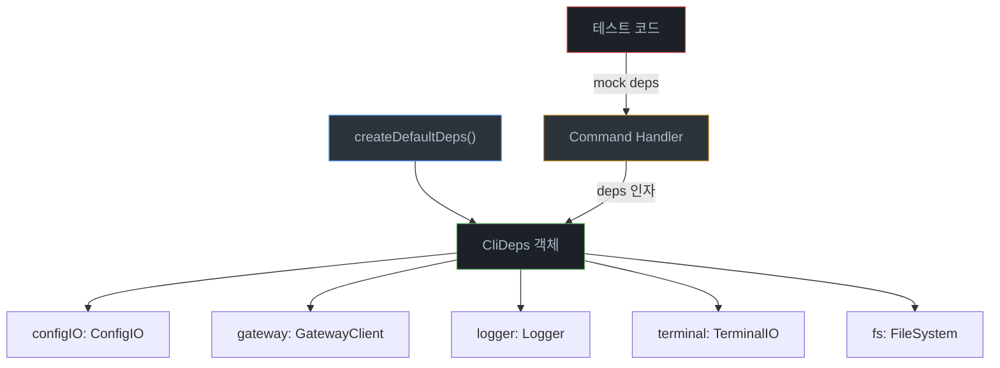
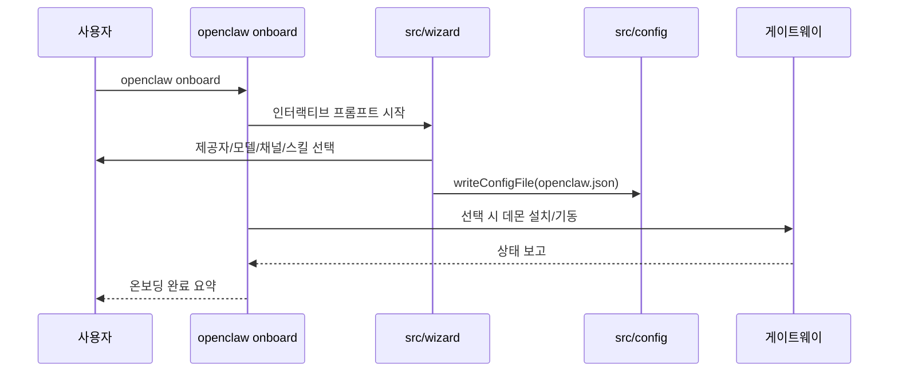

# 05. CLI 명령 시스템 (CLI Command System)

> 본 문서는 OpenClaw 2026.6.11 기준으로 갱신되었습니다.

## 개요

OpenClaw CLI는 **Commander.js** 기반의 대규모 명령줄 인터페이스로, **50개 이상의 최상위 명령어**(카테고리·서브커맨드 포함 시 100개 이상)를 제공한다. 지연 로딩(lazy loading) 방식의 플러그인 아키텍처를 채택하여 초기 기동 시간을 최소화하며, **OSC progress**(터미널 OSC 시퀀스 기반, `packages/terminal-core`에 내장)와 **@clack/prompts**를 조합한 진행률 UI로 사용자 경험을 극대화한다. 의존성 주입(Dependency Injection) 패턴을 통해 테스트 가능성과 모듈 교체 유연성을 확보하고 있다.

---

## 아키텍처

### 전체 흐름도



### 계층 구조



---

## 진입점 (Entry Point)

CLI 실행은 두 단계로 나뉜다.

| 단계 | 파일 | 역할 |
|------|------|------|
| 1단계 | `openclaw.mjs` | Node.js shebang 진입점. Node 22.19+ 버전 체크(`MIN_NODE_MAJOR=22`, `MIN_NODE_MINOR=19`), 컴파일 캐시 활성화, `dist/entry.js` 또는 `dist/entry.mjs` 동적 import |
| 2단계 | `dist/entry.(m)js` | 빌드된 CLI 본체 (`src/entry.ts` 번들). Commander.js 프로그램을 초기화하고 명령어 트리를 구성 |

```javascript
// openclaw.mjs (요점)
#!/usr/bin/env node
// 1) Node.js 22.19+ 검증
// 2) module.enableCompileCache() 시도
// 3) `--help` 단일 호출 시 dist/cli-startup-metadata.json의 precomputed rootHelp 사용
// 4) dist/entry.js → dist/entry.mjs 순서로 tryImport
```

`dist/entry.(m)js`는 TypeScript 소스(`src/cli/`, `src/entry.ts`)를 번들링한 결과물로, Commander.js `program` 인스턴스를 생성(`src/cli/program/build-program.ts`의 `buildProgram()`)하고 모든 명령어를 등록한 뒤 `program.parseAsync(process.argv)`를 호출한다. 최초 사용자는 `openclaw onboard` 위자드로 게이트웨이, 워크스페이스, 스킬 구성을 대화형으로 설정할 수 있다.

---

## CLI 배선 (CLI Wiring)

### src/cli/ 디렉토리

`src/cli/` 디렉토리는 명령어 등록, 의존성 주입, 공통 옵션 처리 등 CLI 인프라를 담당하며 100개 이상의 파일로 구성된다.

```
src/cli/
├── program/                    # Commander 프로그램 빌드 계층
│   ├── build-program.ts        # buildProgram() - 전체 프로그램 조립
│   ├── core-command-descriptors.ts   # 상위 명령 메타데이터
│   ├── subcli-descriptors.ts         # 서브 CLI 메타데이터
│   ├── register.*.ts                 # 카테고리별 등록기 (agent/backup/configure/onboard/...)
│   ├── register.subclis.ts           # 서브 CLI 일괄 등록
│   ├── register-command-groups.ts
│   ├── register-lazy-command.ts      # 지연 로딩 등록 유틸
│   ├── routes.ts / route-specs.ts    # 빠른 경로 라우팅
│   └── root-help.ts / help.ts        # precomputed root-help
├── command-catalog.ts          # 명령별 정책 (배너/플러그인 로딩/가드)
├── command-bootstrap.ts        # 경로 정책 기반 부트스트랩
├── command-registration-policy.ts
├── command-path-policy.ts
├── gateway-cli.ts / gateway-rpc.ts   # 게이트웨이 CLI
├── channels-cli.ts / pairing-cli.ts / devices-cli.ts / nodes-cli.ts
├── daemon-cli.ts / node-cli.ts / cron-cli.ts / logs-cli.ts
├── models-cli.ts / mcp-cli.ts / hooks-cli.ts / skills-cli.ts
├── secrets-cli.ts / security-cli.ts / system-cli.ts
├── docs-cli.ts / dns-cli.ts / qr-cli.ts / tui-cli.ts / proxy-cli.ts
├── webhooks-cli.ts / sandbox-cli.ts / plugins-cli.ts
├── update-cli.ts / completion-cli.ts / directory-cli.ts
├── acp-cli.ts / clawbot-cli.ts / config-cli.ts
├── deps.ts / deps.types.ts    # createDefaultDeps() 의존성 팩토리
├── progress.ts                # 진행률 UI (osc-progress + @clack/prompts)
├── run-main.ts                # 최상위 실행 엔트리
├── route.ts                   # 빠른 경로 디스패처
├── argv.ts / argv-invocation.ts / windows-argv.ts  # argv 정규화
└── banner.ts / tagline.ts     # 브랜딩
```

### 명령어 등록 패턴

Commander.js의 서브커맨드와 지연 로딩을 조합하여 명령어를 등록한다.

```typescript
// src/cli/commands.ts (패턴 예시)
import { Command } from "commander";

export function registerCommands(program: Command, deps: CliDeps): void {
  // 최상위 명령어
  program
    .command("agent")
    .description("CLI 채팅 에이전트 호출")
    .action(async (opts) => {
      const { agentCommand } = await import("../commands/agent.js");
      await agentCommand(opts, deps);
    });

  // 서브커맨드 그룹
  const config = program
    .command("config")
    .description("설정 관리");

  config
    .command("set <key> <value>")
    .description("설정 값 변경")
    .action(async (key, value, opts) => {
      const { configSetCommand } = await import("../commands/config-set.js");
      await configSetCommand(key, value, opts, deps);
    });

  config
    .command("get <key>")
    .description("설정 값 조회")
    .action(async (key, opts) => {
      const { configGetCommand } = await import("../commands/config-get.js");
      await configGetCommand(key, opts, deps);
    });
}
```

> **지연 로딩(Lazy Loading)**: 각 명령어의 구현체는 `action` 콜백 내에서 동적 `import()`로 로드된다. 이를 통해 CLI 기동 시 모든 명령 모듈을 메모리에 올리지 않아도 되며, 초기 응답 시간이 단축된다.

---

## 명령어 구현체 (Command Implementations)

### src/commands/ 디렉토리

`src/commands/`에는 명령어 구현 및 공유 런타임이 다수의 파일로 분산되어 존재한다 (`agent`, `channels`, `doctor`, `models`, `onboard`, `setup`, `sessions`, `status`, `gateway-*`, `configure.*`, `plugins-*`, `sandbox*`, `backup*` 등).

```
src/commands/
├── agent.ts / agent/              # CLI 채팅 에이전트 및 런타임
├── agent-via-gateway.ts           # 게이트웨이 경유 에이전트 호출
├── agents.ts / agents.commands.*.ts  # 격리된 에이전트 관리
├── channels.ts / channels/        # 채널 연결/상태/추가
├── channel-setup/
├── configure.ts / configure.*.ts  # 대화형 설정 (credentials, channels, gateway, agent)
├── onboard.ts / onboard-*.ts      # 온보딩 위자드
├── setup.ts / setup/              # 로컬 config + workspace 초기화
├── doctor.ts / doctor-*.ts        # 진단/자동 수정
├── sessions.ts / sessions-*.ts    # 세션 관리
├── status.ts / status.*.ts        # 채널 헬스 및 최근 수신자
├── status-all.ts / status-json.ts
├── health.ts / health-format.ts   # 게이트웨이 헬스
├── dashboard.ts                   # Control UI 열기
├── flows.ts / tasks.ts            # 플로우/백그라운드 태스크
├── models.ts / models/            # 모델 발견/스캔/구성
├── message.ts / message-format.ts # 메시지 전송/조회/관리
├── sandbox.ts / sandbox-*.ts      # 에이전트 샌드박스 컨테이너
├── backup.ts / backup-*.ts        # 상태 백업/검증
├── reset.ts / uninstall.ts
├── docs.ts                        # 공식 docs 검색
├── auth-choice.ts / auth-token.ts / chutes-oauth.ts / oauth-flow.ts
├── gateway-status.ts / gateway-presence.ts / gateway-install-token.ts
├── daemon-runtime.ts / node-daemon-runtime.ts
├── model-picker.ts / model-allowlist.ts / provider-auth-*.ts
├── config-validation.ts
└── ... (기타 다수)
```

### 명령어 그룹과 주요 엔트리

상위 명령어는 크게 **Core CLI**(설치/설정/진단/에이전트/세션/메시지/태스크/대시보드)와 **Sub-CLI**(게이트웨이, 채널, 디바이스, 모델, 플러그인, 시스템 등)로 나뉜다. 실제 등록 목록은 `src/cli/program/core-command-descriptors.ts`와 `src/cli/program/subcli-descriptors.ts`에서 확인할 수 있다.

#### Core 명령어 (`core-command-descriptors.ts`)

| 명령 | 설명 |
|------|------|
| `openclaw setup` | 로컬 config와 에이전트 워크스페이스를 초기화 |
| `openclaw crestodian` | 대화형 셋업·복구 어시스턴트 열기 |
| `openclaw onboard` | 게이트웨이·워크스페이스·스킬 대화형 온보딩 위자드 |
| `openclaw configure` | 자격 증명·채널·게이트웨이·에이전트 기본값 대화형 구성 |
| `openclaw config` | 비대화형 설정 헬퍼 (`get`/`set`/`unset`/`file`/`validate`/`schema`) |
| `openclaw backup` | OpenClaw 상태의 백업 아카이브 생성/검증 |
| `openclaw migrate` | 다른 에이전트 시스템에서 상태 가져오기 |
| `openclaw doctor` | 게이트웨이·채널 헬스체크 및 자동 수정 |
| `openclaw dashboard` | 현재 토큰으로 Control UI 열기 |
| `openclaw reset` | 로컬 config/state 리셋 (CLI 유지) |
| `openclaw uninstall` | 게이트웨이 서비스·로컬 데이터 제거 (CLI 유지) |
| `openclaw message` | 메시지 전송/조회/관리 |
| `openclaw mcp` | OpenClaw MCP 설정과 채널 브릿지 관리 |
| `openclaw agent` | 게이트웨이를 통해 단일 에이전트 턴 실행 |
| `openclaw agents` | 격리된 에이전트(워크스페이스·인증·라우팅) 관리 |
| `openclaw status` | 채널 헬스와 최근 세션 수신자 표시 |
| `openclaw health` | 실행 중인 게이트웨이에서 헬스 조회 |
| `openclaw sessions` | 저장된 대화 세션 목록 |
| `openclaw transcripts` | 저장된 트랜스크립트(대화 기록) 조회 |
| `openclaw commitments` | 추론된 후속 커밋먼트(follow-up) 목록·관리 |
| `openclaw tasks` | 내구성 백그라운드 태스크 상태 |

#### Sub-CLI (`subcli-descriptors.ts`)

| 명령 | 설명 |
|------|------|
| `openclaw acp` | Agent Control Protocol 도구 |
| `openclaw attach` | 스코프된 MCP 도구로 Claude Code를 게이트웨이 세션에 연결 |
| `openclaw gateway` | WebSocket 게이트웨이 실행·조회·질의 |
| `openclaw daemon` | 게이트웨이 서비스 (레거시 별칭) |
| `openclaw logs` | RPC를 통한 게이트웨이 파일 로그 tail |
| `openclaw system` | 시스템 이벤트·하트비트·존재 상태 |
| `openclaw models` | 모델 발견·스캔·구성 |
| `openclaw infer` / `openclaw capability` | 프로바이더 기반 추론 명령 |
| `openclaw approvals` | exec 승인 관리 (게이트웨이/노드 호스트) |
| `openclaw exec-policy` | 요청된 exec 정책 동기화 |
| `openclaw nodes` | 게이트웨이 소유 노드 페어링·명령 |
| `openclaw devices` | 디바이스 페어링·토큰 |
| `openclaw node` | 헤드리스 노드 호스트 서비스 |
| `openclaw sandbox` | 에이전트 샌드박스 컨테이너 |
| `openclaw tui` | 게이트웨이 연결 터미널 UI |
| `openclaw chat` / `openclaw terminal` | 로컬 터미널 UI 열기 (`tui --local` 별칭) |
| `openclaw cron` | 게이트웨이 스케줄러 크론 작업 |
| `openclaw dns` | Tailscale + CoreDNS 광역 디스커버리 헬퍼 |
| `openclaw docs` | 라이브 OpenClaw 문서 검색 |
| `openclaw qa` | QA 시나리오 및 비공개 QA 디버거 UI (플래그 활성 시) |
| `openclaw proxy` | OpenClaw 디버그 프록시 및 트래픽 캡처 검사 |
| `openclaw hooks` | 내부 에이전트 훅 관리 |
| `openclaw webhooks` | 웹훅 헬퍼·통합 |
| `openclaw qr` | 모바일 페어링 QR/셋업 코드 생성 |
| `openclaw clawbot` | 레거시 clawbot 명령 별칭 |
| `openclaw pairing` | DM 페어링 (인바운드 요청 승인) |
| `openclaw plugins` | OpenClaw 플러그인·확장 관리 |
| `openclaw channels` | 연결된 채팅 채널 (Telegram, Discord 등) |
| `openclaw directory` | 채널별 연락처·그룹 ID 조회 |
| `openclaw security` | 보안 도구·로컬 설정 감사 |
| `openclaw secrets` | 시크릿 런타임 리로드 |
| `openclaw skills` | 사용 가능 스킬 목록·조회 |
| `openclaw update` | OpenClaw 업데이트·채널 상태 |
| `openclaw completion` | 쉘 자동완성 스크립트 생성 |

위 명령들은 대부분 다시 서브커맨드(`gateway run` / `gateway status` / `gateway stop`, `channels add` / `channels list` / `channels remove` 등)를 가지므로, 공식 문서(`docs.openclaw.ai/cli/`)를 기준으로 실제 60+개의 CLI 엔트리가 제공된다.

### 카테고리 분류 요약

| 카테고리 | 대표 명령 |
|----------|-----------|
| 설치·초기화 | `setup`, `onboard`, `configure`, `config`, `reset`, `uninstall`, `update` |
| 게이트웨이·서비스 | `gateway`, `daemon`, `node`, `nodes`, `logs`, `system` |
| 세션·에이전트 | `agent`, `agents`, `sessions`, `tasks`, `message`, `acp`, `hooks` |
| 채널·디렉토리 | `channels`, `directory`, `pairing`, `devices`, `qr`, `webhooks`, `clawbot` |
| 플러그인·스킬·MCP | `plugins`, `skills`, `mcp` |
| 모델·추론 | `models`, `infer`, `capability` |
| 메모리·지식 | `memory`(memory-core 제공), `wiki`(memory-wiki 제공) |
| 보안·시크릿·샌드박스 | `secrets`, `security`, `sandbox`, `approvals`, `exec-policy` |
| 관찰·진단 | `status`, `health`, `doctor`, `dashboard` |
| 운영·자동화 | `cron`, `flows`, `backup`, `proxy`, `dns`, `docs` |
| TUI·쉘 통합 | `tui`, `completion`, `qa` |

---

## 명령어 빌더 패턴 (Command Builder Pattern)

Commander.js의 서브커맨드 체이닝과 지연 로딩을 결합한 빌더 패턴을 사용한다.



```typescript
// 서브커맨드 빌더 패턴 상세 예시
function buildGatewayCommands(parent: Command, deps: CliDeps): void {
  const gateway = parent
    .command("gateway")
    .description("게이트웨이 서버 관리");

  gateway
    .command("run")
    .description("WebSocket 게이트웨이 서버 시작")
    .option("-p, --port <number>", "리슨 포트", "3000")
    .option("--no-daemon", "포그라운드 모드로 실행")
    .action(async (opts) => {
      // 지연 로딩: 실행 시점에만 모듈 로드
      const { gatewayRunCommand } = await import("../commands/gateway-run.js");
      await gatewayRunCommand(opts, deps);
    });

  gateway
    .command("stop")
    .description("게이트웨이 서버 중지")
    .action(async (opts) => {
      const { gatewayStopCommand } = await import("../commands/gateway-stop.js");
      await gatewayStopCommand(opts, deps);
    });
}
```

---

## 진행률 UI (Progress UI)

### src/cli/progress.ts

**osc-progress**와 **@clack/prompts**를 조합하여 터미널 진행률 표시를 구현한다.



```typescript
// src/cli/progress.ts (패턴 예시)
import { spinner } from "@clack/prompts";
import { createProgressBar } from "osc-progress";

export async function withProgress<T>(
  message: string,
  task: (update: (pct: number) => void) => Promise<T>,
): Promise<T> {
  const bar = createProgressBar({ width: 40 });
  const s = spinner();
  s.start(message);

  try {
    const result = await task((pct) => {
      s.message(`${message} ${bar.render(pct)}`);
    });
    s.stop(`${message} — 완료`);
    return result;
  } catch (err) {
    s.stop(`${message} — 실패`, 1);
    throw err;
  }
}

// 사용 예시
await withProgress("채널 동기화 중", async (update) => {
  for (let i = 0; i <= 100; i += 10) {
    await syncBatch(i);
    update(i / 100);
  }
});
```

---

## 상태 출력 (Status Output)

### ANSI-safe 테이블 — packages/terminal-core/src/table.ts

터미널 너비와 ANSI 이스케이프 시퀀스를 고려한 테이블 렌더링을 제공한다.

```typescript
// packages/terminal-core/src/table.ts (패턴 예시)
export interface TableColumn {
  header: string;
  width?: number;
  align?: "left" | "right" | "center";
}

export function renderTable(
  columns: TableColumn[],
  rows: string[][],
): string {
  // ANSI 이스케이프 시퀀스 길이를 제외한 실제 문자 너비 계산
  // 터미널 너비에 맞춰 자동 축소
  // 컬럼 정렬 및 패딩 적용
  // ...
}
```

### CLI 컬러 팔레트 — packages/terminal-core/src/palette.ts

일관된 컬러 스킴을 위한 팔레트 정의를 제공한다.

```typescript
// packages/terminal-core/src/palette.ts (패턴 예시)
import chalk from "chalk";

export const palette = {
  success: chalk.green,
  error: chalk.red,
  warning: chalk.yellow,
  info: chalk.blue,
  muted: chalk.gray,
  highlight: chalk.cyan.bold,
  command: chalk.magenta,
} as const;

// 사용 예시
console.log(palette.success("게이트웨이가 정상 기동되었습니다."));
console.log(palette.error("연결 실패: 타임아웃"));
```

---

## 의존성 주입 (Dependency Injection)

### createDefaultDeps() 패턴

모든 명령어 핸들러는 `CliDeps` 인터페이스를 통해 외부 의존성을 전달받는다. 이를 통해 단위 테스트 시 모의 객체(mock) 교체가 용이해진다.



```typescript
// src/cli/deps.ts (패턴 예시)
export interface CliDeps {
  configIO: ConfigIO;
  gateway: GatewayClient;
  logger: Logger;
  terminal: TerminalIO;
  fs: FileSystem;
}

export function createDefaultDeps(): CliDeps {
  return {
    configIO: createConfigIO(),
    gateway: createGatewayClient(),
    logger: createLogger(),
    terminal: createTerminalIO(),
    fs: createFileSystem(),
  };
}

// 명령어 핸들러 시그니처
export async function agentCommand(
  opts: AgentOptions,
  deps: CliDeps,
): Promise<void> {
  const config = await deps.configIO.load();
  deps.logger.info("에이전트 세션 시작");
  // ...
}

// 테스트 시 모의 객체 주입
describe("agentCommand", () => {
  it("설정을 로드한 뒤 에이전트를 시작해야 한다", async () => {
    const mockDeps: CliDeps = {
      configIO: { load: vi.fn().mockResolvedValue(testConfig) },
      gateway: createMockGateway(),
      logger: createMockLogger(),
      terminal: createMockTerminal(),
      fs: createMockFs(),
    };
    await agentCommand({}, mockDeps);
    expect(mockDeps.configIO.load).toHaveBeenCalled();
  });
});
```

---

## 온보딩 위자드 (Onboarding Wizard)

### openclaw onboard

`onboard`는 최초 사용자가 게이트웨이, 워크스페이스, 인증, 채널, 스킬 등을 대화형으로 구성하는 통합 위자드이다. 내부적으로 `src/commands/onboard*.ts` 모듈과 `src/wizard/` 디렉토리의 프롬프트/셋업 런타임을 조합한다.



비대화형 모드(`--non-interactive`, CI·컨테이너)에서는 `src/commands/onboard-non-interactive.ts`가 선택되어 플래그/환경변수 기반으로 동일한 흐름을 실행한다. 후속 단계는 `openclaw configure`, `openclaw config set`, `openclaw doctor`로 세분화할 수 있다.

---

## 파일 구조 요약

```
openclaw/
├── openclaw.mjs                  # CLI 진입점 (shebang, Node 22.19+ 체크)
└── src/
    ├── entry.ts                  # 번들 엔트리 (dist/entry.(m)js)
    ├── cli/                      # CLI 인프라 (100+ 파일)
    │   ├── program/              # buildProgram(), 명령 디스크립터·라우트
    │   ├── command-catalog.ts    # 명령별 정책
    │   ├── deps.ts               # createDefaultDeps() 의존성 팩토리
    │   ├── progress.ts           # 진행률 UI
    │   ├── run-main.ts / route.ts
    │   ├── *-cli.ts              # 카테고리별 CLI (gateway/channels/mcp/...)
    │   └── ...
    │
    ├── commands/                 # 명령어 구현체 (다수 파일)
    │   ├── agent.ts / agent/     # 에이전트 실행
    │   ├── configure.*.ts        # 대화형 설정
    │   ├── onboard.ts / onboard-*.ts  # 온보딩 위자드
    │   ├── setup.ts / setup/
    │   ├── doctor.ts / doctor-*.ts
    │   ├── channels.ts / channels/
    │   ├── sessions.ts / status.ts / health.ts
    │   ├── models.ts / message.ts / dashboard.ts
    │   ├── sandbox.ts / backup.ts / reset.ts / uninstall.ts
    │   └── ...
    │
    ├── wizard/                   # 온보딩·셋업 프롬프트 런타임
    │   ├── setup.ts / prompts.ts / clack-prompter.ts
    │   └── setup.*.ts            # gateway-config / plugin-config / secret-input
    │
    ├── tui/                      # 터미널 UI (openclaw tui)
    └── config/                   # 설정 스키마·I/O

packages/
└── terminal-core/src/           # ANSI-safe 테이블·팔레트·OSC progress·theme
    ├── table.ts / palette.ts / theme.ts
    └── osc-progress.ts / progress-line.ts
```

---

## 설계 포인트 정리

| 설계 원칙 | 적용 방식 | 이점 |
|-----------|-----------|------|
| 지연 로딩 | 명령어별 동적 `import()` | CLI 기동 시간 최소화 |
| 의존성 주입 | `createDefaultDeps()` 패턴 | 테스트 가능성, 모듈 교체 유연성 |
| 서브커맨드 체이닝 | Commander.js 계층적 명령 트리 | 명령어 네임스페이스 분리 및 확장성 |
| 프로그레시브 UI | osc-progress + @clack/prompts 조합 | 사용자 피드백 강화, 장시간 작업 시 상태 가시성 |
| ANSI-safe 출력 | 이스케이프 시퀀스 인식 테이블 렌더링 | 다양한 터미널 환경 호환성 |
| 대화형 위자드 | `openclaw onboard`로 최초 설정·게이트웨이·스킬 구성 자동화 | 신규 사용자 진입 장벽 최소화 |
