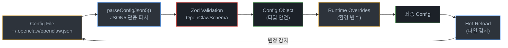
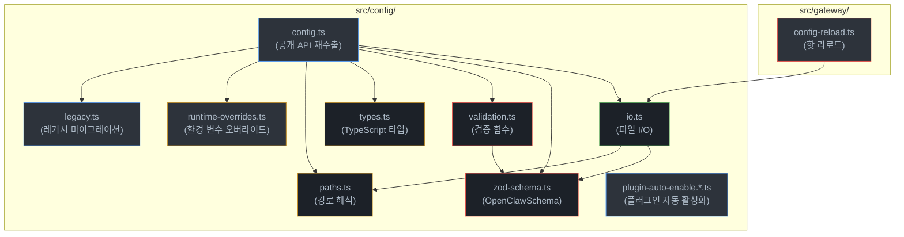
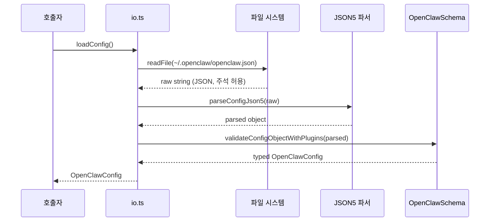
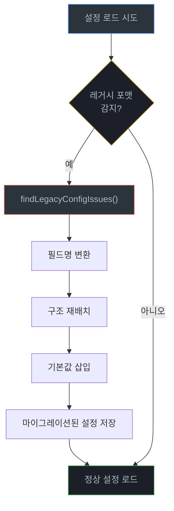
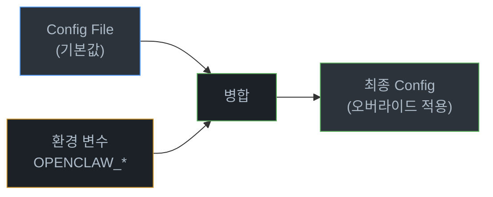
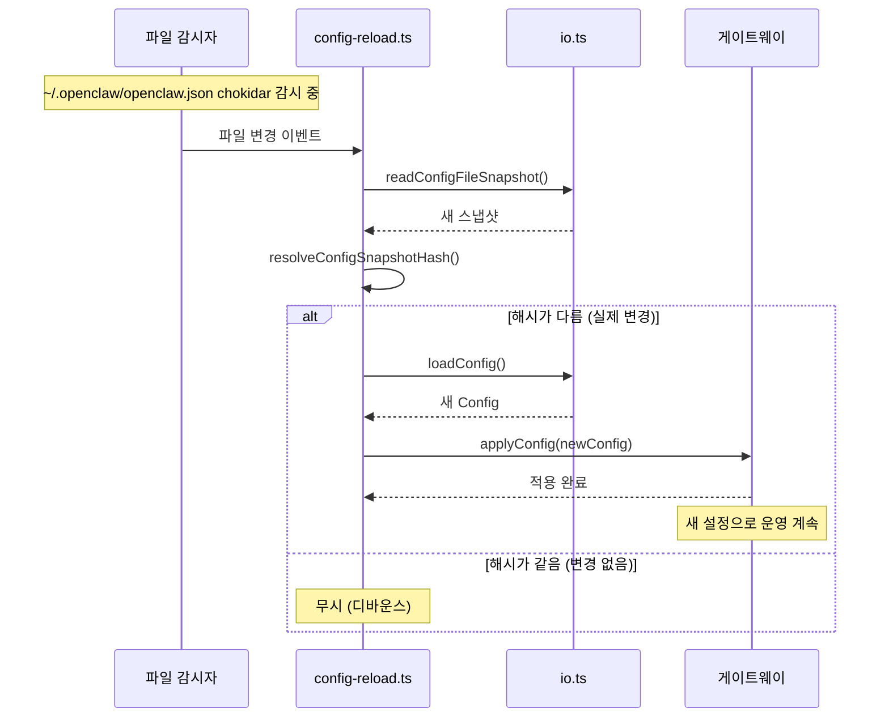
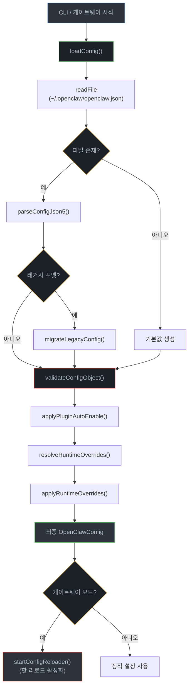

# 06. 설정 시스템 (Configuration System)

> 본 문서는 OpenClaw 2026.6.11 기준으로 갱신되었습니다.

## 개요

OpenClaw의 설정 파일은 기본적으로 **`~/.openclaw/openclaw.json`** (JSON 포맷) 이며, 내부 파서는 주석·후행 쉼표를 허용하기 위해 **JSON5**(`json5` 패키지)로 해석한다. 설정은 **Zod 스키마**로 검증되고, **환경 변수를 통한 런타임 오버라이드**와 **chokidar 기반 핫 리로드**를 지원한다. 레거시 `.clawdbot/clawdbot.json`의 자동 마이그레이션, 플러그인 자동 활성화, NixOS 호환 모드(`OPENCLAW_NIX_MODE=1`) 등 다양한 환경에 대응하는 유연한 구조를 갖추고 있다.

---

## 아키텍처

### 설정 처리 흐름



### 모듈 의존 관계



---

## 설정 파일 위치

| 항목 | 경로 / 환경 변수 |
|------|------------------|
| 기본 설정 파일 | `~/.openclaw/openclaw.json` |
| 설정 디렉토리 (State Dir) | `~/.openclaw/` |
| 레거시 상태 디렉토리 | `~/.clawdbot/` (자동 인식/마이그레이션) |
| 레거시 파일명 | `clawdbot.json` |
| 명시적 경로 오버라이드 | `OPENCLAW_CONFIG_PATH` |
| 상태 디렉토리 오버라이드 | `OPENCLAW_STATE_DIR` |
| Nix 모드 | `OPENCLAW_NIX_MODE=1` |
| 기본 게이트웨이 포트 | `18789` (`OPENCLAW_GATEWAY_PORT`로 재정의) |
| OAuth 자격 증명 디렉토리 | `$STATE_DIR/credentials/oauth.json` (`OPENCLAW_OAUTH_DIR`로 재정의) |
| 경로 해석 모듈 | `src/config/paths.ts` (`resolveConfigPathCandidate`, `CONFIG_PATH`) |

경로 해석은 `paths.ts`에서 수행되며, 신규 `~/.openclaw/` 디렉토리가 있으면 우선하고, 없으면 레거시 `~/.clawdbot/`을 탐색한다. `OPENCLAW_NIX_MODE=1`이면 자동 설치 흐름을 건너뛰고 Nix 특화 에러 메시지를 내보낸다.

---

## 설정 모듈 구조

`src/config/config.ts`는 설정 시스템의 공개 API를 재수출(re-export)하는 배럴 파일(barrel file)이다. 실제 모듈 구성은 200여 개의 파일로 분산되어 있으며(`zod-schema.*`, `legacy.*`, `plugin-auto-enable.*`, `schema.*`, `types.*` 등), 타입 재수출과 런타임 재수출을 분리한다.

```typescript
// src/config/config.ts (요점)
export {
  createConfigIO,
  loadConfig,
  parseConfigJson5,
  readConfigFileSnapshot,
  resolveConfigSnapshotHash,
  writeConfigFile,
} from "./io.js";

export {
  mutateConfigFile,
  replaceConfigFile,
  transformConfigFile,
} from "./mutate.js";

export { assertConfigWriteAllowedInCurrentMode } from "./nix-mode-write-guard.js";

export * from "./paths.js";
export * from "./recovery-policy.js";
export * from "./runtime-overrides.js";
export * from "./types.js";

export {
  validateConfigObject,
  validateConfigObjectRaw,
  validateConfigObjectRawWithPlugins,
  validateConfigObjectWithPlugins,
} from "./validation.js";
```

### 모듈별 책임

| 모듈 | 파일 | 핵심 책임 |
|------|------|-----------|
| I/O | `io.ts`, `io.audit.ts`, `io.write-prepare.ts`, `io.invalid-config.ts`, `io.observe-recovery.ts` | 설정 파일의 읽기/쓰기/파싱, 스냅샷 해시, 감사 기록, 손상 복구 |
| 스키마 | `zod-schema.ts`, `zod-schema.*.ts` (agents, channels, providers, hooks, installs, approvals, session 등 다수) | Zod 기반 설정 스키마 (`OpenClawSchema`) |
| 검증 | `validation.ts`, `issue-format.ts` | 설정 객체 유효성 검증 (기본/플러그인 포함) |
| 타입 | `types.ts`, `types.*.ts` (agents, channels, gateway, memory, skills 등 카테고리별) | TypeScript 타입 정의 |
| 경로 | `paths.ts`, `config-paths.ts` | 설정/상태/OAuth 경로 해석, Nix 모드 분기 |
| 오버라이드 | `runtime-overrides.ts`, `runtime-schema.ts`, `runtime-snapshot.ts` | 환경 변수 런타임 오버라이드, 런타임 스냅샷 |
| 환경 치환 | `env-substitution.ts`, `env-preserve.ts`, `env-vars.ts` | `${VAR}` 치환과 복원 |
| 인클루드 | `includes.ts`, `includes-scan.ts` | `include` 항목 해석 및 순환 방지 |
| 마이그레이션 | `legacy.ts`, `legacy.shared.ts` (규칙: `commands/doctor/shared/legacy-config-migrations.ts`) | 이전 버전(clawdbot) 설정 감지/변환 |
| 자동 활성화 | `plugin-auto-enable.*.ts` | 설치된 플러그인/프로바이더 자동 활성화 |
| 머지/변경 | `merge-patch.ts`, `mutate.ts` | JSON Merge Patch 적용, 안전한 변형 |
| 백업/감사 | `backup-rotation.ts`, `io.audit.ts` | 설정 백업 로테이션, 감사 로그 |
| 리댁션 | `redact-snapshot.*.ts` | 시크릿 마스킹 스냅샷 |
| 핫 리로드 | `../gateway/config-reload.ts` (chokidar) | 파일 변경 감시 및 설정 재로드 |

---

## Zod 스키마 검증

### OpenClawSchema

`zod-schema.ts`에서 정의되는 `OpenClawSchema`는 설정 파일의 구조와 각 필드의 타입, 기본값, 제약 조건을 선언적으로 명세한다.

```typescript
// src/config/zod-schema.ts (구조 예시)
import { z } from "zod";

export const OpenClawSchema = z.object({
  // 게이트웨이 설정
  gateway: z.object({
    port: z.number().int().min(1).max(65535).default(3000),
    host: z.string().default("127.0.0.1"),
    maxConnections: z.number().int().positive().default(100),
    heartbeatInterval: z.number().int().positive().default(30000),
  }).default({}),

  // 채널 설정
  channels: z.record(
    z.string(),
    z.object({
      type: z.string(),
      enabled: z.boolean().default(true),
      options: z.record(z.unknown()).default({}),
    }),
  ).default({}),

  // 에이전트 설정
  agent: z.object({
    model: z.string().default("default"),
    maxTokens: z.number().int().positive().default(4096),
    temperature: z.number().min(0).max(2).default(0.7),
  }).default({}),

  // 플러그인 설정
  plugins: z.record(
    z.string(),
    z.object({
      enabled: z.boolean().default(false),
      config: z.record(z.unknown()).default({}),
    }),
  ).default({}),

  // 로깅 설정
  logging: z.object({
    level: z.enum(["debug", "info", "warn", "error"]).default("info"),
    file: z.string().optional(),
  }).default({}),
});

// 스키마에서 TypeScript 타입 추론
export type OpenClawConfig = z.infer<typeof OpenClawSchema>;
```

### 검증 함수

```typescript
// src/config/validation.ts (패턴 예시)
import { OpenClawSchema } from "./zod-schema.js";
import type { OpenClawConfig } from "./types.js";

/**
 * 기본 설정 검증 — 코어 필드만 검증한다.
 */
export function validateConfigObject(raw: unknown): OpenClawConfig {
  return OpenClawSchema.parse(raw);
}

/**
 * 플러그인 포함 설정 검증 — 플러그인별 스키마를 동적으로 병합하여 검증한다.
 */
export function validateConfigObjectWithPlugins(
  raw: unknown,
  pluginSchemas: Record<string, z.ZodTypeAny>,
): OpenClawConfig {
  // 플러그인 스키마를 기본 스키마에 병합
  let extendedSchema = OpenClawSchema;
  for (const [name, schema] of Object.entries(pluginSchemas)) {
    extendedSchema = extendedSchema.extend({
      plugins: extendedSchema.shape.plugins.extend({
        [name]: z.object({
          enabled: z.boolean().default(false),
          config: schema.default({}),
        }),
      }),
    });
  }
  return extendedSchema.parse(raw);
}
```

---

## 설정 I/O

`io.ts`는 설정 파일의 전체 생명주기(읽기 -> 파싱 -> 쓰기 -> 스냅샷 관리)를 담당한다.



```typescript
// src/config/io.ts (주요 함수 시그니처)

/**
 * ConfigIO 인터페이스를 생성한다.
 * 의존성 주입을 통해 파일 시스템 접근을 추상화한다.
 */
export function createConfigIO(fs?: FileSystem): ConfigIO;

/**
 * 설정 파일을 읽고 파싱하고 검증하여 반환한다.
 * 파일이 없으면 기본값을 반환한다.
 */
export async function loadConfig(configPath?: string): Promise<OpenClawConfig>;

/**
 * JSON5 문자열을 JavaScript 객체로 파싱한다.
 * 주석과 후행 쉼표를 허용하는 JSON5 규격을 따른다.
 */
export function parseConfigJson5(content: string): unknown;

/**
 * 설정 파일의 현재 상태를 스냅샷으로 읽는다.
 * 핫 리로드 시 변경 감지에 사용된다.
 */
export async function readConfigFileSnapshot(
  configPath?: string,
): Promise<ConfigSnapshot>;

/**
 * 스냅샷의 해시를 계산한다.
 * 변경 여부를 빠르게 판별하기 위함이다.
 */
export function resolveConfigSnapshotHash(
  snapshot: ConfigSnapshot,
): string;

/**
 * 설정 객체를 JSON 포맷으로 직렬화하여 파일에 기록한다.
 * (파서는 JSON5 관용 모드를 사용하지만 산출 파일은 표준 JSON 형태이다.)
 */
export async function writeConfigFile(
  config: OpenClawConfig,
  configPath?: string,
): Promise<void>;
```

---

## 레거시 마이그레이션

### findLegacyConfigIssues()

이전 버전(리브랜딩 전 `clawdbot`)의 설정 포맷과 폐기된 키를 감지하여 현재 스키마에 맞는 이행을 안내한다. 구현은 `src/config/legacy.ts`와 `legacy.shared.ts`에 있으며, 실제 변환 규칙은 `src/commands/doctor/shared/legacy-config-migrations.ts`의 `LEGACY_CONFIG_MIGRATION_RULES`로 선언된다. `doctor` 명령이 설정 프리플라이트 단계에서 이 규칙을 적용해 레거시 키를 정확한 경로와 함께 보고·정정하므로, 사용자가 버전 업그레이드 시 설정을 수동으로 수정할 필요가 없도록 보장한다.



```typescript
// src/config/legacy.ts (패턴 예시)
export function findLegacyConfigIssues(
  raw: unknown,
  sourceRaw?: unknown,
  extraRules?: LegacyConfigRule[],
): LegacyConfigIssue[];

// 실제 이행 규칙은 doctor 공유 모듈에서 선언된다.
// src/commands/doctor/shared/legacy-config-migrations.ts
export const LEGACY_CONFIG_MIGRATION_RULES: LegacyConfigRule[];
```

주요 변환 범주 (`legacy-config-migrations.ts`):

- 리브랜딩 이전의 `.clawdbot/clawdbot.json` → `.openclaw/openclaw.json`
- 라우팅 `allowFrom` 등 폐기 필드 감지와 권장 변환
- 채널·프로바이더 섹션의 구형 키/형상 정규화
- iMessage `dmPolicy` 등 채널별 호환 규칙

---

## 런타임 오버라이드

### 환경 변수 기반 설정 오버라이드

환경 변수를 통해 설정 파일의 값을 런타임에 덮어쓸 수 있다. 이는 CI/CD 환경이나 컨테이너 배포 시 설정 파일을 수정하지 않고 동작을 변경할 때 유용하다.



```typescript
// src/config/runtime-overrides.ts (패턴 예시)
export interface RuntimeOverrides {
  gatewayPort?: number;
  gatewayHost?: string;
  logLevel?: string;
  [key: string]: unknown;
}

/**
 * OPENCLAW_ 접두사를 가진 환경 변수를 스캔하여
 * 설정 오버라이드 객체를 생성한다.
 *
 * 환경 변수 명명 규칙:
 *   OPENCLAW_GATEWAY_PORT=8080   → { gateway: { port: 8080 } }
 *   OPENCLAW_LOG_LEVEL=debug     → { logging: { level: "debug" } }
 */
export function resolveRuntimeOverrides(
  env: Record<string, string | undefined> = process.env,
): RuntimeOverrides {
  const overrides: RuntimeOverrides = {};

  for (const [key, value] of Object.entries(env)) {
    if (!key.startsWith("OPENCLAW_") || value === undefined) continue;

    const configPath = key
      .slice("OPENCLAW_".length)
      .toLowerCase()
      .split("_");

    setNestedValue(overrides, configPath, parseValue(value));
  }

  return overrides;
}

/**
 * 설정 객체에 런타임 오버라이드를 적용한다.
 * 파일 기반 설정보다 환경 변수가 우선한다.
 */
export function applyRuntimeOverrides(
  config: OpenClawConfig,
  overrides: RuntimeOverrides,
): OpenClawConfig {
  return deepMerge(config, overrides) as OpenClawConfig;
}
```

### 환경 변수 매핑 예시

| 환경 변수 | 설정 경로 | 값 타입 |
|-----------|-----------|---------|
| `OPENCLAW_GATEWAY_PORT` | `gateway.port` | `number` |
| `OPENCLAW_GATEWAY_HOST` | `gateway.host` | `string` |
| `OPENCLAW_LOG_LEVEL` | `logging.level` | `string` |
| `OPENCLAW_AGENT_MODEL` | `agent.model` | `string` |
| `OPENCLAW_AGENT_MAX_TOKENS` | `agent.maxTokens` | `number` |

---

## 핫 리로드 (Hot-Reload)

### src/gateway/config-reload.ts

게이트웨이 서버 실행 중 설정 파일이 변경되면 **chokidar** 파일 감시자로 이벤트를 받고, 스냅샷 해시 비교와 300ms 디바운스를 거쳐 재로드하여 서비스 재시작 없이 설정을 반영한다. `GatewayReloadMode`는 기본값 `"hybrid"`이며, 스킬 관련 경로(`skills.*`)가 변경되면 세션 캐시 스냅샷을 무효화해 다음 턴에서 재빌드하게 한다.



```typescript
// src/gateway/config-reload.ts (패턴 예시, 실제 구현은 chokidar 기반)
import chokidar from "chokidar";
import {
  loadConfig,
  readConfigFileSnapshot,
  resolveConfigSnapshotHash,
  CONFIG_PATH,
} from "../config/config.js";

export type GatewayReloadSettings = {
  mode: "off" | "restart" | "hot" | "hybrid";  // GatewayReloadMode, 기본값 "hybrid"
  debounceMs: number;                          // gateway.reload.debounceMs, 기본값 300
};

export function startConfigReloader(
  onConfigChanged: (config: OpenClawConfig, plan: GatewayReloadPlan) => void,
): () => void {
  let lastHash: string | null = null;

  const watcher = chokidar.watch(CONFIG_PATH).on("all", async () => {
    try {
      const snapshot = await readConfigFileSnapshot();
      const hash = resolveConfigSnapshotHash(snapshot);

      // 해시 비교로 실제 변경 여부 판별 (디바운스 기본 300ms)
      if (hash === lastHash) return;
      lastHash = hash;

      const config = await loadConfig();
      // diffConfigPaths + buildGatewayReloadPlan으로 변경 경로별 작업을 계획
      onConfigChanged(config, buildGatewayReloadPlan(/* ... */));
    } catch (err) {
      // 파싱 오류 시 기존 설정 유지, 경고 로그만 출력
      console.warn("설정 리로드 실패:", err);
    }
  });

  return () => watcher.close();
}
```

---

## 플러그인 자동 활성화

### src/config/plugin-auto-enable.ts

새로운 플러그인이 설치되면 설정 파일에 자동으로 활성화 항목을 추가한다.

```typescript
// src/config/plugin-auto-enable.ts (패턴 예시)
import { loadConfig, writeConfigFile } from "./io.js";

/**
 * 설치된 플러그인 중 설정에 미등록된 항목을 자동 활성화한다.
 */
export async function applyPluginAutoEnable(
  installedPlugins: string[],
): Promise<void> {
  const config = await loadConfig();
  let modified = false;

  for (const pluginName of installedPlugins) {
    if (!(pluginName in config.plugins)) {
      config.plugins[pluginName] = {
        enabled: true,
        config: {},
      };
      modified = true;
    }
  }

  if (modified) {
    await writeConfigFile(config);
  }
}
```

---

## Nix 모드

### resolveIsNixMode()

OpenClaw가 Nix 하에서 구동 중인지는 **`OPENCLAW_NIX_MODE=1`** 환경 변수로만 판단한다. 자동 감지(`IN_NIX_SHELL`, `/etc/nixos`)는 사용하지 않으며, 관리자가 명시적으로 플래그를 설정해야 한다. Nix 모드에서는:

- 자동 설치 흐름(의존성 설치/업데이트)을 시도하지 않는다.
- 누락된 의존성에 대해 Nix 특화 액션 메시지를 제공한다.
- 설정은 외부(Nix)에서 관리되는 것으로 간주된다.

```typescript
// src/config/paths.ts (발췌)
export function resolveIsNixMode(env: NodeJS.ProcessEnv = process.env): boolean {
  return env.OPENCLAW_NIX_MODE === "1";
}

export let isNixMode = resolveIsNixMode();

const NEW_STATE_DIRNAME = ".openclaw";
const CONFIG_FILENAME = "openclaw.json";
const LEGACY_STATE_DIRNAMES = [".clawdbot"] as const;
const LEGACY_CONFIG_FILENAMES = ["clawdbot.json"] as const;

// 기본 경로 해석 우선순위:
// 1) OPENCLAW_CONFIG_PATH (명시적 오버라이드)
// 2) OPENCLAW_STATE_DIR/openclaw.json (+ 레거시 파일명)
// 3) ~/.openclaw/openclaw.json
// 4) 레거시 ~/.clawdbot/openclaw.json, ~/.clawdbot/clawdbot.json
export let CONFIG_PATH = resolveConfigPathCandidate();
```

---

## 파일 구조 요약

```
src/config/
├── config.ts                     # 공개 API 배럴 (재수출)
├── io.ts                         # 설정 파일 I/O (읽기/쓰기/파싱/스냅샷)
├── io.audit.ts                   # 설정 쓰기 감사 기록
├── io.write-prepare.ts           # 쓰기 전 머지 패치/환경 복원 준비
├── io.invalid-config.ts          # 유효하지 않은 설정 감지/포맷
├── io.observe-recovery.ts        # 손상된 파일 관측 및 복구
├── zod-schema.ts                 # OpenClawSchema (총괄)
├── zod-schema.*.ts               # 카테고리별 스키마 (agents/channels/providers/hooks/session/installs/approvals/secret-input 등)
├── schema.ts / schema.*.ts       # 스키마 보조 (help/hints/labels/tags/shared)
├── validation.ts                 # Zod 검증 + 플러그인 스키마 병합
├── issue-format.ts               # 검증 이슈 포맷팅
├── types.ts / types.*.ts         # 카테고리별 타입 (memory/skills/gateway/channels/...)
├── paths.ts / config-paths.ts    # 경로 해석, CONFIG_PATH, resolveIsNixMode()
├── runtime-overrides.ts          # OPENCLAW_* 런타임 오버라이드
├── runtime-schema.ts / runtime-snapshot.ts  # 런타임 설정 스냅샷
├── env-substitution.ts / env-preserve.ts / env-vars.ts  # ${VAR} 치환/복원
├── includes.ts / includes-scan.ts            # include 파일 합치기
├── legacy.ts / legacy.shared.ts  # 레거시 감지 (변환 규칙은 commands/doctor/shared/legacy-config-migrations.ts)
├── plugin-auto-enable.*.ts       # 플러그인/프로바이더 자동 활성화
├── merge-patch.ts / mutate.ts    # JSON Merge Patch 및 안전한 변경
├── backup-rotation.ts            # 설정 백업 로테이션
├── redact-snapshot.*.ts          # 시크릿 마스킹 스냅샷
├── defaults.ts / allowed-values.ts / port-defaults.ts  # 기본값/허용값
├── sessions/                     # 세션 설정 경로
└── ... (commands.ts, normalize-paths.ts, group-policy.ts 외 다수)

src/gateway/
├── config-reload.ts              # chokidar 기반 핫 리로드
├── config-reload-settings.ts     # reload 모드/디바운스 정규화 (기본 hybrid, 300ms)
├── config-reload-plan.ts         # 변경 경로 → 리로드 작업 계획
└── server-reload-handlers.ts     # 리로드 훅 배선
```

---

## 설정 처리 전체 파이프라인



---

## 설계 포인트 정리

| 설계 원칙 | 적용 방식 | 이점 |
|-----------|-----------|------|
| 선언적 스키마 | Zod `OpenClawSchema`(카테고리별 분할)로 구조 정의 | 타입 안전성, 자동 기본값, 에러 메시지 자동 생성 |
| JSON + 관용 파서 | 기본 파일은 `openclaw.json`, 파서는 JSON5로 주석·후행 쉼표 허용 | 표준 JSON 도구 호환 + 사용자 편의성 |
| 환경 변수 오버라이드 | `OPENCLAW_*` 접두사 규칙 (`OPENCLAW_CONFIG_PATH`, `OPENCLAW_STATE_DIR`, `OPENCLAW_GATEWAY_PORT` 외) | CI/CD, 컨테이너 환경 유연 대응 |
| 환경 변수 치환 | 값 내부 `${VAR}` 복원 가능한 치환 | 시크릿 외부화, 쓰기 시 치환 보존 |
| 핫 리로드 | chokidar 감시 + 스냅샷 해시 + 300ms 디바운스 + reload plan | 무중단 설정 변경, 변경 경로별 부분 재적용 |
| 레거시 마이그레이션 | `.clawdbot` 상태 디렉토리·`clawdbot.json` 자동 인식 | 하위 호환성 보장 |
| 플러그인 자동 활성화 | 설치 감지 시 설정 자동 추가 (`plugin-auto-enable.*`) | 플러그인 도입 장벽 최소화 |
| 감사·백업 | `io.audit.ts` 기록, `backup-rotation.ts` 로테이션 | 변경 추적과 복구 가능성 |
| Nix 호환 | `OPENCLAW_NIX_MODE=1` 플래그 기반 분기 | 자동 설치 억제, Nix 특화 에러 |
| 리댁션 | `redact-snapshot.*`로 시크릿 마스킹 스냅샷 | 로그/진단 안전 |
