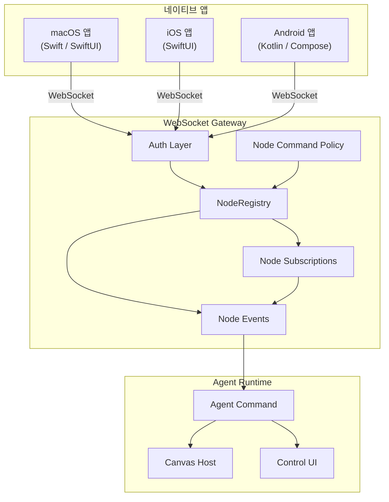

# 07. 네이티브 앱 통합 (Native App Integration)

> 본 문서는 OpenClaw 2026.6.11 기준으로 갱신되었습니다.

## 개요

OpenClaw는 macOS 메뉴 바 앱, iOS 컴패니언 앱, Android 컴패니언 앱 세 가지 네이티브 클라이언트를 제공한다. 세 플랫폼은 `apps/shared/OpenClawKit` Swift 패키지(iOS/macOS 공유)와 프로토콜 정의를 재사용하며, 모든 앱은 WebSocket 프로토콜을 통해 Gateway에 연결된다. 노드(Node) 시스템을 통해 디바이스 고유 기능(오디오, 카메라, 화면 녹화, 위치, 음성 깨우기, Talk 모드 등)을 에이전트에 노출하고, Lit 기반 Control UI와 Canvas 시스템이 브라우저 및 네이티브 WebView에서 실시간 시각적 워크스페이스를 제공한다.

`apps/` 디렉토리에는 위 세 클라이언트(`android`, `ios`, `macos`)와 공유 패키지(`shared`) 외에도 다음 두 개의 보조 macOS 컴포넌트가 포함된다.

- **`macos-mlx-tts`**: MLX 기반 로컬 TTS 헬퍼(`openclaw-mlx-tts`, macOS 15+). 전체 MLX 오디오 스택을 macOS 앱 본체 빌드에서 분리하기 위해 독립 Swift 패키지로 유지된다.
- **`swabble`**: Speech.framework 기반 웨이크워드 훅 데몬(Swift 6.2, CLI는 macOS 26 SpeechAnalyzer/SpeechTranscriber 대상). 완전 온디바이스로 동작하며, 공유 `SwabbleKit` 타깃은 iOS/macOS 앱에 웨이크 게이팅 유틸리티를 제공한다.

---

## 아키텍처



---

## macOS 앱 (`apps/macos/`)

### 기술 스택

| 항목 | 값 |
|------|-----|
| 언어 | Swift |
| UI 프레임워크 | SwiftUI |
| 상태 관리 | Observation 프레임워크 (`@Observable`, `@Bindable`) |
| 빌드 시스템 | Swift Package Manager (`Package.swift`) |
| 최소 요구사항 | macOS (Apple Silicon / Intel) |

### 주요 기능

- **메뉴 바 상주**: LaunchAgent 패턴으로 시스템 시작 시 자동 실행. Gateway 프로세스를 직접 관리(시작/중지/재시작)
- **Voice Wake + Talk Mode**: ElevenLabs 통합으로 음성 입력 및 에이전트 응답 TTS 출력. `VoiceWakeForwarder`가 텍스트를 shell-escape하여 `openclaw-mac agent --message` 명령으로 전달
- **Gateway 관리**: macOS 앱이 게이트웨이의 라이프사이클 전체를 제어. 별도 LaunchAgent 헬퍼 없이 앱 자체가 게이트웨이 프로세스를 소유
- **Canvas 지원**: 내장 WebView에서 A2UI 기반 시각적 워크스페이스 렌더링

### SwiftUI 상태 관리 지침

```swift
// 권장: Observation 프레임워크 사용
@Observable
class GatewayState {
    var isRunning = false
    var connectedNodes: [NodeInfo] = []
    var lastHealthCheck: Date?
}

// 뷰에서 바인딩
struct GatewayView: View {
    @Bindable var state: GatewayState

    var body: some View {
        Toggle("Gateway", isOn: $state.isRunning)
    }
}

// 비권장: ObservableObject (호환성 필요 시에만 사용)
// class GatewayState: ObservableObject { ... }
```

### 패키지 및 릴리스

- 빌드 스크립트: `scripts/package-mac-app.sh` (현재 아키텍처 기본)
- 릴리스 체크리스트: `docs/platforms/mac/release.md`
- 코드사인: `scripts/codesign-mac-app.sh`
- DMG 생성: `scripts/create-dmg.sh`
- 공증(Notarization): `scripts/notarize-mac-artifact.sh`

### 소스 구조

```
apps/macos/Sources/
├── OpenClaw/             # 메인 앱 모듈 (Canvas, Chat, Gateway, Voice 등)
│   └── Resources/
│       └── Info.plist    # CFBundleShortVersionString / CFBundleVersion
├── OpenClawDiscovery/    # Bonjour 기반 게이트웨이 탐색
├── OpenClawIPC/          # 프로세스 간 통신
├── OpenClawMacCLI/       # openclaw-mac CLI 래퍼
└── OpenClawProtocol/     # WebSocket 프로토콜 정의 (공유 모듈)
```

공유 의존성은 `apps/shared/OpenClawKit/` (Sources: `OpenClaw`, `OpenClawChatUI`, `OpenClawProtocol`, Tools: `CanvasA2UI`)에 배치되어 iOS/macOS가 함께 참조한다.

---

## iOS 앱 (`apps/ios/`)

### 기술 스택

| 항목 | 값 |
|------|-----|
| 언어 | Swift |
| UI 프레임워크 | SwiftUI |
| 상태 관리 | Observation 프레임워크 |
| 빌드 시스템 | Swift Package Manager |
| 최소 SDK | iOS (현재 릴리스 대상) |

### 주요 기능

- **모바일 노드**: 게이트웨이에 WebSocket으로 연결하여 디바이스 기능(카메라, 위치, 화면, 음성)을 노드로 등록
- **Canvas 렌더링**: WKWebView 기반 A2UI 캔버스. `openclawCanvasA2UIAction` 메시지 핸들러로 네이티브-JS 브리지 구현
- **Push Notifications**: 게이트웨이 이벤트에 대한 원격 알림 수신
- **음성 인식**: 온디바이스 Speech Recognition으로 Voice Wake 지원
- **Bonjour 탐색**: `_openclaw-gw._tcp` 서비스로 로컬 네트워크에서 게이트웨이 자동 검색

### 버전 정보

과거의 `apps/ios/version.json` 매니페스트는 제거되었다. 이제 iOS는 별도 버전 핀을 커밋하지 않고, 릴리스 업로드 시 명시적 CalVer 버전을 인자로 전달한다(예: `pnpm ios:release:upload -- --version 2026.6.11`). 인자를 생략하면 루트 `package.json`의 `version`(현재 `2026.6.11`)에서 릴리스 접미사를 제거해 기본값을 파생한다. 이 값은 `project.yml`(XcodeGen)의 `OPENCLAW_MARKETING_VERSION`을 거쳐 `Info.plist`의 `CFBundleShortVersionString`에 주입된다. 자세한 규칙은 `apps/ios/VERSIONING.md`를 참고한다.

### 소스 구조

```
apps/ios/Sources/
├── Assets.xcassets/     # 앱 아이콘 및 이미지 에셋
├── Calendar/            # 캘린더 이벤트 노드
├── Camera/              # 카메라 캡처 기능
├── Capabilities/        # 노드 capability 선언
├── Chat/                # 채팅 UI 컴포넌트
├── Contacts/            # 연락처 접근
├── Device/              # 디바이스 메타데이터
├── EventKit/            # EventKit 통합
├── Gateway/             # WebSocket 게이트웨이 연결
├── HomeToolbar.swift    # 홈 툴바
├── Info.plist           # 앱 메타데이터 및 권한 설정
├── LiveActivity/        # Live Activity 지원
├── Location/            # 위치 서비스
├── Media/               # 미디어 업로드
├── Model/               # 데이터 모델
├── Motion/              # 모션 센서
├── Onboarding/          # 최초 실행 온보딩
├── OpenClaw.entitlements# 앱 엔타이틀먼트
├── OpenClawApp.swift    # 앱 진입점
├── Push/                # 푸시 알림
├── Reminders/           # 리마인더 노드
├── RootCanvas.swift     # A2UI 캔버스 WebView 호스트
├── RootTabs.swift       # 메인 탭 내비게이션
├── RootView.swift       # 루트 뷰
├── Screen/              # 화면 녹화
├── Services/            # 공통 서비스
├── SessionKey.swift     # 세션 키 관리
├── Settings/            # 설정 화면
├── Status/              # 연결 상태 표시
└── Voice/               # 음성 입력 / Voice Wake / Talk
```

`apps/ios/`에는 추가로 `ActivityWidget/`, `ShareExtension/`, `WatchApp/`, `WatchExtension/` 확장 타깃과 `fastlane/`, `project.yml` (XcodeGen) 설정이 포함된다.

---

## Android 앱 (`apps/android/`)

### 기술 스택

| 항목 | 값 |
|------|-----|
| 언어 | Kotlin |
| UI 프레임워크 | Jetpack Compose |
| 빌드 시스템 | Gradle (Kotlin DSL) |
| 최소 SDK | 31 (Android 12) |
| 타겟 SDK | 36 |

### 주요 기능

- **모바일 노드**: iOS와 동일하게 게이트웨이에 노드로 등록. SMS 전송 기능 추가 지원 (iOS에는 없음)
- **Foreground Service**: `NodeForegroundService`로 백그라운드에서 지속적 게이트웨이 연결 유지
- **Canvas 지원**: Android WebView 기반 A2UI. `openclawCanvasA2UIAction.postMessage()` 인터페이스로 JS-Native 브리지
- **게이트웨이 탐색**: Bonjour/mDNS 기반 자동 검색 (`GatewayDiscovery.kt`)
- **TLS 지원**: `GatewayTls.kt`에서 커스텀 TLS 인증서 핀닝

### 버전 정보

`app/build.gradle.kts`에서 관리하되, 버전 값 자체는 `Config/Version.properties`(`OPENCLAW_ANDROID_VERSION_NAME` / `OPENCLAW_ANDROID_VERSION_CODE`)에서 주입된다. `pnpm android:version:sync`로 동기화하며, 현재 버전은 `2026.6.11`이다.

```kotlin
val openClawAndroidVersionName =
    requireOpenClawAndroidVersionProperty("OPENCLAW_ANDROID_VERSION_NAME")   // Config/Version.properties

defaultConfig {
    applicationId = "ai.openclaw.app"
    minSdk = 31
    targetSdk = 36
    versionCode = openClawAndroidVersionCode
    versionName = openClawAndroidVersionName
}
```

### 소스 구조

```
apps/android/app/src/main/java/ai/openclaw/app/
├── MainActivity.kt            # 앱 진입점
├── MainViewModel.kt           # 메인 상태 관리
├── NodeApp.kt                 # Application 클래스
├── NodeRuntime.kt             # 노드 런타임 로직
├── NodeForegroundService.kt   # 백그라운드 서비스
├── SecurePrefs.kt             # 보안 저장소
├── chat/                      # 채팅 UI 및 모델
│   ├── ChatController.kt
│   └── ChatModels.kt
├── gateway/                   # 게이트웨이 연결 계층
│   ├── DeviceAuthStore.kt
│   ├── DeviceIdentityStore.kt
│   ├── GatewayDiscovery.kt
│   ├── GatewaySession.kt
│   └── GatewayTls.kt
├── node/                      # 노드 기능 (카메라, 위치, SMS 등)
│   ├── CameraCaptureManager.kt
│   ├── CanvasController.kt
│   ├── LocationCaptureManager.kt
│   ├── ScreenRecordManager.kt
│   └── SmsManager.kt
├── protocol/                  # 프로토콜 상수 및 액션
├── tools/                     # 도구 표시 UI
├── ui/                        # Compose UI 컴포넌트
│   ├── ChatSheet.kt
│   ├── RootScreen.kt
│   ├── SettingsSheet.kt
│   └── chat/                  # 채팅 상세 뷰
├── voice/                     # 음성 관련
│   ├── TalkModeManager.kt
│   ├── VoiceWakeManager.kt
│   └── VoiceWakeCommandExtractor.kt
└── ...
```

---

## 모바일 노드 시스템

모바일 노드 시스템은 네이티브 앱(iOS, Android, macOS)을 게이트웨이에 "노드"로 등록하여, 에이전트가 디바이스 고유 기능을 원격으로 호출할 수 있도록 한다.

### 핵심 컴포넌트

#### 1. Node Registry (`src/gateway/node-registry.ts`)

디바이스 세션을 추적하고 원격 명령 호출(invoke)을 관리하는 핵심 레지스트리:

```typescript
export type NodeSession = {
  nodeId: string;
  connId: string;
  client: GatewayWsClient;
  displayName?: string;
  platform?: string;         // "ios", "android", "macos" 등
  version?: string;
  deviceFamily?: string;
  modelIdentifier?: string;
  remoteIp?: string;
  caps: string[];            // 디바이스 능력 목록
  commands: string[];        // 지원하는 명령어 목록
  permissions?: Record<string, boolean>;
  connectedAtMs: number;
};

export class NodeRegistry {
  private nodesById = new Map<string, NodeSession>();
  private nodesByConn = new Map<string, string>();
  private pendingInvokes = new Map<string, PendingInvoke>();

  register(client: GatewayWsClient, opts: { remoteIp?: string }): NodeSession;
  unregister(connId: string): string | null;
  listConnected(): NodeSession[];
  invoke(params: {
    nodeId: string;
    command: string;
    params?: unknown;
    timeoutMs?: number;
  }): Promise<NodeInvokeResult>;
}
```

#### 2. Node Command Policy (`src/gateway/node-command-policy.ts`)

플랫폼별 명령어 허용 목록을 관리. 각 플랫폼이 어떤 노드 명령을 실행할 수 있는지 정의:

```typescript
// 플랫폼별 기본 명령어 허용 목록
const PLATFORM_DEFAULTS: Record<string, string[]> = {
  ios:     [...CANVAS_COMMANDS, ...CAMERA_COMMANDS, ...SCREEN_COMMANDS, ...LOCATION_COMMANDS],
  android: [...CANVAS_COMMANDS, ...CAMERA_COMMANDS, ...SCREEN_COMMANDS,
            ...LOCATION_COMMANDS, ...SMS_COMMANDS],
  macos:   [...CANVAS_COMMANDS, ...CAMERA_COMMANDS, ...SCREEN_COMMANDS,
            ...LOCATION_COMMANDS, ...SYSTEM_COMMANDS],
  linux:   [...SYSTEM_COMMANDS],
  windows: [...SYSTEM_COMMANDS],
};
```

| 명령 카테고리 | 명령어 예시 | iOS | Android | macOS |
|--------------|-----------|-----|---------|-------|
| Canvas | `canvas.present`, `canvas.a2ui.push` | O | O | O |
| Camera | `camera.snap`, `camera.clip` | O | O | O |
| Screen | `screen.record` | O | O | O |
| Location | `location.get` | O | O | O |
| SMS | `sms.send` | X | O | X |
| System | `system.run`, `browser.proxy` | X | X | O |

#### 노드 기능 (공식 문서: `docs/nodes/`)

| 노드 | 설명 | 관련 문서 |
|------|------|---------|
| audio | 디바이스 오디오 입력/출력 스트리밍 | `docs/nodes/audio.md` |
| camera | 카메라 스냅샷/짧은 클립 캡처 | `docs/nodes/camera.md` |
| images | 디바이스 갤러리 이미지 접근 | `docs/nodes/images.md` |
| location | 단발성 위치 조회 (`location.get`) | `docs/nodes/location-command.md` |
| talk | Talk 모드: 에이전트 응답을 TTS로 출력하고 사용자 발화를 스트리밍 | `docs/nodes/talk.md` |
| voicewake | 디바이스 로컬 웨이크워드 감지 | `docs/nodes/voicewake.md` |
| media-understanding | 캡처된 미디어에 대한 비전 분석 파이프라인 | `docs/nodes/media-understanding.md` |

#### 3. Mobile Node Detection (`src/gateway/server-mobile-nodes.ts`)

현재 연결된 모바일 노드 존재 여부를 확인:

```typescript
const isMobilePlatform = (platform: unknown): boolean => {
  const p = typeof platform === "string" ? platform.trim().toLowerCase() : "";
  if (!p) return false;
  return p.startsWith("ios") || p.startsWith("ipados") || p.startsWith("android");
};

export function hasConnectedMobileNode(registry: NodeRegistry): boolean {
  const connected = registry.listConnected();
  return connected.some((n) => isMobilePlatform(n.platform));
}
```

#### 4. Node Events (`src/gateway/server-node-events.ts`)

노드에서 발생하는 이벤트를 처리하는 핸들러. 지원 이벤트:

| 이벤트 | 설명 |
|--------|------|
| `voice.transcript` | 음성 인식 텍스트를 에이전트 명령으로 변환 |
| `agent.request` | 딥링크 기반 에이전트 요청 (메시지, 세션, 채널 지정) |
| `chat.subscribe` | 특정 세션의 채팅 스트림 구독 |
| `chat.unsubscribe` | 채팅 스트림 구독 해제 |
| `exec.started` | 노드에서 명령 실행 시작 |
| `exec.finished` | 노드에서 명령 실행 완료 |
| `exec.denied` | 노드에서 명령 실행 거부 |

#### 5. Node Subscriptions (`src/gateway/server-node-subscriptions.ts`)

노드-세션 간 pub/sub 매니저. 양방향 매핑(nodeId -> sessionKeys, sessionKey -> nodeIds)으로 효율적 이벤트 라우팅:

```typescript
export type NodeSubscriptionManager = {
  subscribe: (nodeId: string, sessionKey: string) => void;
  unsubscribe: (nodeId: string, sessionKey: string) => void;
  unsubscribeAll: (nodeId: string) => void;
  sendToSession: (sessionKey: string, event: string, payload: unknown,
                  sendEvent?: NodeSendEventFn | null) => void;
  sendToAllSubscribed: (event: string, payload: unknown,
                        sendEvent?: NodeSendEventFn | null) => void;
  sendToAllConnected: (event: string, payload: unknown,
                       listConnected?: NodeListConnectedFn | null,
                       sendEvent?: NodeSendEventFn | null) => void;
  clear: () => void;
};
```

---

## Control UI (`ui/`)

브라우저 기반 관리 인터페이스로, 게이트웨이 내장 HTTP 서버에서 제공된다.

### 기술 스택

| 항목 | 버전 | 용도 |
|------|------|------|
| Lit | 3.3.2 | 웹 컴포넌트 프레임워크 |
| Vite | 7.3.1 | 빌드 도구 |
| DOMPurify | ^3.3.1 | XSS 방지 HTML 새니타이징 |
| Marked | ^17.0.1 | Markdown 렌더링 |
| @noble/ed25519 | 3.0.0 | 디바이스 인증 서명 |

### 상태 관리

Lit Signals 패턴을 사용하여 반응형 상태 관리. Lit 웹 컴포넌트의 `@property` 데코레이터와 시그널 조합으로 세밀한 리렌더링 제어.

### 구조

```
ui/
├── index.html            # SPA 진입점
├── package.json          # 의존성 정의
├── vite.config.ts        # Vite 빌드 설정
├── vitest.config.ts      # 테스트 설정 (브라우저)
├── vitest.node.config.ts # 테스트 설정 (Node)
├── public/               # 정적 에셋
└── src/
    ├── main.ts           # 앱 부트스트랩
    ├── styles.css         # 글로벌 스타일
    ├── styles/            # 스타일 모듈
    └── ui/               # Lit 웹 컴포넌트 (52개 파일)
```

---

## Canvas 시스템 (`src/canvas-host/`)

에이전트가 구동하는 실시간 시각적 워크스페이스. 네이티브 앱의 WebView 또는 독립 브라우저에서 렌더링된다.

### A2UI 번들

```
src/canvas-host/
├── a2ui/                  # A2UI 정적 에셋 번들
│   ├── index.html         # 캔버스 진입점
│   ├── a2ui.bundle.js     # 번들된 JavaScript
│   └── .bundle.hash       # 자동 생성 해시 (무시 대상)
├── a2ui.ts                # A2UI HTTP 핸들러 + 라이브 리로드 주입
└── server.ts              # Canvas Host 서버 (chokidar 파일 감시)
```

### 라이브 캔버스 동작

1. `server.ts`가 chokidar로 `~/.openclaw/canvas/` 디렉토리 감시
2. 파일 변경 시 WebSocket(`/__openclaw__/ws`)으로 `"reload"` 메시지 전송
3. 브라우저/WebView가 자동 리프레시
4. HTML 응답에 `injectCanvasLiveReload()` 스니펫 자동 삽입

### 네이티브 브리지

A2UI 캔버스는 iOS/Android 네이티브 코드와 양방향 통신:

```typescript
// a2ui.ts 에서 주입되는 브리지 코드
globalThis.OpenClaw = globalThis.OpenClaw ?? {};
globalThis.OpenClaw.postMessage = postToNode;
globalThis.OpenClaw.sendUserAction = sendUserAction;

// iOS: window.webkit.messageHandlers.openclawCanvasA2UIAction.postMessage(...)
// Android: window.openclawCanvasA2UIAction.postMessage(...)
```

---

## 공유 Swift 패키지 (`apps/shared/OpenClawKit`)

iOS와 macOS 앱이 공유하는 Swift Package 라이브러리. `Package.swift`가 다음 모듈을 정의한다.

| 모듈 | 용도 |
|------|------|
| `Sources/OpenClaw` | 공유 도메인 로직 |
| `Sources/OpenClawChatUI` | 채팅 UI 컴포넌트 |
| `Sources/OpenClawProtocol` | Gateway 프로토콜 Swift 타입 (`protocol:gen:swift`로 생성) |
| `Tools/CanvasA2UI` | A2UI 캔버스 어시스트 도구 |

Android는 `sourceSets`를 통해 동일한 프로토콜 스키마/에셋을 참조한다.

---

## 디바이스 ID 및 페어링

각 네이티브 앱은 고유 디바이스 ID를 생성하고 게이트웨이와 페어링 과정을 거친다. 이 흐름은 `docs/gateway/pairing.md`에 정의된 "Gateway-owned pairing"과 `src/pairing/`의 로컬 페어링 저장소 두 단계로 구성된다.

1. **디바이스 ID 생성**: 앱 최초 실행 시 UUID 기반 고유 식별자 생성
2. **Bonjour 탐색**: `_openclaw-gw._tcp` mDNS 서비스로 로컬 네트워크에서 게이트웨이를 자동 검색. 게이트웨이 측 mDNS 광고는 `extensions/bonjour` 확장이 담당하며, 클라이언트는 iOS `_openclaw-gw._tcp` 탐색, Android `GatewayDiscovery.kt`, macOS `OpenClawDiscovery`로 각각 이를 소비한다
3. **페어링 요청**: 노드가 WS로 연결한 뒤 `node.pair.request`를 전송하면 게이트웨이가 pending 요청을 저장하고 `node.pair.requested` 이벤트를 발행 (5분 내 만료)
4. **운영자 승인**: `openclaw nodes approve <requestId>` 또는 macOS 앱 UI에서 승인 → 새 토큰 발급 (`node.pair.approve`)
5. **디바이스 인증 페이로드**: `src/gateway/device-auth.ts`에서 정의된 포맷으로 서명

```typescript
export type DeviceAuthPayloadParams = {
  deviceId: string;
  clientId: string;
  clientMode: string;
  role: string;
  scopes: string[];
  signedAtMs: number;
  token?: string | null;
  nonce?: string | null;
  version?: "v1" | "v2";
};
```

6. **WebSocket 재연결**: 발급된 토큰과 서명 페이로드를 `connect` 메시지로 전송
7. **노드 등록**: `NodeRegistry.register()`가 디바이스 세션 생성 및 추적 시작

---

## 버전 관리 위치

| 플랫폼 | 파일 경로 | 버전 키 |
|--------|----------|---------|
| CLI (npm) | `package.json` | `version` (모든 플랫폼 기본값의 원천) |
| Android | `apps/android/Config/Version.properties` → `app/build.gradle.kts` | `OPENCLAW_ANDROID_VERSION_NAME` / `OPENCLAW_ANDROID_VERSION_CODE` |
| iOS | 릴리스 인자 또는 `package.json` 파생 → `project.yml` → `Info.plist` | `OPENCLAW_MARKETING_VERSION` → `CFBundleShortVersionString` / `CFBundleVersion` |
| macOS | `apps/macos/Sources/OpenClaw/Resources/Info.plist` | `CFBundleShortVersionString` / `CFBundleVersion` |

---

## 전체 파일 구조

```
apps/
├── macos/                              # macOS 메뉴 바 앱
│   ├── Package.swift                   # SPM 패키지 정의
│   ├── Package.resolved
│   ├── Icon.icon
│   ├── Sources/
│   │   ├── OpenClaw/                   # 메인 앱 (AppState, Canvas, Chat 등)
│   │   │   └── Resources/Info.plist
│   │   ├── OpenClawDiscovery/          # Bonjour 서비스 탐색
│   │   ├── OpenClawIPC/                # 프로세스 간 통신
│   │   ├── OpenClawMacCLI/             # openclaw-mac CLI 래퍼
│   │   └── OpenClawProtocol/           # 프로토콜 타입
│   └── Tests/
├── ios/                                # iOS 컴패니언 앱
│   ├── project.yml                     # XcodeGen 프로젝트 정의 (OPENCLAW_MARKETING_VERSION)
│   ├── VERSIONING.md                   # 버전 파생/업로드 규칙 (version.json 폐지)
│   ├── Config/                         # 빌드 설정
│   ├── fastlane/                       # TestFlight / 앱스토어 자동화
│   ├── Signing.xcconfig
│   ├── Sources/                        # 메인 앱 (위 소스 구조 참조)
│   ├── ActivityWidget/                 # Live Activity 위젯
│   ├── ShareExtension/                 # 공유 확장
│   ├── WatchApp/                       # Apple Watch 앱
│   ├── WatchExtension/
│   └── Tests/
├── android/                            # Android 컴패니언 앱
│   ├── Config/Version.properties       # 버전 소스 (OPENCLAW_ANDROID_VERSION_NAME/CODE)
│   ├── app/
│   │   ├── build.gradle.kts            # 앱 빌드 설정 (버전 주입)
│   │   └── src/main/java/ai/openclaw/app/
│   │       ├── MainActivity.kt
│   │       ├── NodeRuntime.kt
│   │       ├── NodeForegroundService.kt
│   │       ├── chat/
│   │       ├── gateway/
│   │       ├── node/
│   │       ├── protocol/
│   │       ├── ui/
│   │       └── voice/
│   ├── benchmark/                      # 벤치마크 모듈
│   ├── build.gradle.kts                # 프로젝트 레벨 Gradle
│   ├── gradle/                         # Gradle 래퍼
│   └── settings.gradle.kts
├── shared/
│   └── OpenClawKit/                    # iOS/macOS 공유 Swift 패키지
│       ├── Package.swift
│       ├── Sources/
│       │   ├── OpenClaw/
│       │   ├── OpenClawChatUI/
│       │   └── OpenClawProtocol/
│       └── Tools/
│           └── CanvasA2UI/
├── macos-mlx-tts/                      # MLX 기반 로컬 TTS 헬퍼 (openclaw-mlx-tts, macOS 15+)
│   ├── Package.swift                   # 독립 SPM 패키지 (앱 본체 빌드와 분리)
│   └── Sources/OpenClawMLXTTSHelper/
└── swabble/                            # Speech.framework 웨이크워드 훅 데몬 (Swift 6.2, macOS 26)
    ├── Package.swift
    ├── Sources/                        # swabble CLI + SwabbleKit (공유 웨이크 게이팅)
    └── docs/

ui/                                     # Control UI (Lit 웹 컴포넌트)
├── index.html
├── package.json
├── vite.config.ts
├── public/
└── src/
    ├── main.ts
    ├── styles/
    └── ui/

src/canvas-host/                        # Canvas 시스템
├── a2ui/                               # A2UI 번들 에셋
│   ├── index.html
│   ├── a2ui.bundle.js
│   └── .bundle.hash
├── a2ui.ts                             # A2UI HTTP 요청 핸들러
└── server.ts                           # Canvas Host 서버

src/pairing/                            # 로컬 페어링 저장소 (채널/노드 DM 페어링)
src/node-host/                          # 노드 명령 실행기 (invoke, system.run 정책)

src/gateway/                            # 노드 관련 게이트웨이 소스
├── node-registry.ts                    # 디바이스 세션 레지스트리
├── node-command-policy.ts              # 플랫폼별 명령 허용 정책
├── server-mobile-nodes.ts              # 모바일 노드 감지
├── server-node-events.ts               # 노드 이벤트 핸들러
├── server-node-events-types.ts         # 이벤트 타입 정의
├── server-node-subscriptions.ts        # 노드 구독 매니저
└── device-auth.ts                      # 디바이스 인증 페이로드
```
