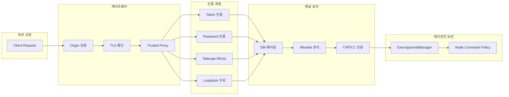
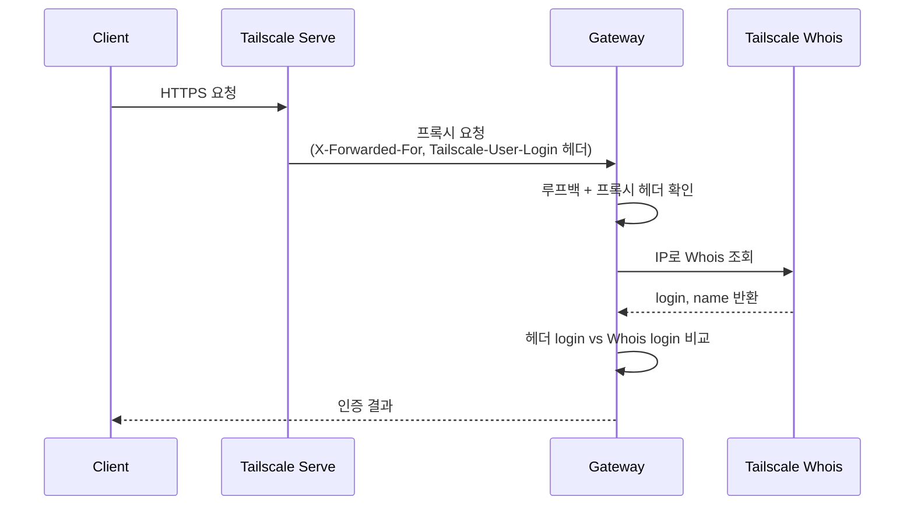
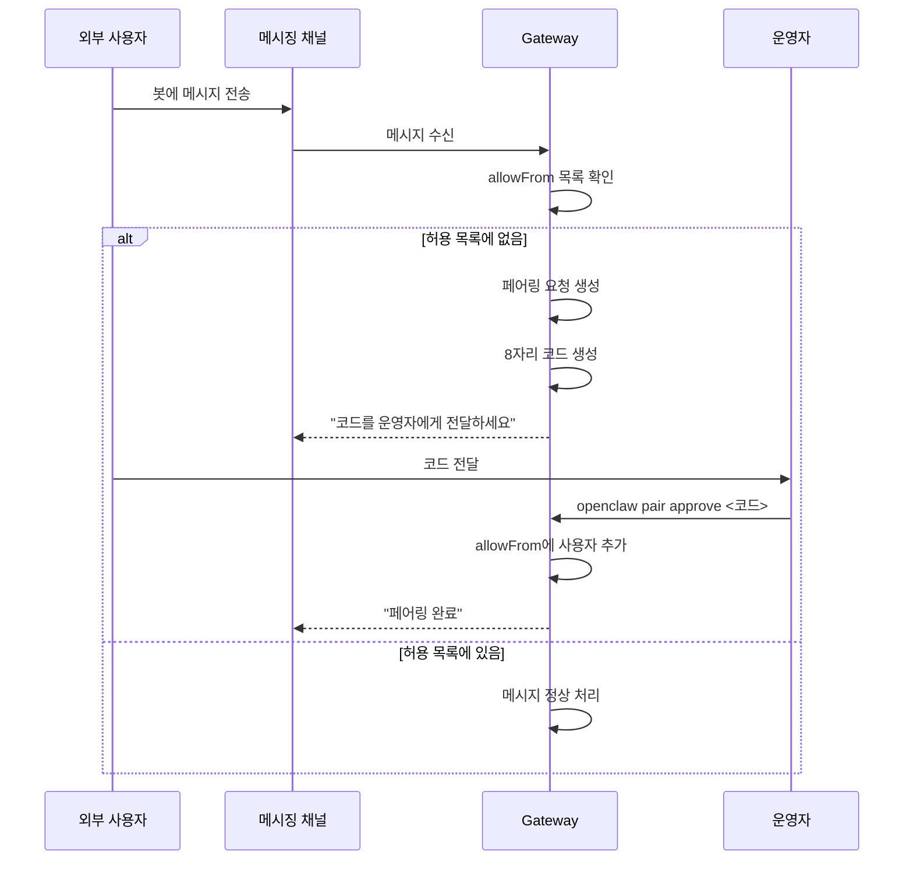

# 08. 보안 모델 (Security Model)

> 본 문서는 OpenClaw 2026.6.11 기준으로 갱신되었습니다.

## 개요

OpenClaw는 다층 보안 아키텍처를 채택한다. 게이트웨이 인증(토큰/비밀번호/Tailscale/신뢰 프록시/루프백), DM 페어링 기반 채널 보안, 타이밍-세이프 비교, 루프백 전용 기본 바인딩, Origin 검증, TLS 지원, 도구 실행 승인 시스템까지 각 계층이 독립적으로 보호 역할을 수행한다. 위협 모델과 형식 검증은 `docs/security/THREAT-MODEL-ATLAS.md` 및 `docs/security/formal-verification.md`에 별도 문서화되어 있으며, 샌드박스·툴 정책·Elevated 세 가지 실행 범위가 추가로 노출면을 제한한다.

---

## 보안 아키텍처



---

## 게이트웨이 인증 (`src/gateway/auth.ts`)

### 인증 타입 정의

```typescript
export type ResolvedGatewayAuth = {
  mode: "token" | "password";
  token?: string;
  password?: string;
  allowTailscale: boolean;
};

export type GatewayAuthResult = {
  ok: boolean;
  method?: "token" | "password" | "tailscale" | "device-token";
  user?: string;
  reason?: string;
};
```

### 타이밍-세이프 비교

토큰 및 비밀번호 비교 시 타이밍 사이드채널 공격을 방지하기 위해 `crypto.timingSafeEqual`을 사용:

```typescript
function safeEqual(a: string, b: string): boolean {
  if (a.length !== b.length) {
    return false;
  }
  return timingSafeEqual(Buffer.from(a), Buffer.from(b));
}
```

길이가 다른 경우 즉시 `false`를 반환하여 불필요한 버퍼 할당을 피하되, 길이가 같은 경우 반드시 상수 시간 비교를 수행한다.

### 루프백 주소 검출

로컬 직접 접속을 식별하여 인증 없이 접근을 허용하는 루프백 감지 로직:

```typescript
function isLoopbackAddress(ip: string | undefined): boolean {
  if (!ip) return false;
  if (ip === "127.0.0.1") return true;
  if (ip.startsWith("127.")) return true;
  if (ip === "::1") return true;
  if (ip.startsWith("::ffff:127.")) return true;
  return false;
}
```

IPv4 루프백(`127.0.0.0/8`), IPv6 루프백(`::1`), IPv4-mapped IPv6 루프백(`::ffff:127.x.x.x`)을 모두 처리한다.

### 로컬 직접 요청 판별

단순 루프백 IP뿐 아니라 Host 헤더, 프록시 헤더, Tailscale Serve 여부를 종합적으로 확인:

```typescript
export function isLocalDirectRequest(
  req?: IncomingMessage,
  trustedProxies?: string[]
): boolean {
  const clientIp = resolveRequestClientIp(req, trustedProxies) ?? "";
  if (!isLoopbackAddress(clientIp)) return false;

  const host = getHostName(req.headers?.host);
  const hostIsLocal = host === "localhost" ||
                      host === "127.0.0.1" ||
                      host === "::1";
  const hostIsTailscaleServe = host.endsWith(".ts.net");

  const hasForwarded = Boolean(
    req.headers?.["x-forwarded-for"] ||
    req.headers?.["x-real-ip"] ||
    req.headers?.["x-forwarded-host"],
  );

  const remoteIsTrustedProxy = isTrustedProxyAddress(
    req.socket?.remoteAddress, trustedProxies
  );
  return (hostIsLocal || hostIsTailscaleServe) &&
         (!hasForwarded || remoteIsTrustedProxy);
}
```

---

## 인증 모드

### 1. Token 기반 인증

| 항목 | 설명 |
|------|------|
| 환경 변수 | `OPENCLAW_GATEWAY_TOKEN` (또는 레거시 `CLAWDBOT_GATEWAY_TOKEN`) |
| 설정 키 | `gateway.auth.token` |
| 전달 방식 | WebSocket 연결 시 `connect` 메시지의 `token` 필드 |
| 비교 방식 | `timingSafeEqual` |

```typescript
if (auth.mode === "token") {
  if (!auth.token) return { ok: false, reason: "token_missing_config" };
  if (!connectAuth?.token) return { ok: false, reason: "token_missing" };
  if (!safeEqual(connectAuth.token, auth.token)) {
    return { ok: false, reason: "token_mismatch" };
  }
  return { ok: true, method: "token" };
}
```

### 2. Password 기반 인증

| 항목 | 설명 |
|------|------|
| 환경 변수 | `OPENCLAW_GATEWAY_PASSWORD` (또는 레거시 `CLAWDBOT_GATEWAY_PASSWORD`) |
| 설정 키 | `gateway.auth.password` |
| 전달 방식 | WebSocket 연결 시 `connect` 메시지의 `password` 필드 |
| 비교 방식 | `timingSafeEqual` |

### 3. Tailscale 인증

Tailscale Serve 프록시를 통한 요청에 대해 Whois API로 사용자 신원을 검증:



검증 단계:
1. `Tailscale-User-Login` 헤더 존재 확인
2. 요청이 Tailscale 프록시 경유인지 확인 (루프백 + `X-Forwarded-*` 헤더)
3. `X-Forwarded-For`에서 클라이언트 IP 추출
4. Tailscale Whois API로 해당 IP의 사용자 확인
5. 헤더의 login과 Whois 결과의 login 일치 여부 비교 (대소문자 무시)

### 4. Local Direct (루프백 우회)

루프백 주소(`127.0.0.1`, `::1`)에서 오는 요청은 인증을 우회할 수 있다. 이는 게이트웨이가 기본적으로 `127.0.0.1`에만 바인딩되므로 외부 접근이 불가능한 상태에서의 편의 기능이다.

### 5. Trusted Proxy 인증 (`docs/gateway/trusted-proxy-auth.md`)

리버스 프록시(예: nginx, Caddy, Cloudflare Tunnel) 뒤에 게이트웨이를 두는 경우 `gateway.auth.trustedProxies` 목록에 프록시 IP를 등록한다. 이 주소에서 오는 요청에 대해서만 `X-Forwarded-For`/`X-Real-IP` 헤더가 신뢰되며, 프록시가 자체적으로 인증(OIDC, mTLS 등)을 수행한 뒤 원본 IP 정보를 위임한다.

### 6. Tailscale 통합 (`docs/gateway/tailscale.md`)

Tailscale Serve를 통해 게이트웨이를 tailnet에만 노출하면 Tailscale SSO가 1차 인증 역할을 수행한다. 게이트웨이는 `bind = tailnet` 모드에서 tailnet IPv4에 바인딩되며, `Tailscale-User-Login` 헤더와 Whois 확인을 통해 사용자 신원을 식별한다. 자세한 배치 가이드는 `docs/gateway/tailscale.md` 참조.

---

## 디바이스 인증 (`src/gateway/device-auth.ts`)

네이티브 앱(iOS, Android, macOS)의 디바이스 신원 확인과 페이로드 서명을 담당:

```typescript
export type DeviceAuthPayloadParams = {
  deviceId: string;      // 디바이스 고유 ID
  clientId: string;      // 클라이언트 인스턴스 ID
  clientMode: string;    // "node", "control" 등
  role: string;          // 역할
  scopes: string[];      // 권한 범위
  signedAtMs: number;    // 서명 시각 (밀리초)
  token?: string | null; // 선택적 토큰
  nonce?: string | null; // v2 논스 (재전송 방지)
  version?: "v1" | "v2"; // 페이로드 버전
};

export function buildDeviceAuthPayload(params: DeviceAuthPayloadParams): string {
  const version = params.version ?? (params.nonce ? "v2" : "v1");
  const base = [
    version, params.deviceId, params.clientId, params.clientMode,
    params.role, params.scopes.join(","), String(params.signedAtMs),
    params.token ?? "",
  ];
  if (version === "v2") {
    base.push(params.nonce ?? "");
  }
  return base.join("|");
}
```

v2 프로토콜은 `nonce` 필드를 추가하여 재전송 공격(replay attack)을 방지한다. Control UI에서는 `@noble/ed25519`를 사용하여 이 페이로드를 서명한다.

---

## 채널 보안

### DM 허용 목록 및 페어링 시스템 (`src/pairing/`)

외부 메시징 채널(Telegram, Discord, Slack 등)에서 봇에 메시지를 보낼 수 있는 사용자를 제어:

#### 페어링 흐름



#### 핵심 구현 세부사항

- **코드 생성**: 8자리 알파벳+숫자 (모호한 문자 `0O1I` 제외)
- **TTL**: 페어링 요청은 1시간 후 만료
- **동시 제한**: 채널당 최대 3개 대기 요청
- **파일 잠금**: `proper-lockfile`으로 동시 접근 보호
- **권한 보호**: 저장 파일은 `0o600` (소유자만 읽기/쓰기), 디렉토리는 `0o700`

```typescript
// 페어링 코드 알파벳 (모호한 문자 제외)
const PAIRING_CODE_ALPHABET = "ABCDEFGHJKLMNPQRSTUVWXYZ23456789";

// 페어링 상수
const PAIRING_CODE_LENGTH = 8;
const PAIRING_PENDING_TTL_MS = 60 * 60 * 1000;  // 1시간
const PAIRING_PENDING_MAX = 3;                     // 채널당 최대 대기
```

#### 저장소 구조

각 채널별 두 개의 JSON 파일로 관리:

| 파일 | 내용 | 경로 패턴 |
|------|------|----------|
| 페어링 요청 | 대기 중인 페어링 코드 | `~/.openclaw/credentials/<channel>-pairing.json` |
| 허용 목록 | 승인된 사용자 ID 목록 | `~/.openclaw/credentials/<channel>-allowFrom.json` |

#### 채널 ID 새니타이징

경로 순회(path traversal) 공격을 방지하기 위한 채널 키 정규화:

```typescript
function safeChannelKey(channel: PairingChannel): string {
  const raw = String(channel).trim().toLowerCase();
  if (!raw) throw new Error("invalid pairing channel");
  const safe = raw.replace(/[\\/:*?"<>|]/g, "_").replace(/\.\./g, "_");
  if (!safe || safe === "_") throw new Error("invalid pairing channel");
  return safe;
}
```

---

## 샌드박스 / 툴 정책 / Elevated (세 가지 실행 범위)

OpenClaw는 서로 다른 축을 가진 세 개의 실행 제어 계층을 제공한다(`docs/gateway/sandbox-vs-tool-policy-vs-elevated.md`).

| 계층 | 관장하는 질문 | 설정 키 |
|------|-------------|---------|
| **Sandbox** | 도구가 *어디서* 실행되는가 (Docker / 호스트) | `agents.defaults.sandbox.*`, `agents.list[].sandbox.*` |
| **Tool policy** | *어떤* 도구가 허용/차단되는가 | `tools.*`, `agents.list[].tools.*` |
| **Elevated** | 샌드박스 밖으로 탈출할 수 있는 *예외* 경로 | `tools.elevated.*`, `agents.list[].tools.elevated.*` |

### 샌드박스 모드

- `off`: 모든 도구가 호스트에서 실행 (레거시)
- `non-main`: 메인 세션 외(그룹/채널 트리거) 세션만 샌드박스 격리
- `all`: 모든 세션을 Docker 컨테이너로 격리 (기본 권장)

### 툴 정책 모드

`tools.profile`(기본 allowlist)과 `tools.allow`/`tools.deny`(세부 오버라이드)로 구성한다. `agents.list[].tools.byProvider[provider]`에서 프로바이더별 프로필을 덮어쓸 수 있다.

### Elevated

샌드박스 모드에서도 일부 exec 도구(`system.run` 등)가 호스트 또는 지정된 노드에서 실행되도록 하는 escape hatch. 개별 에이전트·세션 단위로 명시적으로 허용해야 하며, `openclaw sandbox explain`으로 현재 활성화된 게이트를 조회할 수 있다.

샌드박스 배치 방식과 Docker 바인드 마운트 주의사항은 `docs/gateway/sandboxing.md`에 정리되어 있다.

---

## 위협 모델 및 형식 검증

- `docs/security/THREAT-MODEL-ATLAS.md`: 주요 공격 표면(게이트웨이 WS, 네이티브 노드, 플러그인 경계)과 대응 통제를 카탈로그화한 위협 모델 아틀라스.
- `docs/security/CONTRIBUTING-THREAT-MODEL.md`: 새로운 기능을 추가할 때 위협 모델을 갱신하는 절차.
- `docs/security/formal-verification.md`: 인증 핸들러·페어링 토큰 회전·샌드박스 exec 정책에 대한 형식 검증(모델 검사) 결과 및 결정 근거.

`INCIDENT_RESPONSE.md`는 취약점 보고 시 타임라인 및 롤백 절차를, `SECURITY.md`는 연락 채널과 공개 정책을 정의한다.

---

## 도구 실행 승인 (`src/gateway/exec-approval-manager.ts`)

에이전트가 시스템 명령을 실행하기 전에 사용자 승인을 요청하는 메커니즘:

```typescript
export class ExecApprovalManager {
  private pending = new Map<string, PendingEntry>();

  create(request: ExecApprovalRequestPayload, timeoutMs: number,
         id?: string | null): ExecApprovalRecord;

  async waitForDecision(record: ExecApprovalRecord,
                        timeoutMs: number): Promise<ExecApprovalDecision | null>;

  resolve(recordId: string, decision: ExecApprovalDecision,
          resolvedBy?: string | null): boolean;
}

export type ExecApprovalRequestPayload = {
  command: string;          // 실행할 명령어
  cwd?: string | null;      // 작업 디렉토리
  host?: string | null;     // 대상 호스트
  security?: string | null;  // 보안 수준
  ask?: string | null;       // 승인 요청 메시지
  agentId?: string | null;
  resolvedPath?: string | null;
  sessionKey?: string | null;
};
```

### 승인 흐름

1. 에이전트가 시스템 명령 실행 요청
2. `ExecApprovalManager.create()`로 승인 레코드 생성
3. Control UI 또는 모바일 앱의 노드에 승인 요청 전달
4. `waitForDecision()`으로 사용자 응답 대기 (타임아웃 포함)
5. 사용자 승인/거부 시 `resolve()`로 결정 전달
6. 타임아웃 시 `null` 반환 (기본 거부)

---

## Origin 검증 (`src/gateway/origin-check.ts`)

브라우저 요청의 Origin 헤더를 검증하여 CSRF 공격을 방지:

```typescript
export function checkBrowserOrigin(params: {
  requestHost?: string;
  origin?: string;
  allowedOrigins?: string[];
}): OriginCheckResult;
```

### 검증 규칙

| 우선순위 | 조건 | 결과 |
|----------|------|------|
| 1 | Origin이 없거나 무효 | 거부 |
| 2 | Origin이 `allowedOrigins` 목록에 포함 | 허용 |
| 3 | Origin의 host가 요청 Host 헤더와 일치 | 허용 |
| 4 | Origin과 요청 모두 루프백 호스트 | 허용 |
| 5 | 위 조건 모두 불일치 | 거부 |

---

## TLS 지원 (`src/gateway/server/tls.ts`)

게이트웨이 서버의 TLS 종단 처리를 위한 설정 로더:

```typescript
export async function loadGatewayTlsRuntime(
  cfg: GatewayTlsConfig | undefined,
  log?: { info?: (msg: string) => void; warn?: (msg: string) => void },
): Promise<GatewayTlsRuntime>;
```

`GatewayTlsConfig`에서 인증서와 키 파일 경로를 읽어 HTTPS 서버를 구성한다. TLS 미설정 시 HTTP로 폴백하며, 루프백 전용 바인딩에서는 TLS 없이도 안전하다.

---

## 신뢰 프록시 및 Forwarded-For 파싱 (`src/gateway/net.ts`)

게이트웨이 고유의 프록시/바인드 로직은 `src/gateway/net.ts`에 남아 있으나, 저수준 IP 판별 원시 함수(루프백/사설망 판정, IP 정규화, CIDR 매칭 등)는 별도 패키지 `@openclaw/net-policy`(`packages/net-policy/`)로 분리되었다. `net.ts`와 `origin-check.ts`는 `@openclaw/net-policy/ip`에서 `isLoopbackIpAddress`, `normalizeIpAddress`, `isPrivateOrLoopbackIpAddress` 등을 임포트하여 재사용한다.

리버스 프록시 환경에서 실제 클라이언트 IP를 정확히 식별:

```typescript
export function resolveGatewayClientIp(params: {
  remoteAddr?: string;
  forwardedFor?: string;
  realIp?: string;
  trustedProxies?: string[];
}): string | undefined {
  const remote = normalizeIp(params.remoteAddr);
  if (!remote) return undefined;
  // 신뢰 프록시가 아닌 경우 원본 IP 반환
  if (!isTrustedProxyAddress(remote, params.trustedProxies)) {
    return remote;
  }
  // 신뢰 프록시인 경우 X-Forwarded-For 또는 X-Real-IP 사용
  return parseForwardedForClientIp(params.forwardedFor) ??
         parseRealIp(params.realIp) ?? remote;
}
```

### IP 정규화

IPv4-mapped IPv6 주소를 자동 정규화하여 일관된 비교 보장:

```typescript
function normalizeIPv4MappedAddress(ip: string): string {
  if (ip.startsWith("::ffff:")) {
    return ip.slice("::ffff:".length);  // "::ffff:127.0.0.1" -> "127.0.0.1"
  }
  return ip;
}
```

### 게이트웨이 바인드 전략

| 모드 | 바인드 주소 | 폴백 | 용도 |
|------|-----------|------|------|
| `loopback` | `127.0.0.1` | `0.0.0.0` | 기본값 (로컬 전용) |
| `tailnet` | Tailnet IPv4 | `127.0.0.1` -> `0.0.0.0` | Tailscale 네트워크 |
| `lan` | `0.0.0.0` | 없음 | LAN 접근 허용 |
| `auto` | `127.0.0.1` | `0.0.0.0` | 자동 감지 |
| `custom` | 사용자 지정 IP | `0.0.0.0` | 특정 인터페이스 |

---

## 보안 설정 파일

### Secret Scanning

| 파일 | 용도 |
|------|------|
| `.detect-secrets.cfg` | detect-secrets 도구 설정 |
| `.secrets.baseline` | 알려진 시크릿 허용 목록 (false positive 관리) |

Pre-commit 훅에서 `detect-secrets`를 실행하여 커밋에 포함된 시크릿(API 키, 토큰, 비밀번호)을 자동 감지한다.

### Node.js 버전 요구사항

Node 22 LTS 이상 필수(`package.json`의 `engines` 필드는 `>=22.19.0`을 요구한다). 보안 패치 및 `crypto.timingSafeEqual` 최신 구현을 보장하기 위함이다. 런타임 컨테이너 이미지는 최신 Node를 사용하여 `Dockerfile`이 `node:24-bookworm`(빌드)/`node:24-bookworm-slim`(런타임) 이미지를 고정(digest pin)한다.

---

## Docker 보안

`Dockerfile`에서 적용되는 보안 강화 조치:

```dockerfile
FROM node:24-bookworm

# ... 빌드 단계 ...

# 비루트 사용자 전환
RUN chown -R node:node /app
USER node

# 기본 루프백 바인딩
CMD ["node", "dist/index.js", "gateway", "--allow-unconfigured"]
```

| 보안 조치 | 설명 |
|-----------|------|
| 비루트 실행 | `node` 사용자 (uid 1000)로 실행하여 컨테이너 탈출 리스크 감소 |
| 최소 베이스 이미지 | `node:24-bookworm-slim` (digest 고정, 불필요한 패키지 미포함) |
| 루프백 기본 바인딩 | `--allow-unconfigured`로 시작하되, 기본 `127.0.0.1` 바인딩 |
| LAN 바인딩 명시 필요 | 외부 접근이 필요한 경우 `--bind lan`을 명시적으로 지정해야 함 |

---

## 자격 증명 저장 및 SecretRef

```
~/.openclaw/
├── credentials/                     # 채널별 인증 데이터
│   ├── <channel>-pairing.json       # 대기 중 페어링 요청
│   ├── <channel>-allowFrom.json     # 승인된 사용자 목록
│   └── ...                          # 웹 프로바이더 자격 증명
└── sessions/                        # Pi 세션 데이터
```

- 디렉토리 권한: `0o700` (소유자만 접근)
- 파일 권한: `0o600` (소유자만 읽기/쓰기)
- 원자적 쓰기: 임시 파일 생성 후 `rename()`으로 교체 (부분 쓰기 방지)

### SecretRef 자격 증명 표면

플러그인/채널/프로바이더 설정에서는 시크릿을 inline 값 대신 **SecretRef**(`secret://<store>/<path>` 형태)로 선언한다. 지원되는 백엔드와 각 자격 증명에 노출되는 표면은 다음 문서에 매트릭스 형태로 정리되어 있다.

- `docs/reference/secretref-credential-surface.md`: 자격 증명별 허용 저장소·해석 우선순위·환경 변수 호환 매트릭스
- `docs/reference/secretref-user-supplied-credentials-matrix.json`: 사용자 입력 자격 증명 메타데이터 (기계 판독용)
- `docs/gateway/secrets.md` / `docs/gateway/secrets-plan-contract.md`: 게이트웨이 시크릿 해석 계약과 `secrets plan` CLI 흐름

런타임 해석은 `src/secrets/runtime.ts`, plan 계산은 `src/secrets/plan.ts` 및 `configure-plan.ts`, 자격 증명 참조 감사는 `src/secrets/audit.ts`에서 수행된다.

---

## 전체 보안 관련 파일 구조

```
src/gateway/
├── auth.ts                          # 게이트웨이 인증 (토큰/비밀번호/Tailscale)
├── auth.test.ts                     # 인증 유닛 테스트
├── device-auth.ts                   # 디바이스 인증 페이로드 빌더
├── exec-approval-manager.ts         # 도구 실행 승인 매니저
├── origin-check.ts                  # 브라우저 Origin 검증
├── origin-check.test.ts             # Origin 검증 테스트
├── net.ts                           # IP 파싱, 프록시, 루프백 감지
├── net.test.ts                      # 네트워크 유틸 테스트
├── node-command-policy.ts           # 플랫폼별 명령 허용 정책
├── server-tailscale.ts              # Tailscale 서버 통합
├── server/
│   └── tls.ts                       # TLS 설정 로더
└── server.auth.e2e.test.ts          # 인증 E2E 테스트

src/pairing/
├── pairing-store.ts                 # 페어링 저장소 (코드 생성, 승인)
├── pairing-challenge.ts             # 페어링 챌린지-응답
├── pairing-messages.ts              # 페어링 사용자 메시지
├── pairing-labels.ts                # 채널별 페어링 라벨
├── setup-code.ts                    # 설정 코드 생성/검증
└── allow-from-store-read.ts         # allowFrom 저장소 읽기

src/secrets/                         # SecretRef 해석·감사
├── runtime.ts                       # 런타임 시크릿 해석
├── resolve.ts                       # 참조 해석 로직
├── plan.ts / configure-plan.ts      # secrets plan 계산
├── audit.ts                         # 자격 증명 참조 감사
└── ref-contract.ts                  # SecretRef 포맷 계약

src/security/                        # 딥 오딧, 채널/게이트웨이 노출면 검사
├── audit.ts / audit.deep.runtime.ts
├── audit-channel-*.ts               # 채널별 DM 정책·allowlist 검증
├── dm-policy-shared.ts              # DM 정책 공유 판정 로직
├── audit-gateway-*.ts               # 게이트웨이 노출 및 인증 선택 감사
└── audit-fs.ts                      # 파일시스템 권한 감사

packages/net-policy/                 # @openclaw/net-policy (IP 정책 원시 함수)
├── src/ip.ts                        # 루프백/사설망 판정, 정규화, CIDR 매칭
├── src/ipv4.ts                      # IPv4 입력 검증
└── src/redact-sensitive-url.ts      # URL 내 민감 정보 마스킹

security/                            # 리포지토리 루트 정적 분석 규칙
└── opengrep/                        # OpenGrep(Semgrep) 보안 규칙셋

docs/security/
├── THREAT-MODEL-ATLAS.md            # 위협 모델 아틀라스
├── CONTRIBUTING-THREAT-MODEL.md     # 위협 모델 기여 가이드
└── formal-verification.md           # 형식 검증 결과

docs/gateway/
├── authentication.md                # 인증 모드 총괄
├── trusted-proxy-auth.md            # 신뢰 프록시 인증
├── tailscale.md                     # Tailscale 배치
├── sandboxing.md                    # 샌드박스 설정
├── sandbox-vs-tool-policy-vs-elevated.md
├── secrets.md / secrets-plan-contract.md
└── pairing.md                       # Gateway-owned pairing (노드)

docs/reference/
├── secretref-credential-surface.md
└── secretref-user-supplied-credentials-matrix.json

프로젝트 루트
├── .detect-secrets.cfg              # Secret 스캐너 설정
├── .secrets.baseline                # 알려진 시크릿 베이스라인
├── Dockerfile                       # 비루트 실행, Node 22 기반
├── SECURITY.md                      # 보안 취약점 보고 안내
├── INCIDENT_RESPONSE.md             # 사고 대응 플레이북
└── git-hooks/                       # Pre-commit 훅 (secret 스캔 포함)
```
