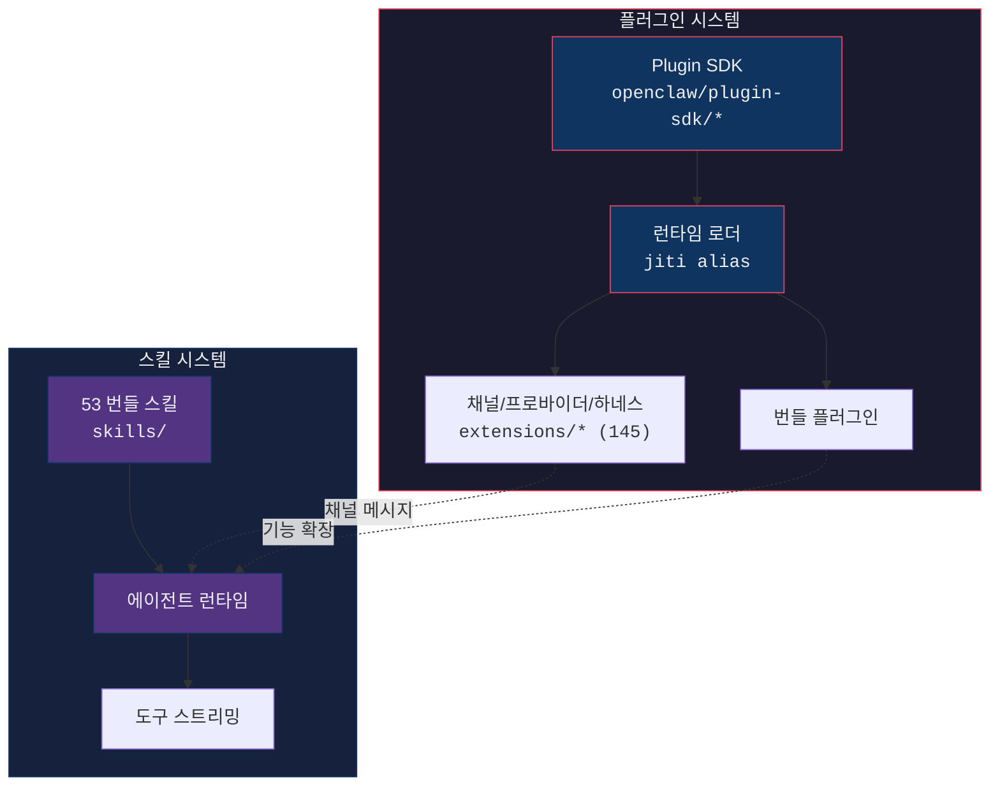
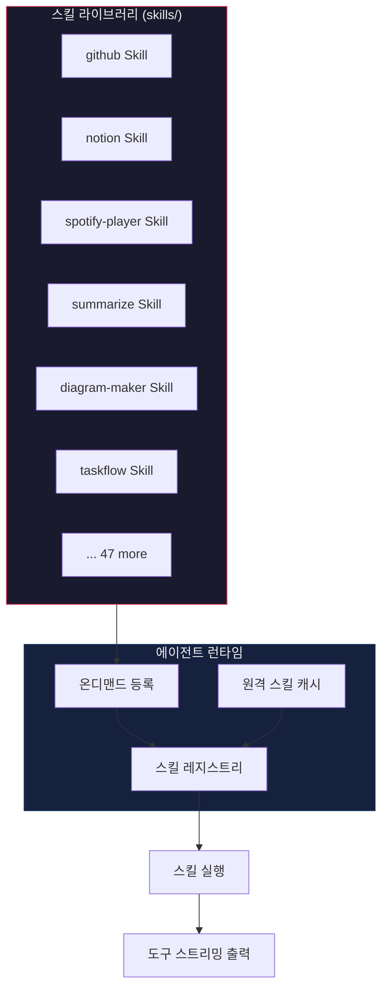
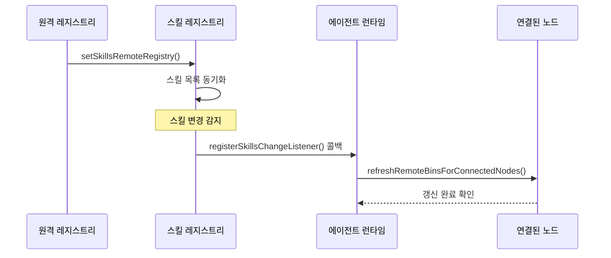

# 09. 플러그인 & 스킬 시스템 (Plugin & Skills System)

> 본 문서는 OpenClaw 2026.6.11 기준으로 갱신되었습니다.

## 목차

1. [개요](#개요)
2. [아키텍처 개요](#아키텍처-개요)
3. [Plugin SDK](#plugin-sdk)
4. [플러그인 런타임](#플러그인-런타임)
5. [확장 채널 (Extension Channels)](#확장-채널-extension-channels)
6. [게이트웨이 플러그인 로딩](#게이트웨이-플러그인-로딩)
7. [플러그인 자동 활성화](#플러그인-자동-활성화)
8. [스킬 라이브러리](#스킬-라이브러리)
9. [스킬 갱신 메커니즘](#스킬-갱신-메커니즘)
10. [도구 정의 패턴](#도구-정의-패턴)
11. [플러그인 생명주기 시퀀스](#플러그인-생명주기-시퀀스)
12. [파일 구조](#파일-구조)

---

## 개요

openclaw의 플러그인 & 스킬 시스템은 **확장 가능한 플러그인 아키텍처**를 기반으로 설계되었다. Plugin SDK를 통해 외부 개발자가 채널 플러그인, 프로바이더 플러그인, 에이전트 하네스 플러그인을 작성할 수 있으며, `jiti` 기반 런타임 로더가 이를 동적으로 해석하고 실행한다.

| 항목 | 상세 |
|------|------|
| 워크스페이스 패키지 | `packages/plugin-sdk`, `packages/plugin-package-contract`, `packages/sdk` (+ 메모리 호스트용 `packages/memory-host-sdk`) |
| 런타임 배포 경로 | `openclaw/plugin-sdk` 서브패스 (예: `/core`, `/runtime`, `/testing`, `/channel-streaming` 등) |
| 플러그인 매니페스트 | `package.json`의 `openclaw.plugin` 메타데이터 (`docs/plugins/manifest.md`) |
| 런타임 로더 | `jiti` alias 기반 동적 모듈 해석 |
| 번들 스킬 | 53개 내장 관리형 스킬 (`skills/`) |
| 번들 확장(extensions) | 145개 디렉토리/엔트리 (`extensions/`) — 채널 매니페스트 약 25개, 나머지는 LLM 프로바이더/메모리/음성/미디어/검색/QA 등 |
| 런타임 소스 | `src/plugins`, `src/plugin-sdk`, `src/plugin-state`, `src/hooks` |
| 대상 런타임 | Node.js >=22.19.0, pnpm 11.2.2 |
| 프로토콜 | ACP (Agent Client Protocol) 호환 |

---

## 아키텍처 개요



### 핵심 흐름 요약

```
Plugin SDK (인터페이스 정의)
    │
    ▼
Runtime Loader (jiti alias 해석)
    │
    ├── Channel Plugins (Slack, Discord, Telegram, ...)
    └── Feature Plugins (Canvas, Browser, ...)
            │
            ▼
    Agent Runtime (스킬 실행)
            │
            ▼
    Tool Streaming (결과 스트리밍)
```

---

## Plugin SDK

### 워크스페이스 패키지 구성 (`packages/`)

플러그인 SDK는 pnpm 워크스페이스의 내부 패키지들로 구성된다.

| 패키지 | 역할 |
|-------|------|
| `@openclaw/plugin-sdk` (`packages/plugin-sdk/`) | 채널/프로바이더/에이전트 하네스 SDK 서브패스 집합. `core`, `plugin-runtime`, `plugin-entry`, `channel-streaming`, `provider-entry`, `provider-auth-runtime`, `testing`, `secret-ref-runtime`, `ssrf-runtime` 등 40여 개 서브패스를 `exports`로 공개한다. |
| `@openclaw/plugin-package-contract` (`packages/plugin-package-contract/`) | 외부 플러그인 `package.json`이 따라야 하는 매니페스트/메타데이터 계약 타입을 공유한다. |
| `@openclaw/sdk` (`packages/sdk/`) | 배포용 SDK 진입점을 집약하는 상위 패키지. |
| `@openclaw/memory-host-sdk` (`packages/memory-host-sdk/`) | 메모리 호스트(`memory-lancedb`, `memory-wiki` 등) 작성용 SDK. 엔진, 저장소, 임베딩, 쿼리, 상태 모듈을 서브패스로 노출한다. |

배포된 npm 패키지 `openclaw`에는 빌드된 SDK가 `openclaw/plugin-sdk` 서브패스들(`./plugin-sdk/core`, `./plugin-sdk/runtime`, `./plugin-sdk/testing`, ...)로 노출된다.

### 관련 공식 문서

| 문서 | 내용 |
|------|------|
| `docs/plugins/architecture.md` | 플러그인 아키텍처 개요 |
| `docs/plugins/manifest.md` | 플러그인 매니페스트(플러그인 엔트리 포인트 선언) 규약 |
| `docs/plugins/sdk-overview.md` | SDK 개요 및 서브패스 가이드 |
| `docs/plugins/sdk-setup.md` | 개발 환경 설정 |
| `docs/plugins/sdk-runtime.md` | 런타임 SDK (로거/설정/이벤트/스토리지) |
| `docs/plugins/sdk-testing.md` | `openclaw/plugin-sdk/testing` 테스트 유틸리티 |
| `docs/plugins/sdk-migration.md` | 버전 간 마이그레이션 가이드 |
| `docs/plugins/sdk-channel-plugins.md` | 채널 플러그인 SDK (`plugin-entry`, `channel-streaming`) |
| `docs/plugins/sdk-provider-plugins.md` | 프로바이더 플러그인 SDK (`provider-entry`, `provider-tools`) |
| `docs/plugins/sdk-agent-harness.md` | 에이전트 하네스 SDK (ACP 런타임, CLI 백엔드) |
| `docs/plugins/building-plugins.md` / `building-extensions.md` | 플러그인/확장 제작 튜토리얼 |
| `docs/plugins/community.md` | 커뮤니티 플러그인 디렉토리 |

### 런타임 Export 경로

Plugin SDK의 런타임 진입점은 `openclaw/plugin-sdk` 서브패스를 통해 공개된다. 채널/프로바이더/하네스 개발자는 필요한 서브패스만 import하여 표준 인터페이스를 구현한다.

```typescript
// dist/plugin-sdk/index.js 에서 export되는 주요 인터페이스

/**
 * 채널 플러그인이 구현해야 하는 핵심 인터페이스
 */
export interface ChannelPlugin {
  /** 플러그인 고유 식별자 */
  id: string;

  /** 사람이 읽을 수 있는 이름 */
  name: string;

  /** 플러그인 초기화 */
  initialize(services: PluginServicesHandle): Promise<void>;

  /** 채널 모니터 시작 */
  startMonitor(): Promise<void>;

  /** 채널 모니터 중지 */
  stopMonitor(): Promise<void>;

  /** 메시지 전송 */
  sendMessage(channelId: string, message: string): Promise<void>;
}

/**
 * 플러그인 설정 스키마 정의
 */
export interface PluginConfig {
  /** JSON Schema 기반 설정 구조 */
  schema: Record<string, unknown>;

  /** 기본값 */
  defaults: Record<string, unknown>;

  /** 필수 필드 목록 */
  required: string[];
}
```

### SDK 사용 예시

```typescript
import type { ChannelPlugin, PluginServicesHandle } from "openclaw/plugin-sdk";

export default class SlackPlugin implements ChannelPlugin {
  id = "slack";
  name = "Slack Channel Plugin";

  private services!: PluginServicesHandle;

  async initialize(services: PluginServicesHandle): Promise<void> {
    this.services = services;
    // Slack API 클라이언트 초기화
  }

  async startMonitor(): Promise<void> {
    // WebSocket 기반 실시간 이벤트 수신 시작
  }

  async stopMonitor(): Promise<void> {
    // WebSocket 연결 정리
  }

  async sendMessage(channelId: string, message: string): Promise<void> {
    // Slack API를 통한 메시지 전송
  }
}
```

---

## 플러그인 런타임

플러그인 런타임은 `src/plugins/` 디렉토리에 위치하며, `jiti` 기반 alias 해석을 통해 TypeScript 플러그인을 동적으로 로드한다.

### 런타임 로딩 메커니즘


### jiti Alias 기반 런타임 로딩

`jiti`는 TypeScript/ESM 모듈을 런타임에 트랜스파일 없이 직접 로드할 수 있게 해주는 런타임 모듈 해석기이다. openclaw에서는 `jiti` alias를 통해 플러그인 모듈 경로를 해석한다.

```typescript
// src/plugins/ 내부 - 런타임 로딩 흐름 (개념적 구조)

import { createJiti } from "jiti";

/**
 * jiti 인스턴스를 통한 플러그인 모듈 동적 로드
 * alias 해석을 통해 openclaw/plugin-sdk 경로를 실제 dist 경로로 매핑
 */
const jiti = createJiti(import.meta.url, {
  alias: {
    "openclaw/plugin-sdk": "/path/to/dist/plugin-sdk/index.js",
  },
});

// 플러그인 모듈을 동적으로 import
const pluginModule = await jiti.import(pluginPath);
```

### 플러그인 레지스트리

`requireActivePluginRegistry()` 함수를 통해 현재 로드된 모든 플러그인에 접근할 수 있다.

```typescript
// 활성 플러그인 레지스트리 접근 패턴

/**
 * 활성 플러그인 레지스트리를 가져온다.
 * 플러그인이 아직 초기화되지 않은 경우 에러를 발생시킨다.
 */
function requireActivePluginRegistry(): PluginRegistry {
  if (!activeRegistry) {
    throw new Error("Plugin registry not initialized");
  }
  return activeRegistry;
}

// 사용 예시
const registry = requireActivePluginRegistry();
const slackPlugin = registry.getPlugin("slack");
```

### Plugin Services Handle

`PluginServicesHandle`은 플러그인에게 주입되는 서비스 인터페이스로, 플러그인이 openclaw 핵심 기능에 접근할 수 있게 해준다.

```typescript
/**
 * 플러그인에 제공되는 서비스 핸들
 * 플러그인이 openclaw의 핵심 기능에 접근할 수 있는 브릿지 역할
 */
type PluginServicesHandle = {
  /** 로깅 서비스 */
  logger: Logger;

  /** 설정 접근 */
  config: PluginConfigAccessor;

  /** 에이전트 런타임 연동 */
  agentBridge: AgentBridge;

  /** 이벤트 시스템 */
  events: EventEmitter;

  /** 스토리지 접근 */
  storage: PluginStorage;
};
```

---

## 확장 채널 (Extension Channels)

확장은 `extensions/*` 디렉토리 아래에 **워크스페이스 패키지**로 관리된다. 현재 저장소에는 145개의 엔트리(디렉토리 + 패키지 파일)가 있으며, 이 중 채널 매니페스트는 약 25개이고 나머지는 LLM 프로바이더 플러그인(`anthropic`, `openai`, `google`, `lmstudio`, `ollama` 등)·메모리 호스트·음성/미디어·검색·QA 하네스(`qa-lab`, `qa-channel`, `qa-matrix`)·도구 플러그인(`browser`, `openshell`, `phone-control`)으로 구성된다. 각 확장은 독립적인 `package.json`을 가지며, pnpm 워크스페이스를 통해 루트 프로젝트와 연결된다.

### 디렉토리 구조

```
extensions/
├── slack/                  # 채널 플러그인
├── discord/
├── telegram/
├── matrix/
├── imessage/
├── anthropic/              # 프로바이더 플러그인
├── openai/
├── google/
├── ollama/
├── lmstudio/
├── browser/                # 도구 플러그인
├── openshell/
├── phone-control/
├── memory-lancedb/         # 메모리 호스트
├── memory-wiki/
├── qa-channel/             # QA 하네스
├── qa-lab/
└── ...                     # 총 145 엔트리
```

### 의존성 관리 규칙

확장 채널의 `package.json`에서 의존성 관리에는 엄격한 규칙이 적용된다.

| 규칙 | 설명 | 예시 |
|------|------|------|
| 플러그인 전용 의존성 | extension의 `package.json`에만 선언 | `@slack/bolt`, `discord.js` |
| openclaw 참조 | `devDependencies` 또는 `peerDependencies`에 선언 | `"openclaw": "workspace:*"` |
| workspace:* 금지 | `dependencies`에 `workspace:*` 사용 금지 | -- |
| 설치 명령 | `npm install --omit=dev`로 프로덕션 설치 | 개발 의존성 제외 |

```jsonc
// extensions/slack/package.json - 올바른 의존성 구조
{
  "name": "@openclaw/extension-slack",
  "version": "1.0.0",
  "dependencies": {
    "@slack/bolt": "^4.0.0",
    "@slack/web-api": "^7.0.0"
    // "openclaw": "workspace:*"  <-- 여기에 넣으면 안 됨!
  },
  "devDependencies": {
    "openclaw": "workspace:*"     // 올바른 위치
  },
  "peerDependencies": {
    "openclaw": "*"               // 또는 peerDependencies
  }
}
```

### 설치 방법

```bash
# 프로덕션 설치 시 devDependencies 제외
npm install --omit=dev

# 이를 통해 openclaw 본체가 중복 설치되는 것을 방지
# 런타임에는 jiti alias로 plugin-sdk를 해석
```

---

## 게이트웨이 플러그인 로딩

게이트웨이 서버가 시작될 때, `src/gateway/server-plugins.ts`의 `loadGatewayPlugins()` 함수가 호출되어 플러그인을 로드한다.

```typescript
// src/gateway/server-plugins.ts

/**
 * 게이트웨이 시작 시 호출되는 플러그인 로드 함수
 *
 * 1. 설정 파일에서 활성화된 플러그인 목록 조회
 * 2. 각 플러그인의 설정 유효성 검증
 * 3. jiti를 통한 동적 로딩
 * 4. 채널 모니터 활성화
 */
export async function loadGatewayPlugins(): Promise<void> {
  const config = getGatewayConfig();
  const enabledPlugins = config.plugins.filter((p) => p.enabled);

  for (const pluginConfig of enabledPlugins) {
    try {
      // jiti 기반 동적 로딩
      const pluginModule = await loadPluginModule(pluginConfig.path);

      // 설정 유효성 검증
      validatePluginConfig(pluginModule, pluginConfig.settings);

      // 레지스트리에 등록
      registerPlugin(pluginModule, pluginConfig);

      // 채널 모니터 활성화
      if (pluginModule.startMonitor) {
        await pluginModule.startMonitor();
      }
    } catch (error) {
      logger.error(`Failed to load plugin: ${pluginConfig.id}`, error);
    }
  }
}
```

---

## 플러그인 자동 활성화

`src/config/plugin-auto-enable.ts`의 `applyPluginAutoEnable()` 함수는 설정 기반으로 플러그인을 자동 활성화한다.

```typescript
// src/config/plugin-auto-enable.ts

/**
 * 설정에 기반하여 플러그인 자동 활성화를 적용한다.
 *
 * - 환경 변수가 설정된 플러그인 자동 감지
 * - 사용자가 명시적으로 비활성화하지 않은 경우 활성화
 * - 필수 설정이 모두 제공된 경우에만 활성화
 */
export function applyPluginAutoEnable(config: AppConfig): AppConfig {
  const availablePlugins = discoverAvailablePlugins();

  for (const plugin of availablePlugins) {
    // 이미 명시적으로 설정된 경우 스킵
    if (config.plugins.some((p) => p.id === plugin.id)) {
      continue;
    }

    // 필수 환경 변수가 모두 존재하는지 확인
    const hasRequiredEnvVars = plugin.requiredEnvVars.every(
      (envVar) => process.env[envVar] !== undefined
    );

    if (hasRequiredEnvVars) {
      config.plugins.push({
        id: plugin.id,
        enabled: true,
        settings: buildSettingsFromEnv(plugin),
      });
    }
  }

  return config;
}
```

---

## 스킬 라이브러리

openclaw에는 **53개의 번들 관리형 스킬**이 `skills/` 디렉토리에 내장되어 있다. 스킬은 에이전트 런타임에 의해 관리되며, 필요 시 온디맨드로 등록된다.

### 번들 스킬 목록 (주요 카테고리)

> 실제 목록은 저장소 루트에서 `ls skills`로 확인할 수 있다. 아래는 2026.6.11 기준 대표 예시이다.

| 카테고리 | 스킬 예시 | 설명 |
|----------|----------|------|
| 개발 도구 | `github`, `gh-issues`, `coding-agent`, `clawhub` | 이슈/PR 관리, 코드 작성, 스킬 허브 |
| 노트/생산성 | `notion`, `obsidian`, `apple-notes`, `bear-notes`, `things-mac`, `apple-reminders` | 문서·메모·할 일 관리 |
| 태스크/보드 | `taskflow`, `taskflow-inbox-triage`, `trello` | 작업 흐름, 인박스 분류 |
| 커뮤니케이션/이메일 | `himalaya`, `imsg` | 이메일, iMessage |
| 미디어 | `spotify-player`, `songsee`, `video-frames`, `meme-maker`, `gifgrep`, `camsnap` | 음악 재생, 영상 프레임, 밈/이미지 |
| 음성 | `openai-whisper`, `sherpa-onnx-tts` | STT/TTS |
| 문서/요약 | `summarize`, `nano-pdf`, `diagram-maker` | 요약, PDF, 다이어그램 |
| 시스템/디버그 | `healthcheck`, `tmux`, `node-inspect-debugger`, `python-debugpy` | 상태 점검, 터미널, 디버깅 |
| 기타 | `weather`, `xurl`, `oracle`, `gemini` | 날씨, HTTP 호출, 외부 모델 |

### 스킬 관리 방식



### 스킬 등록 패턴

```typescript
// skills/ 내 스킬 정의 패턴 예시

import { Type } from "@sinclair/typebox";

/**
 * 스킬은 에이전트 런타임에 의해 관리된다.
 * 사용자가 관련 기능을 요청할 때 온디맨드로 등록된다.
 */
export const githubSkill = {
  name: "github",
  description: "GitHub 이슈 및 PR 관리",
  tools: [
    {
      name: "create_issue",
      description: "GitHub 이슈를 생성한다",
      inputSchema: Type.Object({
        repo: Type.String({ description: "owner/repo 형식" }),
        title: Type.String({ description: "이슈 제목" }),
        body: Type.Optional(Type.String({ description: "이슈 본문" })),
      }),
    },
    {
      name: "list_pull_requests",
      description: "PR 목록을 조회한다",
      inputSchema: Type.Object({
        repo: Type.String({ description: "owner/repo 형식" }),
        state: stringEnum(["open", "closed", "all"], {
          description: "PR 상태 필터",
        }),
      }),
    },
  ],
};
```

---

## 스킬 갱신 메커니즘

스킬 시스템은 원격 스킬 레지스트리와 연결된 노드들에 대한 갱신 메커니즘을 제공한다.

### 핵심 함수

```typescript
/**
 * 스킬 변경 리스너를 등록한다.
 * 스킬이 추가/제거/업데이트될 때 콜백이 호출된다.
 */
function registerSkillsChangeListener(
  callback: (changes: SkillChangeEvent[]) => void
): Disposable;

/**
 * 연결된 모든 노드에 대해 원격 바이너리를 갱신한다.
 * 새로운 스킬 버전이 사용 가능할 때 호출된다.
 */
async function refreshRemoteBinsForConnectedNodes(): Promise<void>;

/**
 * 원격 스킬 레지스트리를 설정한다.
 * 원격 서버에서 사용 가능한 스킬 목록을 동기화한다.
 */
function setSkillsRemoteRegistry(registry: RemoteSkillRegistry): void;
```

### 갱신 흐름



---

## 도구 정의 패턴

openclaw의 도구(Tool) 스키마는 **Typebox 기반 JSON Schema**를 사용하며, **ACP (Agent Client Protocol)** 호환성을 보장한다.

### 기본 규칙

| 규칙 | 설명 |
|------|------|
| 스키마 타입 | Typebox (`@sinclair/typebox`) 기반 |
| 최상위 타입 | 반드시 `type: "object"` + `properties` |
| 금지 키워드 | `anyOf`, `oneOf`, `allOf` 사용 금지 |
| 문자열 목록 | `stringEnum()` / `optionalStringEnum()` 사용 |
| ACP 호환 | Agent Client Protocol 표준 준수 |

### 올바른 도구 스키마 예시

```typescript
import { Type } from "@sinclair/typebox";

// 커스텀 문자열 열거형 헬퍼
function stringEnum<T extends string[]>(
  values: [...T],
  options?: { description?: string }
) {
  return Type.Unsafe<T[number]>({
    type: "string",
    enum: values,
    ...options,
  });
}

function optionalStringEnum<T extends string[]>(
  values: [...T],
  options?: { description?: string }
) {
  return Type.Optional(stringEnum(values, options));
}

// 올바른 도구 정의: 최상위가 object + properties
const searchToolSchema = Type.Object({
  query: Type.String({
    description: "검색 쿼리",
  }),
  language: optionalStringEnum(["ko", "en", "ja"], {
    description: "검색 언어",
  }),
  maxResults: Type.Optional(
    Type.Number({
      description: "최대 결과 수",
      minimum: 1,
      maximum: 100,
    })
  ),
});
```

### 잘못된 도구 스키마 (금지 패턴)

```typescript
// [금지] anyOf 사용 - ACP 호환 불가
const badSchema = Type.Object({
  target: Type.Union([       // anyOf로 컴파일됨
    Type.String(),
    Type.Number(),
  ]),
});

// [금지] oneOf 사용
const badSchema2 = Type.Object({
  format: Type.OneOf([       // oneOf로 컴파일됨
    Type.Literal("json"),
    Type.Literal("csv"),
  ]),
});

// [올바른 대체] stringEnum 사용
const goodSchema = Type.Object({
  format: stringEnum(["json", "csv"], {
    description: "출력 형식",
  }),
});
```

---

## 플러그인 생명주기 시퀀스

플러그인이 발견되고 활성화되기까지의 전체 생명주기를 시퀀스 다이어그램으로 표현한다.

```mermaid
sequenceDiagram
    participant FS as 파일 시스템
    participant Discovery as 플러그인 탐색
    participant Config as 설정 검증
    participant Loader as 런타임 로더 (jiti)
    participant Registry as 플러그인 레지스트리
    participant Monitor as 채널 모니터

    rect rgb(26, 26, 46)
        Note over FS,Discovery: 1단계: 플러그인 탐색 (Discovery)
        FS->>Discovery: extensions/* 스캔
        Discovery->>Discovery: package.json 파싱
        Discovery->>Discovery: 플러그인 메타데이터 수집
    end

    rect rgb(22, 33, 62)
        Note over Discovery,Config: 2단계: 등록 & 설정 검증
        Discovery->>Registry: 플러그인 등록 요청
        Registry->>Config: 설정 스키마 검증
        Config->>Config: 필수 환경 변수 확인
        Config->>Config: applyPluginAutoEnable()
        Config-->>Registry: 검증 결과 반환
    end

    rect rgb(83, 52, 131)
        Note over Loader,Registry: 3단계: 런타임 로딩
        Registry->>Loader: 플러그인 모듈 로드 요청
        Loader->>Loader: jiti alias 해석
        Loader->>Loader: TypeScript 모듈 로드
        Loader->>Registry: 플러그인 인스턴스 반환
    end

    rect rgb(15, 52, 96)
        Note over Registry,Monitor: 4단계: 채널 모니터 활성화
        Registry->>Monitor: initialize(servicesHandle)
        Monitor->>Monitor: 외부 서비스 연결
        Monitor->>Monitor: startMonitor()
        Monitor-->>Registry: 활성화 완료
    end
```



---

## 파일 구조

### 플러그인 관련 파일

```
packages/                           # pnpm 워크스페이스 내부 SDK 패키지
├── plugin-sdk/                     # @openclaw/plugin-sdk 서브패스 계약
│   ├── package.json                # exports 맵 (plugin-entry, runtime, testing, ...)
│   └── ...
├── plugin-package-contract/        # @openclaw/plugin-package-contract
│   └── src/index.ts
└── memory-host-sdk/                # @openclaw/memory-host-sdk
    └── src/
        ├── engine.ts
        ├── runtime.ts
        └── ...

src/
├── plugin-sdk/                     # 구현 소스 (빌드 시 dist/plugin-sdk/로 출력)
│   ├── plugin-entry.ts             # 채널 플러그인 엔트리 계약
│   ├── provider-entry.ts           # 프로바이더 플러그인 엔트리
│   ├── agent-harness.ts            # 에이전트 하네스 SDK
│   ├── channel-streaming.ts        # 채널 스트리밍 런타임
│   ├── testing.ts                  # 테스트 유틸리티
│   ├── secret-ref-runtime.ts       # SecretRef 해석
│   └── ...                         # 다수의 서브패스 구현
│
├── plugins/
│   ├── index.ts                    # 플러그인 시스템 진입점
│   ├── discovery.ts                # extensions/ 스캔
│   ├── bundled-plugin-scan.ts      # 번들 플러그인 수집
│   ├── activation-planner.ts       # 활성화 계획 수립
│   ├── cli-backends.runtime.ts     # CLI 백엔드 하네스
│   ├── capability-provider-runtime.ts
│   └── ...
│
├── plugin-state/                   # 플러그인 상태 저장소 (SQLite 기반 state store)
│   ├── plugin-state-store.ts
│   ├── plugin-state-store.sqlite.ts
│   └── runtime-health-store.ts
│
├── hooks/                          # 훅 시스템 (bundled 훅, frontmatter, 설정)
│   ├── bundled/
│   ├── config.ts
│   └── ...
│
├── gateway/
│   └── server-plugins.ts           # loadGatewayPlugins()
│
└── config/
    └── plugin-auto-enable.ts       # applyPluginAutoEnable()
```

### 스킬 라이브러리

```
skills/
├── github/
│   ├── index.ts
│   └── tools/
├── notion/
│   ├── index.ts
│   └── tools/
├── spotify-player/
│   ├── index.ts
│   └── tools/
├── obsidian/
│   ├── index.ts
│   └── tools/
├── summarize/
│   ├── index.ts
│   └── tools/
├── taskflow/
│   ├── index.ts
│   └── tools/
└── ... (53개 스킬)
```

### 확장 채널

```
extensions/                         # 번들 확장 (채널/프로바이더/도구/메모리/QA), 145 엔트리
├── slack/ discord/ telegram/ matrix/ imessage/ msteams/ line/ signal/ whatsapp/ ...
├── anthropic/ openai/ google/ ollama/ lmstudio/ groq/ moonshot/ mistral/ xai/ ...
├── browser/ openshell/ phone-control/ diffs/ image-generation-core/ ...
├── memory-lancedb/ memory-wiki/ memory-core/ active-memory/ ...
└── qa-lab/ qa-channel/ qa-matrix/ diagnostics-otel/ diagnostics-prometheus/ ...
```

---

> **참고**: 플러그인과 스킬 시스템은 openclaw의 확장성을 핵심적으로 담당하는 구조이다. Plugin SDK를 통한 표준 인터페이스, jiti 기반 동적 로딩, Typebox 기반 ACP 호환 스키마가 유기적으로 결합되어 안정적인 확장 생태계를 형성한다.
