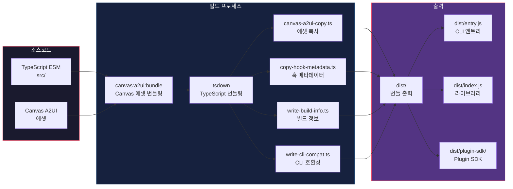
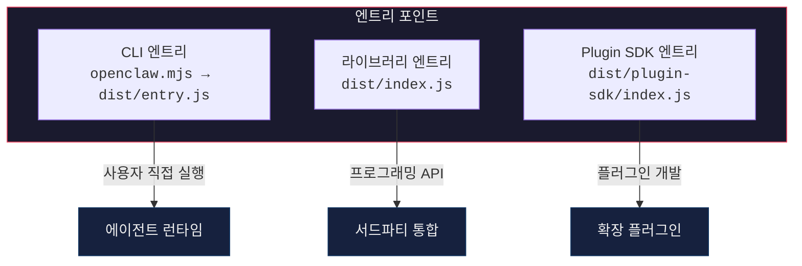
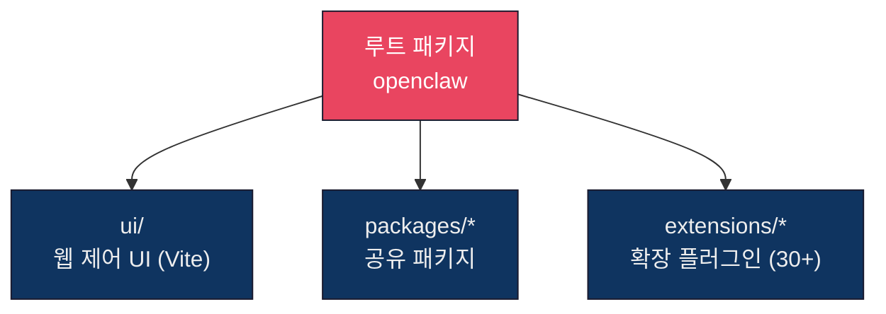
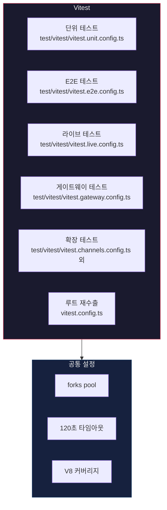
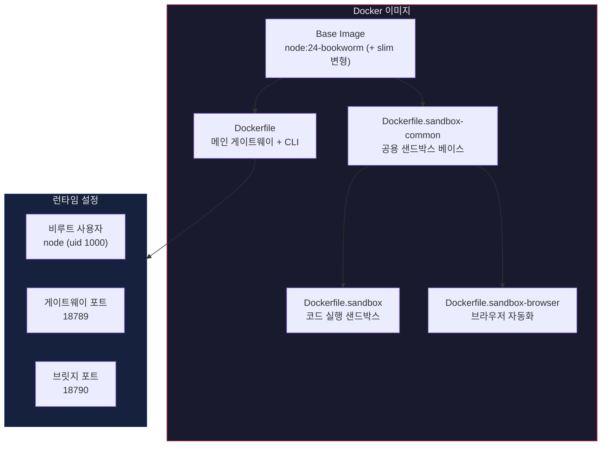
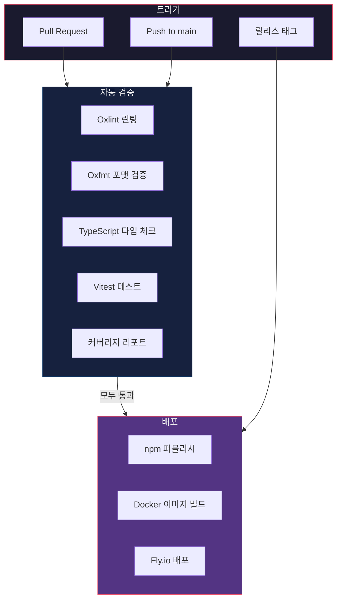

# 10. 빌드 & 배포 시스템 (Build & Deployment System)

## 목차

1. [개요](#개요)
2. [빌드 파이프라인](#빌드-파이프라인)
3. [빌드 명령어 상세](#빌드-명령어-상세)
4. [엔트리 포인트](#엔트리-포인트)
5. [모노레포 구조](#모노레포-구조)
6. [TypeScript 설정](#typescript-설정)
7. [번들러 설정](#번들러-설정)
8. [테스트 시스템](#테스트-시스템)
9. [린팅 & 포맷팅](#린팅--포맷팅)
10. [Pre-commit 훅](#pre-commit-훅)
11. [Docker 배포](#docker-배포)
12. [클라우드 배포](#클라우드-배포)
13. [macOS 패키징](#macos-패키징)
14. [릴리스 채널](#릴리스-채널)
15. [CI/CD 파이프라인](#cicd-파이프라인)
16. [커밋 워크플로우](#커밋-워크플로우)
17. [주요 개발 명령어](#주요-개발-명령어)
18. [파일 구조](#파일-구조)

---

## 개요

openclaw의 빌드 & 배포 시스템은 **pnpm 10 워크스페이스 모노레포**를 기반으로 구성되어 있다. `tsdown` 번들러로 TypeScript ESM 소스를 컴파일하고, 다수의 Docker 변형 이미지(메인/sandbox/sandbox-browser/sandbox-common)와 Fly.io·Render·Kubernetes 등 다양한 배포 타깃을 지원하며, GitHub Actions를 활용한 CI/CD 파이프라인으로 자동화된다.

| 항목 | 기술 스택 |
|------|-----------|
| 패키지 관리 | pnpm 10 워크스페이스 (`packageManager: pnpm@10.32.1`) |
| Node 요구사항 | `>=22.14.0` |
| 버전 | 2026.4.16 |
| 번들러 | tsdown (`tsdown.config.ts`, rolldown 기반) |
| 테스트 | Vitest (`vitest.config.ts`, 다수의 `test/vitest/*.config.ts`) |
| 린팅 | Oxlint (type-aware) |
| 포맷팅 | Oxfmt + SwiftFormat |
| 컨테이너 | Docker (`node:24-bookworm` / `bookworm-slim` 변형) |
| 클라우드 | Fly.io, Render, Railway, GCP, Azure, Hetzner, Hostinger, Oracle, DigitalOcean, Kubernetes, Northflank, ClawDock 등 |
| CI/CD | GitHub Actions (`.github/workflows/`) |

---

## 빌드 파이프라인



---

## 빌드 명령어 상세

### 메인 빌드 (`pnpm build`)

실제 진입점은 `scripts/build-all.mjs`이며, Docker 빌드 전용으로는 `build:docker` 스크립트가 별도로 정의되어 있다.

```bash
pnpm build                       # scripts/build-all.mjs — 전체 빌드
pnpm build:ci-artifacts          # CI 아티팩트 수집 모드
pnpm build:docker                # Docker 이미지 빌드용 단축 파이프라인
pnpm build:plugin-sdk:dts        # Plugin SDK 타입 선언만 생성
pnpm build:strict-smoke          # SDK entry/export 검증 포함 smoke 빌드
```

`build:docker` 스크립트가 실행하는 주요 단계:

```text
tsdown-build.mjs           # tsdown 번들링
runtime-postbuild.mjs      # 런타임 후처리
write-npm-update-compat-sidecars.ts
build-stamp.mjs            # 빌드 스탬프
canvas-a2ui-copy.ts        # Canvas 에셋 복사
copy-hook-metadata.ts      # 훅 메타데이터
copy-export-html-templates.ts
write-build-info.ts        # 빌드 타임스탬프/커밋 해시
write-cli-startup-metadata.ts
write-cli-compat.ts        # CLI 호환성 정보
```

### UI 빌드 (`pnpm ui:build`)

```bash
pnpm ui:build  # 웹 제어 UI 빌드 (Vite 기반)
```

### 빌드 스크립트 상세

| 스크립트 | 파일 경로 | 역할 |
|---------|----------|------|
| Canvas A2UI 번들 | `pnpm canvas:a2ui:bundle` | Canvas 컴포넌트를 단일 번들로 패키징 |
| tsdown | `tsdown` (루트 설정) | TypeScript ESM을 JavaScript로 번들링 |
| Canvas 에셋 복사 | `scripts/canvas-a2ui-copy.ts` | 번들된 Canvas 에셋을 dist/에 배치 |
| 훅 메타데이터 | `scripts/copy-hook-metadata.ts` | 런타임 훅 메타데이터를 dist/에 복사 |
| 빌드 정보 | `scripts/write-build-info.ts` | 빌드 시간, 커밋 해시, 버전 정보 기록 |
| CLI 호환성 | `scripts/write-cli-compat.ts` | CLI 버전 호환성 매트릭스 생성 |

---

## 엔트리 포인트

openclaw은 세 가지 주요 엔트리 포인트를 제공한다.



| 엔트리 포인트 | 경로 | 용도 |
|---------------|------|------|
| CLI | `openclaw.mjs` -> `dist/entry.js` | 터미널에서 직접 실행하는 CLI 인터페이스 |
| Library | `dist/index.js` | Node.js에서 프로그래밍 방식으로 사용하는 API |
| Plugin SDK | `dist/plugin-sdk/index.js` | 채널/기능 플러그인 개발 SDK |

```typescript
// CLI 엔트리 포인트 (openclaw.mjs)
#!/usr/bin/env node
import "./dist/entry.js";

// 라이브러리로 사용
import { createAgent, AgentConfig } from "openclaw";

// 플러그인 SDK로 사용
import type { ChannelPlugin } from "openclaw/plugin-sdk";
```

---

## 모노레포 구조

### pnpm-workspace.yaml

```yaml
packages:
  - .              # 루트 패키지 (openclaw 본체)
  - ui             # 웹 제어 UI
  - packages/*     # 공유 SDK 패키지 (plugin-sdk, plugin-package-contract, memory-host-sdk)
  - extensions/*   # 번들 확장 (채널/프로바이더/도구/QA 하네스 113 엔트리)

minimumReleaseAge: 2880   # 신규 npm 패키지 최소 2일 대기
```

`packages/`에는 `plugin-sdk`, `plugin-package-contract`, `memory-host-sdk` 3개의 내부 SDK 패키지가 들어 있다.

### 구조 다이어그램



---

## TypeScript 설정

### tsconfig.json 주요 설정

```jsonc
// tsconfig.json
{
  "compilerOptions": {
    "target": "ES2023",                  // 최신 ES2023 타겟
    "module": "ESNext",                  // ESM 모듈 시스템
    "moduleResolution": "bundler",       // 번들러 호환 모듈 해석
    "strict": true,                      // 엄격 모드 활성화
    "experimentalDecorators": true,      // 데코레이터 지원
    "emitDecoratorMetadata": true,       // 데코레이터 메타데이터
    "esModuleInterop": true,             // ESM/CJS 상호 운용
    "skipLibCheck": true,                // 라이브러리 타입 체크 스킵
    "forceConsistentCasingInFileNames": true,
    "resolveJsonModule": true,
    "declaration": true,
    "declarationMap": true,
    "sourceMap": true,
    "outDir": "./dist"
  },
  "include": ["src/**/*"],
  "exclude": ["node_modules", "dist", "**/*.test.ts"]
}
```

| 옵션 | 값 | 설명 |
|------|-----|------|
| target | ES2023 | 최신 JavaScript 표준 타겟 |
| strict | true | 모든 엄격 타입 체크 활성화 |
| experimentalDecorators | true | 데코레이터 문법 지원 |
| moduleResolution | bundler | tsdown 번들러와 호환되는 모듈 해석 |

---

## 번들러 설정

openclaw은 **tsdown**을 주 번들러로 사용하며, 내부적으로 Rust 기반의 **rolldown**을 번들링 엔진으로 활용한다.

### tsdown 설정 (`tsdown.config.ts`)

실제 설정은 다수의 엔트리(코어 CLI/라이브러리, Plugin SDK 서브패스, 번들 플러그인, 번들 훅)를 하나의 그래프로 구성한다. 주요 구조 요약:

```typescript
// tsdown.config.ts (실제 파일 요약)
export default defineConfig([
  nodeBuildConfig({
    clean: true,
    entry: {
      index: "src/index.ts",             // 라이브러리 엔트리
      entry: "src/entry.ts",             // CLI 엔트리
      "cli/daemon-cli": "src/cli/daemon-cli.ts",
      // agents/*, plugins/*, telegram/*, mcp/* 등 고정 파일명 런타임 boundary
      ...coreDistEntries,
      "plugin-sdk/compat": "src/plugin-sdk/compat.ts",
      ...pluginSdkSubpathEntries,        // core, runtime, testing, ...
      ...bundledPluginEntries,           // extensions/* 번들 플러그인
      ...bundledHookEntries,             // src/hooks/bundled/*/handler.ts
    },
    deps: { neverBundle: shouldNeverBundleDependency },
  }),
  ...buildBundledPluginConfigs(),        // runtime dependency staging 플러그인
]);
```

| 항목 | 값 |
|------|-----|
| 번들러 | tsdown |
| 번들링 엔진 | rolldown |
| 플랫폼 | `platform: "node"` |
| 출력 형식 | ESM |
| 타겟 | Node.js 22+ (`engines: >=22.14.0`) |
| 타입 선언 | `build:plugin-sdk:dts`로 별도 생성 |
| 제외 의존성 | `@lancedb/lancedb`, `@matrix-org/matrix-sdk-crypto-nodejs`, `matrix-js-sdk` 등 + 번들 플러그인 런타임 의존성 |

---

## 테스트 시스템

### 프레임워크: Vitest



### 테스트 설정 파일

루트의 `vitest.config.ts`는 `test/vitest/vitest.config.ts`를 재수출하며, 이 파일이 `rootVitestProjects`(다중 Vitest project 묶음)를 정의한다. 개별 축은 `test/vitest/` 아래 수십 개의 config로 분리되어 있다.

| 설정 파일 | 용도 | 명령어 |
|----------|------|--------|
| `test/vitest/vitest.unit.config.ts` | 단위 테스트 | `pnpm test:coverage` 등 |
| `test/vitest/vitest.e2e.config.ts` | End-to-End 테스트 | `pnpm test:e2e` |
| `test/vitest/vitest.live.config.ts` | 라이브 API/디바이스 테스트 | `pnpm test:live` (스크립트 파생) |
| `test/vitest/vitest.gateway.config.ts` | 게이트웨이 테스트 | `pnpm test:auth:compat` 등 |
| `test/vitest/vitest.channels.config.ts` | 채널 플러그인 테스트 | `pnpm test:channels` |
| `test/vitest/vitest.contracts.config.ts` | 계약 테스트 | `pnpm test:contracts` |
| `test/vitest/vitest.bundled.config.ts` | 번들 플러그인 테스트 | `pnpm test:bundled` |
| `test/vitest/vitest.acp.config.ts` | ACP 하네스 테스트 | — |
| `test/vitest/vitest.extension-*.config.ts` | 개별 확장(matrix, feishu 등) 테스트 | `pnpm test:extension` |

### 커버리지 기준

```typescript
// vitest.config.ts 커버리지 설정 (개념적 구조)
export default defineConfig({
  test: {
    pool: "forks",           // forks 기반 병렬 실행
    testTimeout: 120_000,    // 120초 타임아웃
    coverage: {
      provider: "v8",        // V8 네이티브 커버리지
      thresholds: {
        lines: 70,           // 라인 커버리지 70%
        functions: 70,       // 함수 커버리지 70%
        statements: 70,      // 구문 커버리지 70%
        branches: 55,        // 분기 커버리지 55%
      },
    },
  },
});
```

| 커버리지 항목 | 최소 기준 |
|--------------|----------|
| Lines | 70% |
| Functions | 70% |
| Statements | 70% |
| Branches | 55% |

### 테스트 명령어

```bash
pnpm test              # 기본 테스트 실행
pnpm test:coverage     # 커버리지 포함 테스트
pnpm test:e2e          # End-to-End 테스트
pnpm test:live         # 라이브 API 테스트
pnpm test:watch        # 파일 변경 감시 테스트
pnpm test:docker:all   # Docker 환경 전체 테스트
```

---

## 린팅 & 포맷팅

openclaw은 Rust 기반 고성능 도구인 **Oxlint**와 **Oxfmt**를 주 도구로 사용하며, Swift 소스는 SwiftFormat/SwiftLint로 추가 검증한다.

| 도구 | 용도 |
|------|------|
| Oxlint | Type-aware 린팅 (`pnpm lint`, `scripts/run-oxlint.mjs`) |
| Oxfmt | 코드 포맷팅 (`pnpm format`) |
| SwiftFormat | iOS/macOS/shared Swift 포맷 (`pnpm format:swift`) |
| SwiftLint | Swift 린팅 (`pnpm lint:swift`) |
| markdownlint-cli2 | 문서 린팅 (`pnpm lint:docs`) |

```bash
# 린팅 실행
pnpm lint        # Oxlint type-aware 린팅

# 포맷팅 실행
pnpm format      # Oxfmt 코드 포맷팅

# 전체 체크 (lint + format + type check)
pnpm check       # 통합 검증
```

---

## Pre-commit 훅

### 설정 파일

`.pre-commit-config.yaml`과 `prek` 도구를 통해 커밋 전 자동 검증이 실행된다.

```bash
# Pre-commit 훅 설치
prek install

# 커밋 시 자동으로 실행되는 검증:
# 1. Oxlint 린팅
# 2. Oxfmt 포맷 검증
# 3. TypeScript 타입 체크
# 4. 테스트 실행 (선택적)
```

---

## Docker 배포

### 기본 Docker 이미지



### Dockerfile 구성

```dockerfile
# Dockerfile (요약 — 실제는 멀티스테이지 빌드)
ARG OPENCLAW_NODE_BOOKWORM_IMAGE="node:24-bookworm@sha256:..."
ARG OPENCLAW_VARIANT=default    # default(bookworm) | slim(bookworm-slim)
ARG OPENCLAW_EXTENSIONS=""       # 옵트인할 번들 확장 디렉토리

FROM ${OPENCLAW_NODE_BOOKWORM_IMAGE} AS ext-deps
# extensions/*/package.json 만 추출하여 빌드 레이어 캐시 보존

FROM ${OPENCLAW_NODE_BOOKWORM_IMAGE} AS build
# Bun + pnpm + build 실행 (pnpm build:docker)

FROM ${OPENCLAW_NODE_BOOKWORM_IMAGE} AS runtime
USER node
WORKDIR /home/node/app
EXPOSE 18789 18790
CMD ["node", "dist/index.js", "gateway", "--bind", "lan", "--port", "18789"]
```

| Docker 설정 | 값 |
|-------------|-----|
| 베이스 이미지 | `node:24-bookworm` (SHA256 pinned), `bookworm-slim` 변형 지원 |
| 멀티스테이지 | `ext-deps` → `build` → `runtime` |
| 옵트인 확장 | `--build-arg OPENCLAW_EXTENSIONS="matrix diagnostics-otel ..."` |
| 사용자 | `node` (uid 1000, 비루트) |
| 게이트웨이 포트 | 18789 (기본) |
| 브릿지 포트 | 18790 |

### docker-compose.yml

```yaml
# docker-compose.yml (요약)
services:
  openclaw-gateway:
    image: ${OPENCLAW_IMAGE:-openclaw:local}
    environment:
      OPENCLAW_GATEWAY_TOKEN: ${OPENCLAW_GATEWAY_TOKEN:-}
      HOME: /home/node
    volumes:
      - ${OPENCLAW_CONFIG_DIR}:/home/node/.openclaw
      - ${OPENCLAW_WORKSPACE_DIR}:/home/node/.openclaw/workspace
      # 샌드박스 격리를 사용하려면 Docker 소켓을 마운트하고 DOCKER_GID 지정
      # - /var/run/docker.sock:/var/run/docker.sock
    ports:
      - "${OPENCLAW_GATEWAY_PORT:-18789}:18789"
      - "${OPENCLAW_BRIDGE_PORT:-18790}:18790"
    command:
      ["node", "dist/index.js", "gateway", "--bind", "${OPENCLAW_GATEWAY_BIND:-lan}", "--port", "18789"]
    healthcheck:
      test: ["CMD", "node", "-e", "fetch('http://127.0.0.1:18789/healthz')..."]

  openclaw-cli:
    image: ${OPENCLAW_IMAGE:-openclaw:local}
    network_mode: "service:openclaw-gateway"
    cap_drop: [NET_RAW, NET_ADMIN]
    security_opt: ["no-new-privileges:true"]
```

### 추가 Docker 이미지

| 파일 | 용도 |
|------|------|
| `Dockerfile` | 메인 게이트웨이 + CLI 서비스 (멀티스테이지, slim 변형 지원) |
| `Dockerfile.sandbox-common` | 샌드박스 이미지들의 공용 베이스 (sandbox 사용자, 언어 런타임) |
| `Dockerfile.sandbox` | 격리된 코드/쉘 실행 샌드박스 |
| `Dockerfile.sandbox-browser` | 브라우저 자동화 전용 (Chromium 포함) |

추가로 저장소 루트에는 `docker-setup.sh`, `setup-podman.sh`, `openclaw.podman.env` 등의 Podman/로컬 셋업 스크립트와 Fly 전용 `fly.private.toml`이 포함된다.

---

## 클라우드 배포

OpenClaw는 단일 클라우드에 묶이지 않고 다양한 배포 타깃을 공식 지원한다. 각 타깃별 가이드는 `docs/install/`에 있다.

| 대상 | 문서 | 비고 |
|------|------|------|
| Docker | `docs/install/docker.md` | 표준 배포 경로 |
| Podman | `docs/install/podman.md` | rootless 컨테이너 |
| Kubernetes | `docs/install/kubernetes.md` | Helm/매니페스트 |
| Fly.io | `docs/install/fly.md` | `fly.toml` |
| Render | `docs/install/render.mdx` | `render.yaml` |
| Railway | `docs/install/railway.mdx` | — |
| Northflank | `docs/install/northflank.mdx` | — |
| GCP | `docs/install/gcp.md` | Cloud Run 등 |
| Azure | `docs/install/azure.md` | — |
| Oracle | `docs/install/oracle.md` | — |
| DigitalOcean | `docs/install/digitalocean.md` | — |
| Hetzner | `docs/install/hetzner.md` | — |
| Hostinger | `docs/install/hostinger.md` | — |
| Raspberry Pi | `docs/install/raspberry-pi.md` | ARM 디바이스 |
| macOS VM | `docs/install/macos-vm.md` | — |
| Docker VM Runtime | `docs/install/docker-vm-runtime.md` | — |
| Ansible | `docs/install/ansible.md` | — |
| Nix | `docs/install/nix.md` | — |
| Bun | `docs/install/bun.md` | Bun 런타임 실행 |
| ClawDock | `docs/install/clawdock.md` | OpenClaw 제공 관리형 도커 |
| Installer | `docs/install/installer.md` | `install.sh` 번들 |

### Fly.io (`fly.toml`)

```toml
app = "openclaw"
primary_region = "iad"

[build]
dockerfile = "Dockerfile"

[env]
NODE_ENV = "production"
OPENCLAW_PREFER_PNPM = "1"
OPENCLAW_STATE_DIR = "/data"
NODE_OPTIONS = "--max-old-space-size=1536"

[processes]
app = "node dist/index.js gateway --allow-unconfigured --port 3000 --bind lan"

[http_service]
internal_port = 3000
force_https = true
auto_stop_machines = false
auto_start_machines = true
min_machines_running = 1

[[vm]]
size = "shared-cpu-2x"
memory = "2048mb"

[mounts]
source = "openclaw_data"
destination = "/data"
```

### Render (`render.yaml`)

```yaml
services:
  - type: web
    name: openclaw
    runtime: docker
    plan: starter
    healthCheckPath: /health
    envVars:
      - key: OPENCLAW_GATEWAY_PORT
        value: "8080"
      - key: OPENCLAW_STATE_DIR
        value: /data/.openclaw
      - key: OPENCLAW_WORKSPACE_DIR
        value: /data/workspace
      - key: OPENCLAW_GATEWAY_TOKEN
        generateValue: true
    disk:
      name: openclaw-data
      mountPath: /data
      sizeGB: 1
```

---

## macOS 패키징

macOS 네이티브 앱 패키징은 `scripts/package-mac-app.sh` 스크립트로 수행된다.

```bash
# macOS 앱 패키징
bash scripts/package-mac-app.sh

# 이 스크립트는 다음 작업을 수행한다:
# 1. dist/ 빌드 산출물 수집
# 2. Node.js 런타임 번들링
# 3. macOS .app 번들 구조 생성
# 4. Info.plist 설정
# 5. 코드 서명 (선택적)
```

---

## 릴리스 채널


| 채널 | 버전 형식 | npm 태그 | 설명 |
|------|----------|---------|------|
| **stable** | `vYYYY.M.D` | `latest` | 정식 릴리스. 프로덕션 사용 권장 |
| **beta** | `vYYYY.M.D-beta.N` | `beta` | 사전 릴리스. 새 기능 테스트 |
| **dev** | main branch HEAD | `dev` | 개발 빌드. 최신 커밋 기준 |

### 버전 예시

```
stable: v2026.2.1      → npm install openclaw@latest
beta:   v2026.2.1-beta.3 → npm install openclaw@beta
dev:    (main HEAD)     → npm install openclaw@dev
```

---

## CI/CD 파이프라인

### GitHub Actions



### PR 검증 규칙

모든 Pull Request는 다음 검증을 통과해야 머지할 수 있다.

| 검증 단계 | 도구 | 실패 시 |
|----------|------|--------|
| 린팅 | Oxlint 1.43.0 | PR 머지 차단 |
| 포맷팅 | Oxfmt 0.28.0 | PR 머지 차단 |
| 테스트 | Vitest 4.0.18 | PR 머지 차단 |

---

## 커밋 워크플로우

openclaw에서는 `scripts/committer` 스크립트를 사용한 표준화된 커밋 워크플로우를 따른다.

```bash
# 커밋 스크립트 사용법
scripts/committer "<커밋 메시지>" <파일1> <파일2> ...

# 예시
scripts/committer "add webhook retry logic" src/gateway/webhooks.ts src/gateway/retry.ts
scripts/committer "fix memory leak in plugin loader" src/plugins/plugin-loader.ts
```

### 커밋 메시지 규칙

| 규칙 | 설명 | 예시 |
|------|------|------|
| 간결함 | 행동 중심의 짧은 메시지 | `add webhook retry logic` |
| 소문자 시작 | 첫 글자 소문자 | `fix`, `add`, `update` |
| 현재형 동사 | 과거형이 아닌 현재형 사용 | `fix` (O) / `fixed` (X) |
| 구체적 | 변경 내용을 명확하게 기술 | `add timeout to API calls` |

---

## 주요 개발 명령어

| 명령어 | 설명 |
|--------|------|
| `pnpm install` | 모든 워크스페이스 의존성 설치 |
| `pnpm build` | 메인 빌드 (tsdown + 후처리 스크립트) |
| `pnpm check` | 통합 검증 (lint + format + type check) |
| `pnpm test` | Vitest 테스트 실행 |
| `pnpm test:coverage` | 커버리지 포함 테스트 실행 |
| `pnpm test:e2e` | End-to-End 테스트 실행 |
| `pnpm test:live` | 라이브 API 테스트 실행 |
| `pnpm test:watch` | 파일 변경 감시 모드 테스트 |
| `pnpm test:docker:all` | Docker 환경 전체 테스트 |
| `pnpm dev` | 개발 모드 실행 (watch 모드) |
| `pnpm openclaw` | 빌드된 CLI 직접 실행 |
| `pnpm tsgo` | TypeScript Go 컴파일러 (실험적) |
| `pnpm ui:build` | 웹 제어 UI 빌드 (Vite) |
| `pnpm lint` | Oxlint 린팅 실행 |
| `pnpm format` | Oxfmt 코드 포맷팅 |

---

## 파일 구조

### 빌드 관련 파일

```
/
├── tsdown.config.ts               # tsdown 번들러 설정 (entry/bundled 플러그인/hook 포함)
├── tsconfig.json                  # TypeScript 컴파일러 설정
├── tsconfig.oxlint.json           # Oxlint 타입 체크 설정
├── tsconfig.plugin-sdk.dts.json   # Plugin SDK 타입 선언 생성
├── knip.config.ts                 # 데드 코드 감지 설정
├── pnpm-workspace.yaml            # pnpm 워크스페이스 정의
├── package.json                   # 루트 패키지 (빌드 스크립트 포함)
├── pnpm-lock.yaml                 # 의존성 잠금 파일
│
├── scripts/                       # 다수의 빌드/릴리스/QA 스크립트
│   ├── build-all.mjs              # pnpm build
│   ├── tsdown-build.mjs           # tsdown 호출
│   ├── runtime-postbuild.mjs
│   ├── canvas-a2ui-copy.ts        # Canvas A2UI 에셋 복사
│   ├── copy-hook-metadata.ts      # 훅 메타데이터 복사
│   ├── write-build-info.ts        # 빌드 정보 기록
│   ├── write-cli-compat.ts        # CLI 호환성 정보 기록
│   ├── package-mac-app.sh         # macOS 앱 패키징
│   └── ...
│
├── openclaw.mjs                   # CLI 엔트리 포인트
│
└── dist/                          # 빌드 출력
    ├── entry.js                   # CLI 엔트리
    ├── index.js                   # 라이브러리 엔트리
    ├── plugin-sdk/                # Plugin SDK 서브패스 번들 (다수)
    └── extensions/                # 번들 확장 런타임
```

### 테스트 설정 파일

```
/
├── vitest.config.ts                  # test/vitest/vitest.config.ts 재수출
└── test/vitest/
    ├── vitest.config.ts              # rootVitestProjects 정의
    ├── vitest.unit.config.ts
    ├── vitest.e2e.config.ts
    ├── vitest.live.config.ts
    ├── vitest.gateway.config.ts
    ├── vitest.channels.config.ts
    ├── vitest.contracts.config.ts
    ├── vitest.bundled.config.ts
    ├── vitest.acp.config.ts
    ├── vitest.cli.config.ts
    ├── vitest.commands.config.ts
    ├── vitest.agents.config.ts
    ├── vitest.daemon.config.ts
    ├── vitest.cron.config.ts
    ├── vitest.boundary.config.ts
    └── vitest.extension-*.config.ts  # matrix, feishu, irc, bluebubbles, ...
```

### Docker 및 배포 파일

```
/
├── Dockerfile                     # 메인 Docker 이미지 (멀티스테이지)
├── Dockerfile.sandbox-common      # 샌드박스 공용 베이스
├── Dockerfile.sandbox             # 코드/쉘 실행 샌드박스
├── Dockerfile.sandbox-browser     # 브라우저 샌드박스
├── docker-compose.yml             # Docker Compose 오케스트레이션
├── docker-setup.sh                # Docker 셋업 스크립트
├── setup-podman.sh                # Podman 셋업 스크립트
├── openclaw.podman.env            # Podman 환경 파일
│
├── fly.toml                       # Fly.io 배포 설정
├── fly.private.toml               # Fly.io private 배포 설정
├── render.yaml                    # Render 배포 설정
│
├── Makefile                       # `make build` -> `pnpm build`
├── zizmor.yml                     # GitHub Actions 린트 설정
│
└── .github/workflows/             # GitHub Actions CI/CD
    ├── ci.yml                     # PR 검증 워크플로우
    ├── codeql.yml                 # CodeQL 보안 분석
    ├── docker-release.yml         # Docker 이미지 릴리스
    ├── macos-release.yml          # macOS 앱 릴리스
    ├── openclaw-npm-release.yml   # npm 패키지 릴리스
    ├── openclaw-release-checks.yml
    ├── openclaw-cross-os-release-checks-reusable.yml
    ├── openclaw-live-and-e2e-checks-reusable.yml
    ├── openclaw-scheduled-live-checks.yml
    ├── plugin-clawhub-release.yml # ClawHub 플러그인 릴리스
    ├── plugin-npm-release.yml     # npm 플러그인 릴리스
    ├── sandbox-common-smoke.yml   # 샌드박스 이미지 스모크
    ├── install-smoke.yml          # 설치 스모크 테스트
    ├── parity-gate.yml
    ├── docs-sync-publish.yml      # 문서 배포
    ├── docs-translate-trigger-release.yml
    ├── control-ui-locale-refresh.yml
    ├── auto-response.yml / labeler.yml / stale.yml
    └── workflow-sanity.yml
```

### UI 프로젝트

```
ui/
├── package.json                   # UI 패키지 설정
├── vite.config.ts                 # Vite 빌드 설정
├── tsconfig.json                  # UI TypeScript 설정
├── src/
│   ├── main.ts                    # UI 엔트리 포인트
│   ├── App.vue                    # 루트 컴포넌트
│   └── components/                # UI 컴포넌트
└── public/                        # 정적 에셋
```

---

> **참고**: openclaw의 빌드 & 배포 시스템은 최신 Rust 기반 도구체인(tsdown/rolldown, Oxlint, Oxfmt)을 적극 활용하여 빌드 속도와 개발자 경험을 극대화한다. Docker 멀티스테이지 빌드와 다양한 샌드박스 이미지 변형, 그리고 Fly.io/Render/Kubernetes/Raspberry Pi 등 광범위한 배포 타깃을 함께 지원하여 단일 벤더에 종속되지 않는 배포 전략을 제공한다.
