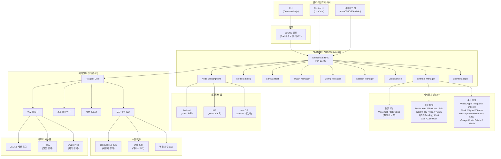
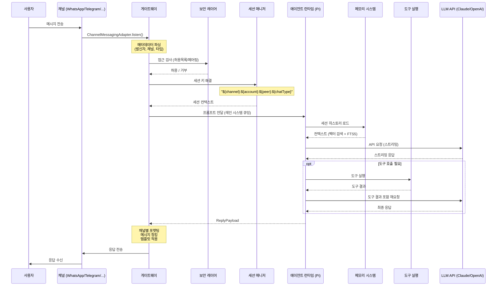
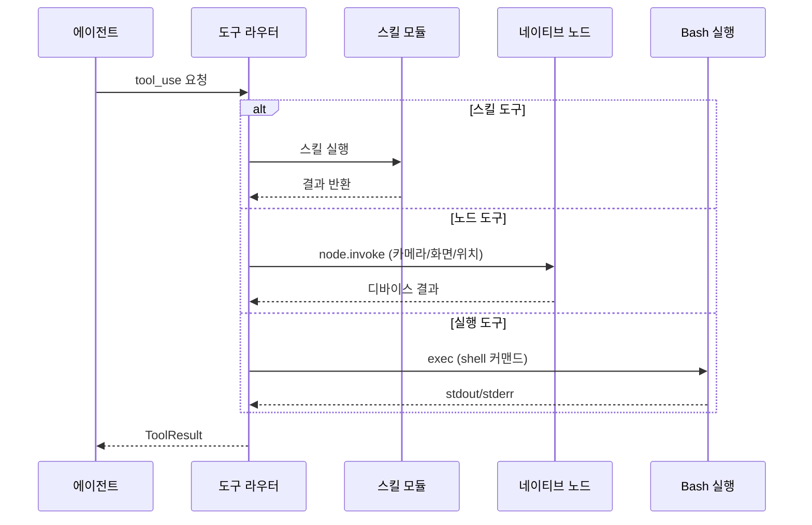
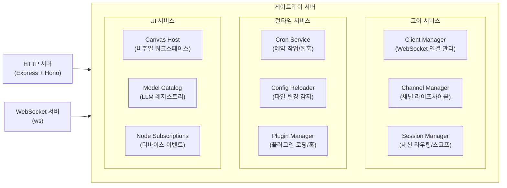
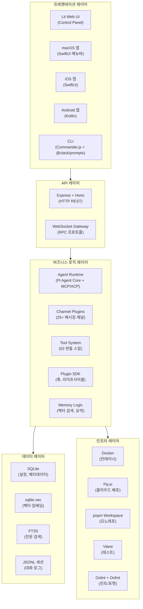
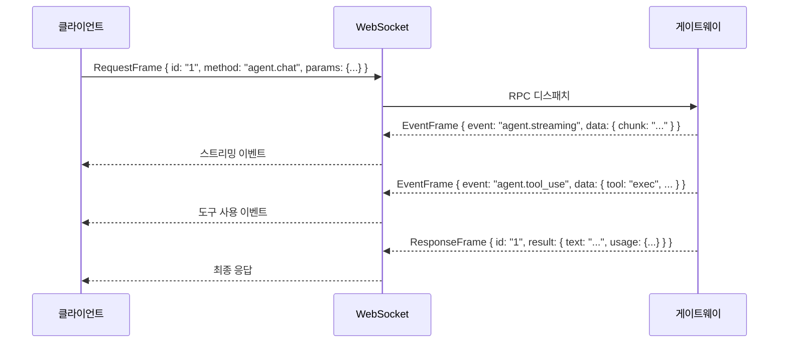
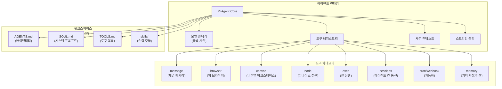
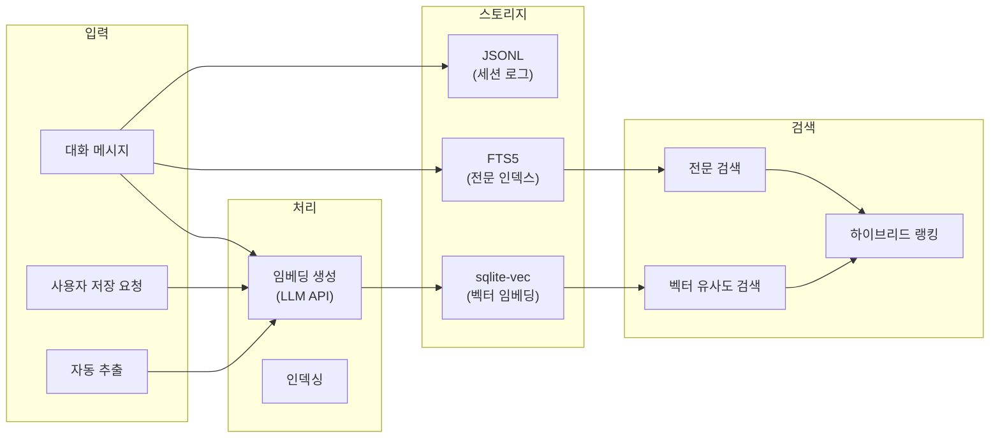
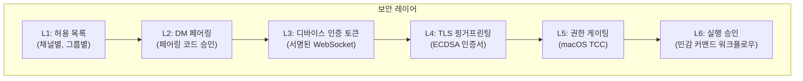

# ARCHITECTURE.md

이 문서는 OpenClaw 프로젝트의 종합 아키텍처와 구현 세부사항을 설명합니다.

---

## 1. 프로젝트 개요

> 본 문서는 OpenClaw **2026.6.11** 기준으로 갱신되었습니다 (2026-07-02, HEAD `574604e`). 직전 분석은 2026.4.16 기준. 서브시스템별 변경 이력은 [00-업데이트노트-2026.6.11.md](./00-업데이트노트-2026.6.11.md) 참고.

**OpenClaw**는 메시징 플랫폼과 AI 코딩 에이전트를 연결하는 **셀프 호스팅 개인 AI 어시스턴트(self-hosted Personal AI Assistant) 게이트웨이** 입니다. WhatsApp, Telegram, Discord, Slack, Signal, iMessage, Microsoft Teams 등 25개 이상의 메시징 플랫폼을 단일 제어 플레인으로 통합하고, 멀티 에이전트 라우팅, 실시간 음성 통화, MCP/ACP 프로토콜, 미디어 생성/이해, 벡터 메모리를 제공합니다.

```
버전: 2026.6.11 (날짜 기반 버전, 최신 태그 v2026.7.1-beta.1)
언어: TypeScript (ESM, strict)
런타임: Node.js 22.19+ (Node 24 권장)
패키지 관리: pnpm 11.2 (모노레포 워크스페이스, packages 21개)
에이전트 프로토콜: MCP, ACP (게이트웨이 PROTOCOL_VERSION 4)
라이선스: MIT
```

---

## 2. 고수준 시스템 아키텍처



---

## 3. 데이터 플로우

### 3.1 메시지 처리 시퀀스

사용자 메시지가 채널에서 수신되어 AI 응답이 반환되기까지의 전체 플로우입니다.



### 3.2 도구 실행 플로우



---

## 4. 컴포넌트 상호작용

### 4.1 게이트웨이 내부 구조

게이트웨이는 OpenClaw의 **단일 제어 플레인**으로, 모든 클라이언트/채널/세션/이벤트를 관리합니다.



### 4.2 게이트웨이 초기화 순서

```
startGatewayServer()
├─ 설정 로드 + Zod 검증
├─ 플러그인 레지스트리 초기화 (extensions/ 스캔)
├─ 모든 채널 플러그인 로드
├─ LLM 모델 카탈로그 로드
├─ HTTP/WebSocket 서버 생성 (포트 18789)
├─ WebSocket RPC 핸들러 연결
├─ 게이트웨이 메서드 등록
├─ 채널 매니저 초기화 (모니터 시작)
├─ 세션 매니저 초기화
├─ cron 서비스 시작
├─ Config Reloader 시작 (파일 워치)
├─ Tailscale 노출 시작 (설정된 경우)
└─ 클라이언트 연결 준비 완료
```

---

## 5. 기술 레이어 다이어그램



### 기술 레이어 상세

| 레이어 | 기술 | 역할 |
|--------|------|------|
| **프레젠테이션** | Lit, Vite, SwiftUI, Kotlin, Commander.js | 사용자 인터페이스 |
| **API** | Express, Hono, ws (WebSocket) | HTTP/WS 통신 |
| **비즈니스 로직** | Pi Agent Core, Channel Plugins, Plugin SDK | 핵심 비즈니스 로직 |
| **데이터** | SQLite, sqlite-vec, FTS5, JSONL | 영속성 및 검색 |
| **인프라** | Docker, Fly.io, pnpm, Vitest | 빌드/배포/테스트 |

---

## 6. 모노레포 워크스페이스 구조

OpenClaw는 pnpm 11.2 워크스페이스 기반 모노레포로 구성됩니다. 2026.6.11 기준으로 다수의 코어 로직이 `src/`에서 `packages/*`(21개)로 모듈화되었습니다.

```
openclaw/                          # 루트 (pnpm-workspace.yaml)
├── package.json                   # 루트 스크립트, devDependencies
├── pnpm-workspace.yaml            # 워크스페이스 정의
├── tsconfig.json                  # 공유 TypeScript 설정
├── vitest.config.ts               # 공유 테스트 설정
│
├── src/                           # 메인 애플리케이션 소스
│   ├── cli/                       # CLI 진입점 및 프로그램 빌더
│   ├── commands/                  # CLI 커맨드 구현
│   ├── gateway/                   # 게이트웨이 서버 코어 (WebSocket RPC)
│   ├── agents/                    # AI 에이전트 런타임 (멀티 에이전트 라우팅)
│   ├── mcp/                       # MCP (Model Context Protocol) 지원
│   ├── acp/                       # ACP (Agent Client Protocol) 지원
│   ├── channels/                  # 채널 인터페이스
│   ├── llm/                       # (신규) LLM 통합 레이어
│   ├── model-catalog/             # (신규) 모델 카탈로그
│   ├── provider-runtime/          # (신규) 프로바이더 런타임
│   ├── tools/                     # (신규) 도구 정의/실행
│   ├── trajectory/                # (신규) 에이전트 트래젝터리
│   ├── transcripts/               # (신규) 대화 트랜스크립트
│   ├── chat/                      # 채팅 오케스트레이션
│   ├── context-engine/            # 컨텍스트 엔진
│   ├── plugins/                   # 플러그인 런타임
│   ├── plugin-sdk/                # 플러그인 SDK 통합
│   ├── memory-host-sdk/           # 메모리 호스트 SDK 바인딩
│   ├── config/                    # 설정 시스템
│   ├── security/                  # 보안 레이어
│   ├── auto-reply/                # 자동 응답 파이프라인
│   ├── routing/                   # 세션 라우팅
│   ├── sessions/                  # 세션 스토어
│   ├── flows/                     # 플로우 엔진
│   ├── media/                     # 미디어 파이프라인
│   ├── media-generation/          # 미디어 생성 오케스트레이션
│   ├── media-understanding/       # 미디어 이해
│   ├── image-generation/          # 이미지 생성
│   ├── video-generation/          # 비디오 생성
│   ├── music-generation/          # 음악 생성
│   ├── tts/                       # 음성 합성
│   ├── talk/                      # 실시간 음성 통화 (구 realtime-voice)
│   ├── realtime-transcription/    # 실시간 전사
│   ├── web-fetch/                 # 웹 페치
│   ├── web-search/                # 웹 검색
│   ├── cron/                      # Cron / 예약 작업
│   ├── hooks/                     # 훅 시스템
│   ├── pairing/                   # 페어링 프로토콜
│   ├── node-host/                 # 네이티브 노드 호스트
│   ├── daemon/                    # 데몬 프로세스
│   ├── bootstrap/                 # 런타임 부트스트랩
│   ├── infra/                     # 인프라 유틸리티
│   ├── logging/                   # 로깅
│   ├── secrets/                   # 시크릿 관리
│   ├── tui/                       # TUI
│   ├── skills/                    # (신규) 스킬 런타임 코어
│   ├── state/                     # (신규) 상태 스토어
│   ├── plugin-state/              # (신규) 플러그인 상태
│   └── wizard/                    # 온보딩 마법사
│   # 이동/제거: terminal → packages/terminal-core, canvas-host → extensions/canvas,
│   #            markdown → packages/markdown-core, web 제거
│
├── ui/                            # Control UI (Lit + Vite)
│
├── packages/                      # pnpm 워크스페이스 패키지 (21개, 코어 모듈화)
│   ├── acp-core/ agent-core/ gateway-client/ gateway-protocol/
│   ├── llm-core/ llm-runtime/ model-catalog-core/ tool-call-repair/
│   ├── markdown-core/ terminal-core/ web-content-core/ normalization-core/
│   ├── media-core/ media-generation-core/ media-understanding-common/
│   ├── memory-host-sdk/ net-policy/ speech-core/
│   └── plugin-sdk/ plugin-package-contract/ sdk/
│
├── extensions/                    # 플러그인/확장 (145 엔트리)
│   # 메시징 채널 (매니페스트 약 25개)
│   ├── telegram, discord, slack, whatsapp, signal, sms,
│   ├── msteams, imessage, feishu, googlechat,
│   ├── irc, line, matrix, mattermost, nextcloud-talk,
│   ├── nostr, qqbot, synology-chat, tlon, twitch,
│   ├── zalo, zalouser,
│   # LLM 프로바이더
│   ├── anthropic, openai, google, openrouter, ollama,
│   ├── mistral, groq, perplexity, xai, deepseek, ...
│   # 메모리/검색
│   ├── memory-core, memory-lancedb, memory-wiki, active-memory,
│   ├── brave, exa, tavily, duckduckgo, searxng,
│   # 음성/미디어
│   ├── voice-call, talk-voice, elevenlabs, deepgram,
│   ├── fal, runway, comfy, ...
│   └── ...                        # (총 145 엔트리)
│
├── skills/                        # 번들 스킬 (53개)
│
├── apps/                          # 네이티브 앱
│   ├── macos/                     # macOS 메뉴바 앱 (Swift)
│   ├── ios/                       # iOS 노드 앱 (Swift)
│   ├── android/                   # Android 노드 앱 (Kotlin)
│   └── shared/                    # 공유 네이티브 라이브러리
│
└── docs/                          # 사용자 문서 (Mintlify)
```

---

## 7. 프로토콜 아키텍처

OpenClaw 게이트웨이는 **WebSocket RPC 프로토콜**을 사용합니다. 모든 통신은 세 가지 프레임 타입으로 이루어집니다.

### 7.1 프레임 타입

```typescript
// 요청 프레임 - 클라이언트 → 서버
interface RequestFrame {
  id: string;           // 유니크 요청 ID
  method: string;       // RPC 메서드명
  params: unknown;      // 메서드 파라미터
}

// 응답 프레임 - 서버 → 클라이언트
interface ResponseFrame {
  id: string;           // 매칭되는 요청 ID
  result?: unknown;     // 성공 결과
  error?: {             // 에러 정보
    code: number;
    message: string;
    data?: unknown;
  };
}

// 이벤트 프레임 - 서버 → 클라이언트 (양방향)
interface EventFrame {
  event: string;        // 이벤트 타입
  data: unknown;        // 이벤트 페이로드
}
```

### 7.2 프로토콜 플로우



### 7.3 주요 RPC 메서드

| 메서드 | 방향 | 설명 |
|--------|------|------|
| `agent.chat` | 요청 | 에이전트에게 메시지 전송 |
| `agent.streaming` | 이벤트 | 스트리밍 응답 청크 |
| `agent.tool_use` | 이벤트 | 도구 호출 알림 |
| `channel.send` | 요청 | 채널에 메시지 전송 |
| `channel.status` | 요청 | 채널 연결 상태 |
| `session.list` | 요청 | 세션 목록 조회 |
| `session.reset` | 요청 | 세션 초기화 |
| `config.get` | 요청 | 설정 조회 |
| `config.set` | 요청 | 설정 변경 |
| `config.reload` | 이벤트 | 설정 변경 알림 |
| `node.invoke` | 요청 | 네이티브 노드 커맨드 실행 |
| `cron.create` | 요청 | 예약 작업 생성 |
| `webhook.listen` | 요청 | 웹훅 리스너 등록 |
| `plugin.list` | 요청 | 설치된 플러그인 목록 |

---

## 8. 채널 아키텍처 요약

### 8.1 메시징 채널 (25개 이상)

| 채널 | 라이브러리 | 연결 방식 |
|------|-----------|-----------|
| WhatsApp | Baileys | 웹 스크래핑 |
| Telegram | grammY | Bot API (폴링/웹훅) |
| Discord | discord.js | Gateway API |
| Slack | @slack/bolt | Socket Mode |
| Signal | signal-cli | REST 래퍼 |
| iMessage / BlueBubbles | BlueBubbles | 브릿지 |
| LINE | @line/bot-sdk | Webhook |
| Google Chat | googleapis | Chat API |
| Microsoft Teams | Bot Framework | 웹훅 |
| Matrix | matrix-js-sdk | 동기화 |
| Mattermost | mattermost-redux | WebSocket |
| Feishu | Lark/Feishu API | 웹훅 |
| Nextcloud Talk | Nextcloud API | REST/WebSocket |
| Nostr | nostr-tools | relay |
| IRC | IRC 프로토콜 | TCP |
| QQ | QQBot API | 웹훅 |
| Synology Chat | Synology API | 웹훅 |
| Tlon | Urbit/Tlon | 네이티브 |
| Twitch | Twitch IRC/EventSub | Chat/Webhook |
| Zalo (OA) | Zalo OA API | 웹훅 |
| Zalo User | Zalo Personal | 클라이언트 |
| Voice Call / Talk Voice | WebRTC / Twilio | 실시간 음성 |

### 8.2 채널 플러그인 인터페이스

```typescript
// 각 채널은 다음 어댑터 세트를 구현
interface ChannelPluginAdapters {
  // 연결 라이프사이클
  setup: ChannelSetupAdapter;         // 인증 플로우
  auth: ChannelAuthAdapter;           // 자격 증명 검증
  heartbeat: ChannelHeartbeatAdapter; // 연결 유지
  logout: (context: ChannelContext) => Promise<void>;

  // 메시징
  messaging: ChannelMessagingAdapter; // 인바운드 메시지 수신
  outbound: ChannelOutboundAdapter;   // 아웃바운드 메시지 전송

  // 그룹 및 타겟팅
  grouping: ChannelGroupAdapter;      // 그룹 메시지 처리
  mention: ChannelMentionAdapter;     // @멘션 파싱
  resolver: ChannelResolverAdapter;   // 피어/그룹 ID 해결
  directory: ChannelDirectoryAdapter; // 채팅/그룹 목록

  // 스트리밍 및 스레딩
  streaming: ChannelStreamingAdapter; // 멀티파트 메시지 지원
  threading: ChannelThreadingAdapter; // 스레드/답장 처리

  // 고급 기능
  security: ChannelSecurityAdapter;   // DM 페어링/허용 목록
  pairing: ChannelPairingAdapter;     // 신규 사용자 승인
  status: ChannelStatusAdapter;       // 헬스 체크
  config: ChannelConfigAdapter;       // 스키마 검증
}
```

---

## 9. 에이전트 런타임 아키텍처

### 9.1 Pi 에이전트 통합



### 9.2 도구 정의 예시

```typescript
// 에이전트 도구 정의 구조
const agentTools = {
  // 채널 메시징
  message: {
    action: "send" | "edit" | "react",
    target: string,
    channel: string,
    text: string,
    media?: string[],
  },

  // 브라우저 제어
  browser: {
    action: "navigate" | "click" | "type" | "screenshot" | "eval",
    url?: string,
    selector?: string,
    input?: string,
    script?: string,
  },

  // 캔버스 (비주얼 워크스페이스)
  canvas: {
    action: "push" | "reset" | "eval" | "snapshot",
    content?: string,
  },

  // 디바이스 접근 (macOS/iOS/Android 노드)
  node: {
    action: "system.run" | "camera.capture" | "screen.record" | "location.get",
    params?: Record<string, unknown>,
  },

  // 셸 실행
  exec: {
    command: string,
    timeout?: number,
    shell?: string,
    needsScreenRecording?: boolean,
    elevatedOnMacos?: boolean,
  },

  // 메모리 도구
  memory: {
    action: "store" | "search" | "list" | "delete",
    content?: string,
    query?: string,
    tags?: string[],
  },
};
```

### 9.3 모델 선택 및 폴백

```typescript
// 모델 선택 체인 (우선순위)
type ModelSelectionChain = [
  // 1. 세션별 오버라이드
  SessionModelOverride,
  // 2. 그룹별 오버라이드
  GroupModelOverride,
  // 3. 에이전트 기본 모델
  AgentDefaultModel,
  // 4. 글로벌 기본 모델
  GlobalDefaultModel,
  // 5. 하드코딩 폴백
  HardcodedFallback,
];

// 인증 프로필 로테이션
interface AuthProfileRotation {
  primary: AuthProfile;    // 예: Claude Pro 구독
  secondary: AuthProfile;  // 예: API 키
  tertiary?: AuthProfile;  // 예: 다른 프로바이더
}

// 사고 수준 (Claude 확장 사고)
type ThinkingLevel = "off" | "minimal" | "low" | "medium" | "high" | "xhigh";
```

---

## 10. 메모리 시스템 아키텍처



---

## 11. 보안 아키텍처 요약



| DM 정책 | 동작 |
|---------|------|
| `pairing` (기본값) | 알 수 없는 DM에 페어링 코드 발급, 승인 필요 |
| `allowlist` | `allowFrom` 목록에 있는 발신자만 허용 |
| `open` | 모든 DM 수락 (`allowFrom: ["*"]` 필요, 위험) |

---

## 12. 핵심 설계 원칙

CLAUDE.md에 명시된 OpenClaw의 핵심 설계 원칙입니다.

| 원칙 | 설명 |
|------|------|
| **Strict TypeScript** | ESM 모듈, `any` 사용 금지, 엄격한 타입 검사 |
| **ESM Only** | CommonJS 미사용, 순수 ES 모듈 |
| **파일 크기 제한** | 파일당 ~500-700 LOC 가이드라인, 명확성 우선 |
| **공존 테스트** | `*.test.ts`를 소스 파일과 같은 위치에 배치 |
| **멀티 에이전트 안전성** | `git stash` 자동 생성 금지, 세션 격리, 크로스 커팅 방지 |
| **프라이버시 우선** | 로컬 우선 실행, 클라우드 스토리지 없음 |
| **단일 제어 플레인** | 게이트웨이 WebSocket이 모든 통신의 중심 |
| **플러그인 확장성** | 모든 채널/도구가 플러그인으로 구현 가능 |
| **스트리밍 우선** | 응답 스트리밍, 청킹, 비동기 처리 기본 |
| **동시성 제어** | 레인 시스템으로 세션별 큐/백프레셔 관리 |

---

## 13. 엔드투엔드 메시지 플로우 예시

**예: Telegram 메시지 → Claude 응답 (도구 사용 포함)**

```
1. 사용자가 Telegram에서 "내일 서울 날씨 알려줘" 전송

2. Telegram Bot 핸들러
   ├─ grammY 롱폴링으로 수신
   └─ 게이트웨이에 발행: { channel: "telegram", sender: "123", text: "..." }

3. 게이트웨이 인바운드 핸들러
   ├─ 메타데이터 파싱
   ├─ 세션 키 해결: "telegram:bot-token:123:dm" → "main" 세션
   ├─ 허용 목록 체크: OK
   ├─ 커맨드 감지: 커맨드 아님
   ├─ 세션 레인에 큐잉
   └─ 에이전트 실행 트리거

4. 에이전트 실행
   ├─ 세션 히스토리 로드 (SQLite-vec + FTS5)
   ├─ 메모리 컨텍스트 주입
   ├─ 모델 선택: Claude (Anthropic)
   ├─ Pi 에이전트 사고 스트리밍
   ├─ 도구 호출: browser { action: "navigate", url: "weather.com/seoul" }
   ├─ 도구 결과 수신
   ├─ 도구 결과 포함 재요청
   └─ 최종 응답 반환: "내일 서울은 맑고 최고 5°C..."

5. 응답 처리
   ├─ 템플릿 적용: 모델명, 비용 추가
   ├─ 메시지 청킹 (기본: 4096자)
   ├─ Telegram용 포맷팅 (MarkdownV2)
   └─ Telegram API로 전송

6. 메모리 업데이트
   ├─ 대화 JSONL 세션 로그 기록
   ├─ 벡터 임베딩 생성 및 저장
   └─ FTS5 인덱스 업데이트
```

---

## 14. 의존성 그래프 (단순화)

```
진입점: openclaw.mjs → src/entry.ts → src/cli/run-main.ts

CLI 커맨드:
├─ gateway → src/commands/gateway.ts → GatewayServer
├─ agent → src/commands/agent.ts → AgentCommand (Pi RPC)
├─ send → src/commands/send.ts → ChannelOutbound
├─ onboard → src/commands/onboard.ts → WizardUI
├─ doctor → src/commands/doctor.ts → DiagnosticRunner
├─ skills → src/commands/skills.ts → SkillManager

게이트웨이 서버 의존성:
├─ config (src/config/config.ts)
├─ channels (src/channels/ + extensions/)
├─ agents (src/agents/ + Pi embedding)
├─ plugins (src/plugins/ + extensions/)
├─ memory (src/memory/ + sqlite-vec + FTS5)
├─ infra (logging, env, ports 등)
└─ WebSocket (ws 라이브러리)

워크스페이스 패키지 (21개):
├─ ui/ → Lit + Vite (Control Panel)
├─ packages/gateway-protocol, gateway-client → 게이트웨이 RPC/클라이언트
├─ packages/agent-core, acp-core → 에이전트/ACP 코어
├─ packages/llm-core, llm-runtime, model-catalog-core, tool-call-repair → LLM 스택
├─ packages/media-core, media-generation-core, media-understanding-common, speech-core → 미디어/음성
├─ packages/markdown-core, terminal-core, web-content-core, normalization-core → 콘텐츠/터미널
├─ packages/net-policy → 네트워크 정책
├─ packages/plugin-sdk, plugin-package-contract, sdk → 플러그인/공개 SDK
└─ packages/memory-host-sdk → 메모리 호스트 SDK
```

---

## 요약

OpenClaw는 다음과 같은 핵심 강점을 가진 **셀프 호스팅 AI 게이트웨이**입니다:

1. **통합 제어 플레인** (게이트웨이 WebSocket) - 모든 채널/클라이언트를 위한 단일 허브
2. **멀티채널 통신** (25+ 메시징 채널) - WhatsApp, Telegram, Discord, Slack, Signal, iMessage, Teams, Matrix 등
3. **AI 에이전트 런타임** (Pi) - 53개 스킬, 스트리밍, 멀티 에이전트 라우팅, MCP/ACP 프로토콜
4. **실시간 음성/미디어** - Voice Call, 실시간 전사, 이미지/비디오/음악 생성
5. **벡터 메모리 시스템** (SQLite-vec + FTS5) - 하이브리드 검색 기반 컨텍스트
6. **확장 가능한 플러그인 아키텍처** - 145개 extensions 엔트리, 플러그인 SDK + 훅 시스템
7. **네이티브 앱 통합** (macOS/iOS/Android) - 브릿지 프로토콜 기반
8. **프라이버시 우선 설계** - 셀프 호스팅, 로컬 우선, 클라우드 스토리지 없음
9. **개발자 경험** - pnpm 모노레포, Vitest, Oxlint, 직관적 CLI

전체 시스템은 **스트리밍, 청킹, 비동기 메시지 처리**를 중심으로 구축되어 있으며, **동시성 제어** (레인 시스템), **보안** (허용 목록, 페어링, TLS, 권한 게이팅), **안정성** (재시도 정책, 페일오버, 헬스 체크)에 세심한 주의를 기울이고 있습니다.
