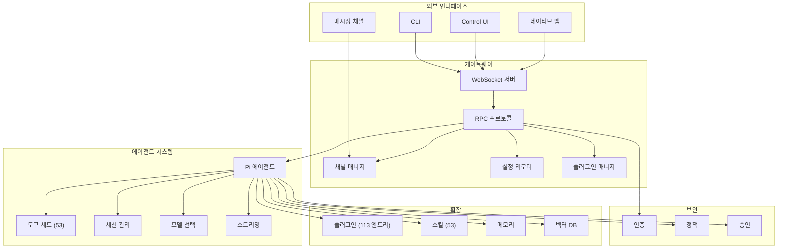
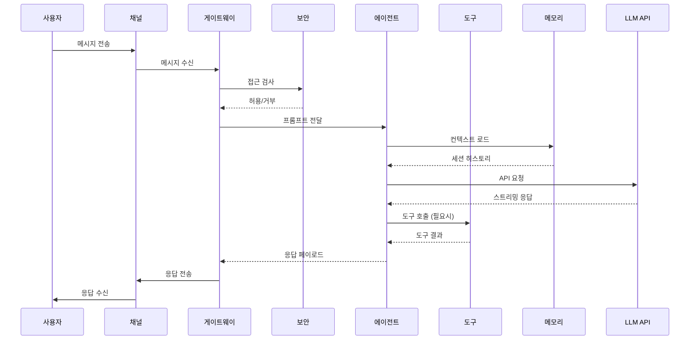
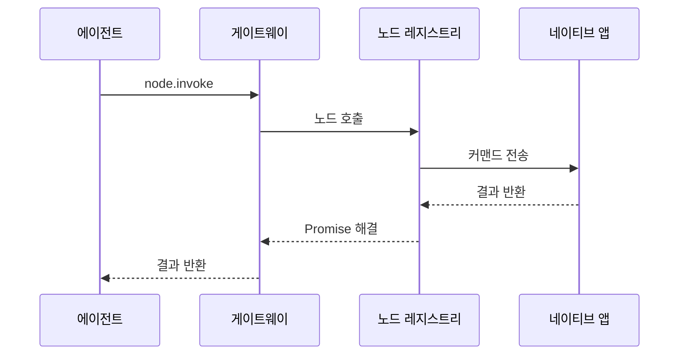

# OpenClaw 프로젝트 분석

이 디렉토리는 OpenClaw 프로젝트의 주요 기능별 세부 아키텍처를 문서화합니다.

## 프로젝트 개요

**OpenClaw**는 메시징 플랫폼과 AI 코딩 에이전트를 연결하는 **셀프 호스팅 게이트웨이 (self-hosted gateway)** 입니다. WhatsApp, Telegram, Discord, Slack, Signal, iMessage, Microsoft Teams 등 22개 이상의 메시징 채널을 단일 제어 플레인으로 통합하고, 멀티 에이전트 라우팅, 음성 통화, MCP/ACP 프로토콜, 미디어 생성/이해, 벡터 메모리를 제공합니다.

## 문서 목록

| 파일 | 내용 |
|------|------|
| [ARCHITECTURE.md](./ARCHITECTURE.md) | 종합 아키텍처 개요 - 시스템 구조, 데이터 플로우, 기술 레이어 |
| [01-게이트웨이-아키텍처.md](./01-게이트웨이-아키텍처.md) | 게이트웨이 서버, WebSocket 연결, RPC 프로토콜, 클라이언트 관리 |
| [02-채널-메시징-시스템.md](./02-채널-메시징-시스템.md) | 채널 플러그인 인터페이스, 메시지 라우팅, 청킹, 22개 이상 채널 |
| [03-에이전트-AI-시스템.md](./03-에이전트-AI-시스템.md) | Pi 에이전트 런타임, 도구 실행, 모델 선택, 스트리밍 |
| [04-메모리-벡터DB-시스템.md](./04-메모리-벡터DB-시스템.md) | SQLite-vec 벡터 검색, FTS5 전문 검색, 메모리 시스템 |
| [05-CLI-명령-시스템.md](./05-CLI-명령-시스템.md) | CLI 커맨드 구조, 진행률 표시, 대화형 마법사 |
| [06-설정-시스템.md](./06-설정-시스템.md) | JSON5 설정, Zod 검증, 핫 리로드, 그룹 정책 |
| [07-네이티브-앱-통합.md](./07-네이티브-앱-통합.md) | macOS/iOS/Android 앱, 페어링 프로토콜, Bonjour mDNS |
| [08-보안-모델.md](./08-보안-모델.md) | DM 정책, 인증, 도구 정책, 허용 목록, TLS 인증서 |
| [09-플러그인-스킬-시스템.md](./09-플러그인-스킬-시스템.md) | 플러그인 검색/로딩, 훅 시스템, 스킬 플랫폼 (53개 번들) |
| [10-빌드-배포-시스템.md](./10-빌드-배포-시스템.md) | pnpm 워크스페이스, Docker, Fly.io, CI/CD 파이프라인 |

## 아키텍처 개요



## 주요 데이터 플로우

### 메시지 처리 플로우



### 노드 호출 플로우



## 기술 스택

| 영역 | 기술 |
|------|------|
| 언어 | TypeScript (ESM, strict) |
| 런타임 | Node.js 22.14+ (Node 24 권장) |
| 패키지 관리 | pnpm 10 (모노레포 워크스페이스) |
| 빌드 | TypeScript, tsdown (Rolldown) |
| 테스트 | Vitest |
| 린트/포맷 | Oxlint, Oxfmt |
| CLI | Commander.js, @clack/prompts |
| Web UI | Lit, Vite |
| HTTP 서버 | Express, Hono |
| WebSocket | ws |
| 에이전트 프로토콜 | MCP, ACP |
| 데이터베이스 | SQLite, sqlite-vec, FTS5 |
| 스키마 검증 | Zod |
| 네이티브 앱 | Swift (macOS/iOS), Kotlin (Android) |
| 배포 | Docker, Fly.io |

## 프로젝트 통계

| 항목 | 값 |
|------|------|
| TypeScript 파일 | 3,292개 |
| 총 코드 라인 수 | 456,691 LOC |
| 번들 스킬 | 53개 |
| 확장 (extensions 엔트리) | 113개 |
| 워크스페이스 패키지 | 3개 (memory-host-sdk, plugin-package-contract, plugin-sdk) |
| 메시징 채널 | 22개 이상 |
| 라이선스 | MIT |
| 버전 | 2026.4.16 |

## 핵심 디렉토리

```
openclaw/
├── src/                          # 메인 애플리케이션 소스
│   ├── acp/                      # ACP (Agent Client Protocol) 지원
│   ├── agents/                   # AI 에이전트 (Pi 런타임, 멀티 에이전트 라우팅)
│   ├── auto-reply/               # 자동 응답 파이프라인
│   ├── bindings/                 # 채널-세션 바인딩
│   ├── bootstrap/                # 런타임 부트스트랩
│   ├── canvas-host/              # Canvas (비주얼 워크스페이스) 호스트
│   ├── channels/                 # 채널 인터페이스 코어
│   ├── chat/                     # 채팅 오케스트레이션
│   ├── cli/                      # CLI 진입점
│   ├── commands/                 # CLI 커맨드 구현
│   ├── compat/                   # 호환성 레이어
│   ├── config/                   # JSON5 설정 + Zod 검증
│   ├── context-engine/           # 컨텍스트 엔진
│   ├── cron/                     # Cron / 예약 작업
│   ├── daemon/                   # 데몬 프로세스
│   ├── docs/                     # 내부 문서 런타임
│   ├── flows/                    # 플로우 엔진
│   ├── gateway/                  # 게이트웨이 서버 (WebSocket RPC)
│   ├── hooks/                    # 훅 시스템
│   ├── i18n/                     # 다국어
│   ├── image-generation/         # 이미지 생성
│   ├── infra/                    # 인프라 유틸리티
│   ├── logging/                  # 로깅
│   ├── markdown/                 # 마크다운 처리
│   ├── mcp/                      # MCP (Model Context Protocol) 지원
│   ├── media/                    # 미디어 파이프라인
│   ├── media-generation/         # 미디어 생성 오케스트레이션
│   ├── media-understanding/      # 미디어 이해
│   ├── memory-host-sdk/          # 메모리 호스트 SDK 바인딩
│   ├── music-generation/         # 음악 생성
│   ├── node-host/                # 네이티브 노드 호스트
│   ├── pairing/                  # 페어링 프로토콜
│   ├── plugins/                  # 플러그인 런타임
│   ├── plugin-sdk/               # 플러그인 SDK 통합
│   ├── process/                  # 프로세스 관리
│   ├── proxy-capture/            # 프록시 캡처
│   ├── realtime-transcription/   # 실시간 전사
│   ├── realtime-voice/           # 실시간 음성 통화
│   ├── routing/                  # 세션 라우팅
│   ├── scripts/                  # 런타임 스크립트
│   ├── secrets/                  # 시크릿 관리
│   ├── security/                 # 보안 레이어
│   ├── sessions/                 # 세션 스토어
│   ├── shared/                   # 공유 유틸
│   ├── status/                   # 상태 표시
│   ├── tasks/                    # 태스크 러너
│   ├── terminal/                 # 터미널 UI
│   ├── tts/                      # 음성 합성
│   ├── tui/                      # TUI (텍스트 UI)
│   ├── types/                    # 공유 타입
│   ├── utils/                    # 유틸리티
│   ├── video-generation/         # 비디오 생성
│   ├── web/                      # 웹 엔드포인트
│   ├── web-fetch/                # 웹 페치 도구
│   ├── web-search/               # 웹 검색 도구
│   └── wizard/                   # 온보딩 마법사
│
├── apps/
│   ├── macos/                    # macOS 메뉴바 앱 (Swift)
│   ├── ios/                      # iOS 노드 앱 (Swift)
│   ├── android/                  # Android 노드 앱 (Kotlin)
│   └── shared/                   # 공유 네이티브 라이브러리
│
├── packages/                     # pnpm 워크스페이스 패키지
│   ├── memory-host-sdk/          # 메모리 호스트 SDK
│   ├── plugin-package-contract/  # 플러그인 패키지 계약
│   └── plugin-sdk/               # 플러그인 개발 SDK
│
├── extensions/                   # 플러그인/확장 (113 엔트리)
│   ├── telegram, discord, slack, whatsapp, signal, msteams, imessage,
│   ├── bluebubbles, feishu, googlechat, irc, line, matrix, mattermost,
│   ├── nextcloud-talk, nostr, qqbot, synology-chat, tlon, twitch,
│   ├── zalo, zalouser           # 22개 이상 메시징 채널
│   ├── anthropic, openai, google, openrouter, ollama, ...  # LLM 프로바이더
│   ├── memory-core, memory-lancedb, memory-wiki           # 메모리 백엔드
│   ├── voice-call, talk-voice, elevenlabs, deepgram       # 음성/TTS
│   └── ...                       # 미디어, 검색, QA 등
│
├── skills/                       # 번들 스킬 (53개 디렉토리)
├── ui/                           # Control UI (Lit + Vite)
├── docs/                         # 사용자 문서 (Mintlify)
├── assets/                       # 정적 자산
├── scripts/                      # 빌드/배포 스크립트
├── git-hooks/                    # Git 훅
├── patches/                      # 패치 파일
├── qa/                           # QA 테스트
├── Swabble/                      # Swabble 서브프로젝트
├── test/                         # 통합 테스트
├── test-fixtures/                # 테스트 픽스처
└── vendor/                       # 벤더 의존성
```

